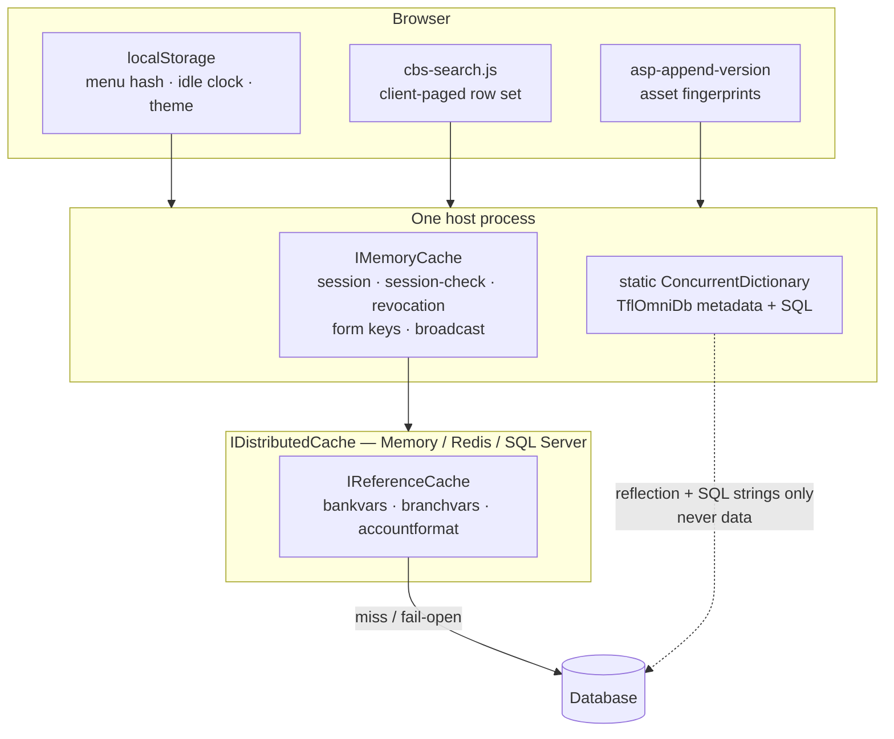
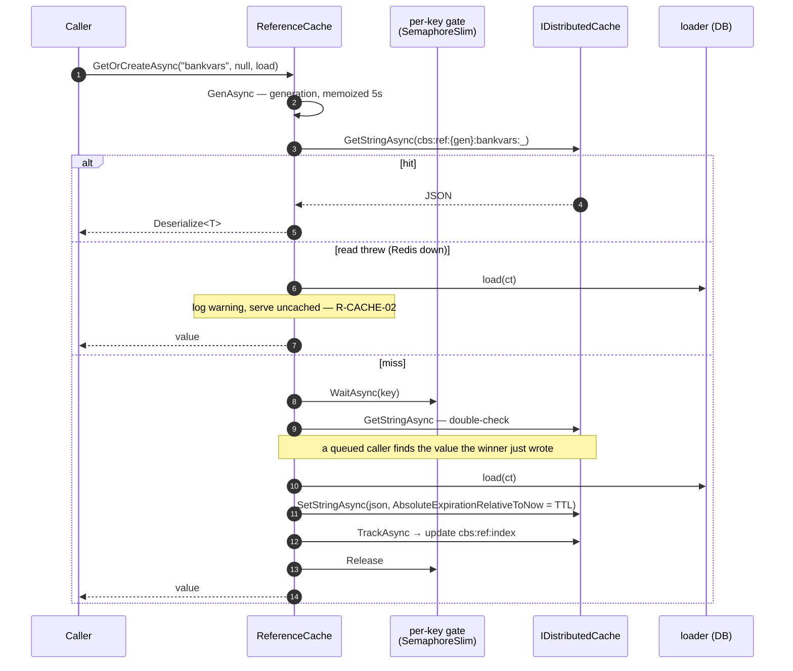
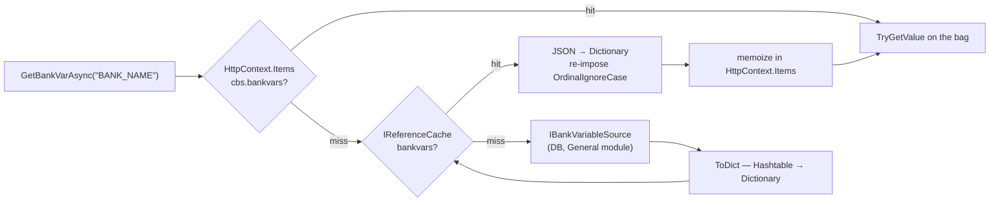

# Caching in TrustBank CBS

Every cache in the codebase, what it holds, how long, and how it is invalidated. Diagrams are
[Mermaid](https://mermaid.js.org/) — they render in VS Code (Markdown Preview) and on GitHub.

Source of truth:
- Reference cache: [`TflCbs.Framework/Caching/`](../../TflCbs.Framework/Caching/) — `IReferenceCache`, `ReferenceCache`, `ReferenceCatalog`, `ReferenceCacheRegistration`
- Read-through accessor: [`BankVars.cs`](../../TflCbs.Framework/Services/BankVars.cs)
- Admin screen: [`ReferenceCacheController.cs`](../../TflCbs.Modules.Bank.Web/Areas/Bank/Controllers/ReferenceCacheController.cs) → `/Bank/ReferenceCache`
- Tests: [`ReferenceCacheTests.cs`](../../TflCbs.ArchTests/ReferenceCacheTests.cs), [`AccountWidthsCacheTests.cs`](../../TflCbs.ArchTests/AccountWidthsCacheTests.cs), [`SessionCheckCacheTests.cs`](../../TflCbs.IntegrationTests/SessionCheckCacheTests.cs)

---

## 1. The map — five kinds of cache



| # | Kind | Scope | Survives restart? | Shared across hosts? |
|---|---|---|---|---|
| 1 | `IReferenceCache` (distributed) | app | with Redis/SqlServer | with Redis/SqlServer |
| 2 | `IMemoryCache` | process | no | no |
| 3 | `static ConcurrentDictionary` (TflOmniDb) | process | no | no |
| 4 | `HttpContext.Items` memo | one request | — | — |
| 5 | Browser (`localStorage`, JS state) | one browser | yes | — |

---

## 2. The reference cache — the one that matters

Slow-changing master data behind one interface, [`IReferenceCache`](../../TflCbs.Framework/Caching/IReferenceCache.cs):

```csharp
Task<T>    GetOrCreateAsync<T>(string category, string? id, Func<CancellationToken, Task<T>> load,
                               TimeSpan? ttl = null, CancellationToken ct = default);
Task<bool> RemoveAsync(string category, string? id = null, CancellationToken ct = default);
Task<bool> RemoveAllAsync(CancellationToken ct = default);
Task<IReadOnlyList<CacheEntryInfo>> DescribeAsync(CancellationToken ct = default);
```

**Reads fail open; invalidation does not.** The two `Remove*` methods return `bool` because there is no
safe way to fail open on a flush: an unreachable cache means the stale values are *still being served*,
so they report `false` rather than let a caller announce a flush that did not happen. They still never
throw.

Keyed by **`(category, id)`** — `id` is `null` for a whole-category blob (bank variables) or a
discriminator for sliced data (branch variables, per branch).

### Two hard rules

| Rule | What it means | Where it lives |
|---|---|---|
| **R-CACHE-01** — the provider is OPTIONAL | The app must start and run fully with **no** cache configured. Absent/unknown `Cache:Provider` ⇒ in-memory. Redis is never a hard dependency. | [`ReferenceCacheRegistration.cs`](../../TflCbs.Framework/Caching/ReferenceCacheRegistration.cs) · test `ReferenceCache_Resolves_WithNoCacheConfig_FallsBackToInMemory` |
| **R-CACHE-02** — failures are fail-open | A runtime cache error falls back to the DB loader transparently. Log it; never throw to the caller; never show a user-facing error. | every `try/catch` in [`ReferenceCache.cs`](../../TflCbs.Framework/Caching/ReferenceCache.cs) |

### Key shape

```
cbs:ref:{generation}:{category}:{id ?? "_"}      e.g.  cbs:ref:3:branchvars:12
cbs:ref:gen                                       the generation counter
cbs:ref:index                                     JSON map of live entries, for the inspector UI
```

With Redis, `Cache:Redis:InstanceName` (`cbs:`) prefixes all of it again — hence `cbs:cbs:ref:gen`
in a `redis-cli KEYS *`.

### Read-through, with a stampede guard



The gate is **per key and per process** — one host repopulates a cold key once. It does not
coordinate across hosts; on a multi-host farm each host may load once. That is the intended
ceiling, not an oversight.

### Invalidation — two shapes

- **`RemoveAsync(category, id?)`** — reads `cbs:ref:index`, deletes the matching keys, prunes the
  index. If an `id` was given and it isn't indexed yet, the key is computed and deleted anyway.
- **`RemoveAllAsync()`** — **O(1) generation bump**. `cbs:ref:gen` goes `3 → 4`, so every existing
  `cbs:ref:3:*` key becomes unreachable and TTL-expires on its own. No `KEYS`/`SCAN`, no provider-
  specific "clear" call — that's what makes it provider-agnostic. Under a race the bump can only
  ever **over**-invalidate, which is safe.

> The generation is memoized in-process for **5 seconds** ([`ReferenceCache.cs:41-46`](../../TflCbs.Framework/Caching/ReferenceCache.cs#L41-L46)).
> So on a farm, a flush on host A reaches host B within ~5s. Single host: immediate.

### Registered categories

[`ReferenceCatalog.cs`](../../TflCbs.Framework/Caching/ReferenceCatalog.cs):

| Category | Holds | Default TTL | Loader |
|---|---|---|---|
| `bankvars` | all bank-wide variables, one blob | 12h | `IBankVariableSource.GetBankVariablesAsync` (General) |
| `branchvars` | one branch's variables, `id` = `OrgElementId` | 12h | `IBankVariableSource.GetBranchVariablesAsync` |
| `accountformat` | the three account-number segment widths | 12h | `AccountService` → `b_AccountNumberFormat` |

TTL is the **backstop**, not the mechanism — it exists so a missed invalidation self-heals within
half a day. Override per category with `Cache:Ttl:<name>`.

### Admission test — what may go in

A master belongs in the reference cache only when it is **slow-changing, small, and
non-transactional**. Never balances, never transactions, never anything a teller's next keystroke
changes. If a stale read for the TTL window would be a defect, it does not belong here.

---

## 3. How `IBankVars` uses it — the worked example

[`BankVars.cs`](../../TflCbs.Framework/Services/BankVars.cs) is the read-through accessor screens
use. Three layers per lookup:



Four things worth knowing:

1. **One entry holds the whole bag.** Ten variable reads in a request = one cache read, then
   dictionary lookups.
2. **The comparer does not survive JSON.** `StringComparer.OrdinalIgnoreCase` is lost on
   deserialize, so a fresh `Dictionary(raw, OrdinalIgnoreCase)` is built on every cache read
   ([`BankVars.cs:74`](../../TflCbs.Framework/Services/BankVars.cs#L74)). The `HttpContext.Items`
   memo exists to make that rebuild happen **once per request**, not once per lookup.
3. **Branch variables are sliced by `OrgElementId`**, read off `CbsSessionStore.Current.User`. No
   branch on the session ⇒ `null`, never an exception. Memo key is `cbs.branchvars:{orgId}`, so a
   branch switch can't serve the previous branch's bag.
4. **`IsBankVarOnAsync` is string truthiness** — `"1"` / `"true"` / `"yes"`. That is the no-`BIT`
   convention surfacing at the read side: flags are `INT` 0/1 or text in the DB, never a CLR `bool`.

### Why this replaced the session snapshot

The old design copied bank variables into `SessionHelper.BankVariables` at login, so changing a
variable meant every logged-in user had to log in again. Nothing is snapshotted now: an admin flush
reaches every logged-in user on their **next request**. `SessionHelper.BankVariables` /
`BranchVariables` / `GetBankVar` / `IsBankVarOn` were removed — do not reintroduce them.

### Branch variables are warmed at login, not read by anything yet

`branchvars` has **no reader in the migrated app**. Every legacy consumer of a branch variable is on
an unmigrated screen — 69 call sites across 23 files: the transaction family (`x_Transaction`,
`x_TransactionV2`, `x_TransferV2`, BranchToBranch, ManyToMany, Batch), loan and deposit account
opening, Reports, DayEnd and Client KYC. A read-through cache with no reader stays empty, which is
why the inspector listed nothing for the category even though it is registered.

So [`CompleteSignInAsync`](../../TflCbs.Core.Authentication.Web/Controllers/AccountController.cs)
warms it, the way legacy did:

| | legacy `Login.aspx.vb:60-63` | now |
|---|---|---|
| When | at authentication | `CompleteSignInAsync` — the single point an authenticated identity comes into existence, so the direct and second-factor paths both get it |
| Guard | `If User.OrgElementId.HasValue` | `orgId > 0` |
| Lands in | `SessionHelper.BranchVariables`, **per user** | the shared `branchvars:{orgId}` entry, **per branch** |
| If it fails | cleared the session, failed authentication | logged, sign-in proceeds |

**This is not the session snapshot returning** (§10). Legacy copied the bag into each user's session,
so a changed variable needed a re-login. The warm writes the same shared entry an ordinary read would
write — one read serves every user of that branch for the TTL, and an admin flush still reaches
everyone on their next request. It changes only *when* the first read happens.

The try/catch is the one deliberate difference from legacy. The identity already exists by that line,
so a failing warm must never turn a successful sign-in into a failed one; the first real read would
load the bag anyway. Legacy's equivalent sat inside a catch that cleared the session and refused the
login.

It goes through `IBankVars.WarmBranchVarsAsync(orgElementId)` rather than `GetBranchVarAsync` because
the latter resolves the branch off `CbsSessionStore.Current`, and at login the session is stashed but
**not yet adopted** — the session-derived path would find no branch and cache nothing.

Legacy also had a second path worth knowing about when those screens migrate: the snapshot was barely
used (4 references), while the real consumers called `g_BranchVariablesBllc.GetValueOfBranchVariable`
— a **DB round trip per variable, per use**. `GetBranchVarAsync` replaces that one, and gets a cached
bag instead.

### Consumers

| Caller | Variable |
|---|---|
| [`_SessionInfoBar.cshtml`](../../TflCbs.Web.Shared/Views/Shared/_SessionInfoBar.cshtml) | `BANK_NAME` — every page render, the hottest path |
| [`AccountController.cs`](../../TflCbs.Core.Authentication.Web/Controllers/AccountController.cs) `CompleteSignInAsync` | none — **warms** the `branchvars` bag for the user's branch |
| [`SignatureController.cs`](../../TflCbs.Modules.RetailBanking.Web/Areas/RetailBanking/Controllers/SignatureController.cs) | `SIGNATURE_IMAGE_SIZE`, `MAX_ACTIVE_SIGN_COUNT` |
| [`ModulesController.cs`](../../TflCbs.Core.Shell.Web/Controllers/ModulesController.cs), [`SystemNotificationController.cs`](../../TflCbs.Core.Shell.Web/Controllers/SystemNotificationController.cs) | `SERVICE_BRANCH` |
| [`AccountWidths.cs`](../../TflCbs.Modules.RetailBanking.Web/AccountWidths.cs) (via `IReferenceCache` directly) | account-number segment widths |

`AccountWidthsCache` is a second worth-copying pattern: it is a record, **not a ValueTuple**,
because `System.Text.Json` ignores fields — a tuple caches as `{}` and reads back as `0/0/0`. And a
failed read **throws inside the loader** so the bad value never enters the cache; the next render
retries and the caller gets `Fallback` (3/4/10).

---

## 4. Configuration

```jsonc
"Cache": {
  "Provider": "Memory",                                  // Memory | Redis | SqlServer | (absent ⇒ Memory)
  "Redis":     { "Configuration": "", "InstanceName": "cbs:" },
  "SqlServer": { "ConnectionString": "", "SchemaName": "dbo", "TableName": "AppCache" },
  "Ttl":       { "bankvars": "12:00:00", "branchvars": "12:00:00" }
}
```

Base `appsettings.json` stays on **Memory** for every host, so any environment is fail-open out of
the box — IIS, Docker and prod all run in-memory today. The only override is
`TflCbs.Host.Main/appsettings.Development.json` (gitignored, so local-only). No compose file defines
a Redis service, and no deployment sets a `Cache__*` environment variable.

Pin the timeouts on any real endpoint — the shape that is in use:

```
192.168.0.55:6379,password=<pwd>,abortConnect=False,connectTimeout=5000,syncTimeout=1000
```

> On a multi-host farm the Memory default is per **process** despite the name — each host keeps its
> own copy for the full 12h TTL, so a flush on one host never reaches the others. That is the case a
> shared Redis exists to fix.

### When Redis is configured but unreachable

Two different behaviours, because two things share the provider.

**The reference cache is fail-open and values stay correct.** Every call is wrapped; on error it logs
`Reference cache: … failed` and runs the DB loader. Nothing is lost, because Redis only ever held a
copy of what the database already knows. Pinned by `CacheFailure_FallsBackToLoader_DoesNotThrow`.

**The ASP.NET session is on the same `IDistributedCache`.** Its reads and writes fail and are
swallowed by `SessionMiddleware` (`Session cache read exception`, `Error closing the session`), so the
session never persists — a fresh session id every request. R-CACHE-01/02 cover the reference cache,
not this.

Measured on the login page, host pointed at a dead endpoint:

| | healthy | unreachable, `syncTimeout` 5s (default) | unreachable, `syncTimeout` 1s |
|---|---|---|---|
| Page | 200 in **0.05s** | 200 in **~11s** | 200 in **~3s** |
| Values | from Redis | correct, from DB | correct, from DB |

Three things that measurement made obvious:

- **Request-duration telemetry stays green through the outage.** The app logged
  `responded 200 in 46 ms` while the client waited 11s — the wait sits in session load/commit,
  outside the timed pipeline. Alert on the `Session cache read exception` log line instead.
- **`syncTimeout` is the knob**, not `connectTimeout`. It is the per-operation wait paid before the
  fallback runs, on every cache call, for the whole outage — there is no circuit breaker.
- **Do not lower `connectTimeout`.** It covers the initial handshake; at `1000` a perfectly healthy
  local Redis failed to connect at all (`UnableToConnect … state: Connecting`). Leave it at `5000`.

### Bare-minimum `redis-cli`

Everything below runs from `cmd`. Commands without `-h` default to `127.0.0.1:6379`.

| Need | Command |
|---|---|
| Connect — local, no password | `redis-cli` |
| Connect — remote, with password | `redis-cli -h <host> -p 6379 -a "<pwd>" --no-auth-warning` |
| Health check, one-shot | `redis-cli PING` → `PONG` |
| Is the Windows service running? | `sc query Redis` · start it with `net start Redis` (elevated) |
| List every key | `KEYS *` |
| Key count | `DBSIZE` |
| What type is a key | `TYPE <key>` |
| Seconds until an entry expires | `TTL cbs:cbs:ref:1:bankvars:_` |
| **The cached value itself** | `HGET cbs:cbs:ref:1:bankvars:_ data` |
| One entry's size, without dumping it | `HSTRLEN cbs:cbs:ref:1:bankvars:_ data` |
| Which fields an entry has | `HKEYS cbs:cbs:ref:1:bankvars:_` → `sldexp` `absexp` `data` |
| The live-entry catalog (§2) | `HGET cbs:cbs:ref:index data` |
| The generation counter (§2) | `HGETALL cbs:cbs:ref:gen` |
| Drop one cached entry | `DEL cbs:cbs:ref:1:bankvars:_` |
| Wipe the whole database ⚠ | `FLUSHDB` |
| Version · uptime · mode | `INFO server` |
| Key count per database | `INFO keyspace` |
| Is auth enforced? | `CONFIG GET requirepass` |
| Which interfaces it listens on | `CONFIG GET bind` |
| Eviction policy — cache sanity | `CONFIG GET maxmemory-policy` |
| Leave the prompt | `exit` |

Five things that bite:

- **Every entry is a Redis hash, not a string.** `GET cbs:cbs:ref:1:bankvars:_` returns an error, not
  the value: ASP.NET's Redis cache splits each entry into `absexp` / `sldexp` / `data`, so the payload
  is always `HGET <key> data`. Same for the catalog and the session keys.
- **Never type a generation number from this table.** `cbs:ref:{gen}` bumps on every `flushall`, so
  `cbs:ref:1:…` is stale the moment someone flushes. Read the real key out of `KEYS *` first.
- **`FLUSHDB` logs everyone out.** Sessions live in the same keyspace as `cbs:{guid}` (§6), not just
  reference data. To clear reference data alone use `/Bank/ReferenceCache` → `flushall`, which is the
  O(1) generation bump (§2) and leaves sessions alone.
- **`KEYS *` blocks the server** while it scans every key. Harmless against a dev database of ten
  keys; never do it against a production instance under load.
- **`--scan --pattern "cbs:*"` silently returns nothing** on the Redis 5.0.14 Windows build
  (`C:\Program Files\Redis`) even when the keys exist — it prints no error, just an empty result.
  Use `KEYS *` there.

A failed connection tells you *where* it failed, and the three cases are worth telling apart:
`actively refused` means nothing is listening (usually `bind` is loopback-only); a ~20s hang then a
failure means a firewall is dropping packets; `WRONGPASS` or `NOAUTH` means you reached Redis and the
password is the problem.

### The provider-selection trap (fixed 2026-06-29 — do not regress)

`AddControllersWithViews()` registers a default `MemoryDistributedCache` (for the cache tag helpers)
**before** `AddCbsFramework()` → `AddCbsReferenceCache()` runs. So an `IDistributedCache` almost
always already exists, and the old "respect any existing registration" guard silently ignored
`Cache:Provider=Redis` on every startup — the cache always ran in-memory while the config said Redis.

The rule now:

1. An explicitly configured **external** provider (`Redis` / `SqlServer`) is **authoritative** — the
   prior registration is *removed*, the configured provider wins.
2. No external provider (`Memory` / absent / unknown) ⇒ respect an existing `IDistributedCache`
   (true bring-your-own: NCache, Garnet, Memcached), and only add in-memory if none exists.

Never reintroduce the unconditional `services.All(d => d.ServiceType != typeof(IDistributedCache))`
guard. Two regression tests pin this: `ExplicitRedisProvider_Wins_OverPreRegisteredInMemoryCache`
and `NoExplicitProvider_RespectsPreRegisteredCache`.

---

## 5. The admin screen — `/Bank/ReferenceCache`

[`ReferenceCacheController`](../../TflCbs.Modules.Bank.Web/Areas/Bank/Controllers/ReferenceCacheController.cs)
in `TflCbs.Modules.Bank.Web`. Access-guarded and audited like any screen.

- **GET** — `DescribeAsync()` renders the live entries: category, id, key, **size in bytes**, stored-at,
  expires-at. Sizes only, **never values** — bank variables can carry operational configuration.
- **POST `command=flush`** with a `category` → `RemoveAsync(category)`; **`command=flushAll`** →
  `RemoveAllAsync()` (the generation bump). Note the camelCase `flushAll`.

### Flushing from the UI

| Goal | What you click |
|---|---|
| **One category** | The **Flush** button on that category's row. Each registered category (§2) gets its own row; the button is **disabled when that category has no live entries**, so a greyed-out button means nothing is cached, not that flushing is blocked. |
| **Everything** | The red **Flush all** button in the header. It asks for confirmation first — *"Flush ALL reference caches? Values reload from the database on next use."* |

Both post to the same URL (command dispatch), so the menu guard authorizes the inspector and the
flush identically, and both are audited: `Reference cache flushed: {Category} by {User}`.

After a flush you land back on the screen via PRG, so a refresh cannot re-flush. The outcome is
reported honestly — a flush that could not reach the cache shows
*"The cache could not be reached — nothing was invalidated. Cached values are still being served."*
rather than a success message, and logs a warning. That is the `bool` from §2 surfacing in the UI.

Flushing evicts; it does not reload. Values come back from the database on the **next request** that
needs them.

### Reaching the screen

- **In Development** — just browse to `/Bank/ReferenceCache`. `[CbsAllowAnonymousInDevelopment]` on
  the controller means no login and no menu row are needed.
- **Anywhere else** — the attribute is inert and the fail-closed guard applies, so an `a_Menus` row
  with NavigateUrl `/Bank/ReferenceCache` must be seeded or admins get a **403, not a 404**.

---

## 6. The in-process caches (`IMemoryCache`)

Five, all per host, all gone on restart.

| Where | Holds | TTL | Invalidation |
|---|---|---|---|
| [`CbsSessionStore.cs`](../../TflCbs.Framework/Services/CbsSessionStore.cs) | the `SessionHelper` (user, branch, menu, access set) under `cbs:{guid}` — the cookie carries only the GUID | sliding, `Auth:SessionIdleMinutes` (25) | logout, or `CbsAccessMiddleware` rebuilding from the cookie after eviction |
| [`CbsAccessMiddleware.cs`](../../TflCbs.Framework/Infrastructure/CbsAccessMiddleware.cs#L135-L163) | a **positive** "session still open" verdict | `Auth:SessionCheckCacheSeconds` (30, clamped 0–300) | TTL only |
| [`SessionRevocation.cs`](../../TflCbs.Framework/Auth/SessionRevocation.cs) | per-session-id revocation verdict | 30s | write-through on revoke (this host), TTL elsewhere |
| [`FieldEncryptionKeyStore.cs`](../../TflCbs.Framework/Security/FieldEncryptionKeyStore.cs) | the RSA private key for one rendered form | 30 min absolute | removed on use (single-use) |
| [`BroadcastService.cs`](../../TflCbs.Framework/Services/BroadcastService.cs) | the marquee text — identical for every user | 2 min | `Invalidate()` from the notifications screen |

### The session-check cache, precisely

Opt-in per endpoint with `[CbsCacheSessionCheck]`, and only honoured on **GET** — the picker and
search routes, which fire several times per screen. What it is allowed to skip is narrow:

- Only a **definitive positive** is cached. A negative signs the user out, and a *failed* lookup is
  never cached.
- The **revocation check stays live** on every request.
- The only thing it delays is noticing a session superseded by a fresh login elsewhere — bounded by
  the TTL.
- `0` turns the **cache** off, never the check.

### The two `ponytail:` ceilings

Marked in source, deliberate, with a named upgrade path:

- `FieldEncryptionKeyStore` — in-process. Safe only because both halves of the exchange hit the same
  host. **Adding a second host without sticky sessions breaks form decryption**; the key store moves
  to the distributed cache at that point.
- `BroadcastService.Invalidate()` — clears only the host that served the POST. Other hosts catch up
  within 2 minutes. Move the key to the distributed cache if two minutes ever matters.

---

## 7. TflOmniDb's static caches

Process-lifetime `ConcurrentDictionary`, never invalidated, because the content is derived from
types and cannot change at runtime. **No row data is ever cached here.**

| File | Key → value |
|---|---|
| [`MetadataReader.cs`](../../libs/TflOmniDb/TflOmniDb/Metadata/MetadataReader.cs) | `Type` → `EntityDescriptor` (the `[DbTable]`/`[DbColumn]` reflection, done once) |
| [`SqlGenerator.cs`](../../libs/TflOmniDb/TflOmniDb/Sql/SqlGenerator.cs) | `EntityDescriptor` → `StatementSet` (generated SQL; a separate dictionary for the dirty-read variants, so a hot loop doesn't rebuild strings) |
| [`PocoMaterializer.cs`](../../libs/TflOmniDb/TflOmniDb/Repository/PocoMaterializer.cs) | `Type` → column-name → `PropertyInfo` map |

---

## 8. Browser-side

| Where | What |
|---|---|
| [`site.js`](../../TflCbs.Web.Shared/wwwroot/js/site.js#L158-L169) | Compares the server-rendered **menu hash** with `localStorage`; on change drops every `cbs.menu.*` key. That is how a rights change or logout invalidates a client-cached menu. |
| [`cbs-search.js`](../../TflCbs.Web.Shared/wwwroot/js/cbs-search.js#L351-L373) | **Client paging**: when the result set is small enough it is fetched once and paged in the browser — no request, no spinner. Capped by `ClientPagingMaxRows` (100 by default, hard cap 500) because each cached row of a tokenized grid mints a row token. |
| [`cbs-idle.js`](../../TflCbs.Web.Shared/wwwroot/js/cbs-idle.js) | The idle clock in `localStorage`, so every tab on the origin shares one countdown. Written at most every 5s. |
| [`cbs-theme.js`](../../TflCbs.Web.Shared/wwwroot/js/cbs-theme.js) | Theme choice. Both wrap every access in `try/catch` — private windows throw. |
| `_Layout.cshtml`, all script/link tags | `asp-append-version="true"` — content-hash query string. Cache-**busting**, not caching. |

### HTTP caching: there is none, on purpose

Authenticated responses get no-store/no-cache headers from `ApplyNoCache`
([`CbsAccessMiddleware.cs:228`](../../TflCbs.Framework/Infrastructure/CbsAccessMiddleware.cs#L244)),
matching the legacy app. Image and blob endpoints set `Cache-Control: no-store` explicitly. There is
no `[ResponseCache]` and no `UseOutputCache` anywhere in the solution — don't add one to an
authenticated route.

---

## 9. Adding a new cached master — the checklist

1. **Apply the admission test** (§2). Slow-changing, small, non-transactional, and a stale read for
   the TTL window must be harmless.
2. **One line in [`ReferenceCatalog.cs`](../../TflCbs.Framework/Caching/ReferenceCatalog.cs)**:
   `new ReferenceCategory("mymaster", "My Master", Ttl("mymaster", twelveHours))`. The inspector and
   the flush UI pick it up automatically — no UI work.
3. **Call `GetOrCreateAsync("mymaster", id, loader)`** from a read-through accessor, not from the
   screen. Add `Cache:Ttl:mymaster` to `appsettings.json` if the default doesn't fit.
4. **Make the cached shape JSON-safe** — a record or a class with **properties**. No tuples, no
   fields, no custom comparers expected to survive (re-impose them after the read, as `BankVars` does).
5. **Throw inside the loader on a bad read** so the bad value never enters the cache.
6. **Invalidate where the master is written** — `RemoveAsync("mymaster", id)` in the service that
   updates it. A TTL backstop is not an invalidation strategy.
7. **Test it** in `TflCbs.ArchTests` against the in-memory `IDistributedCache` — no Redis needed.

## 10. Things never to do

- **Never make Redis a hard dependency** (R-CACHE-01). The app runs with nothing configured.
- **Never throw a cache error to the caller** (R-CACHE-02). Log, fall back to the loader.
- **Never cache balances, transactions, or anything a teller changes.**
- **Never cache a negative or a failed lookup** in the session-check path.
- **Never show cached *values* in the inspector** — sizes and timings only.
- **Never reintroduce a session snapshot of bank variables.** Warming a *shared* cache entry at login
  (§3, `branchvars`) is not a snapshot — the test is whether a flush reaches logged-in users without
  a re-login. Copying a bag into `SessionHelper` fails that test; filling the shared entry early does not.
- **Never add `[ResponseCache]` / `UseOutputCache`** to an authenticated route.

---

## Related

- [`.claude/memory/reference-cache.md`](../../.claude/memory/reference-cache.md) — the standing rules, in memory form
- [`BACKLOG.md`](../../BACKLOG.md) §Cache-adjacent — feature flags on the cache, hit/miss metrics, generalizing to more masters
- [`docs/architecture/reusable-boundary.md`](../architecture/reusable-boundary.md) — why `IReferenceCache` sits in the framework, not a module
- [`docs/architecture/search-paging.md`](../architecture/search-paging.md) — the client-paging row cache in detail
