[Git with Gitea — start page](git-with-gitea.md) · [← Part 0 · Common ground](git-with-gitea-part0.md) · [Part 2 · Command line →](git-with-gitea-part2.md) · [Cheat sheet](git-with-gitea-cheat-sheet.md)

# Part 1 — Git in Visual Studio

Everything in this half is done through the IDE. You will not need Part 2 to follow it.

Two honest framings before you start, because they shape everything below:

- **Visual Studio's Git tooling is a skin over ordinary git.** Every button runs one of the
  commands in Part 2. Nothing here is a different system, and nothing the UI does is invisible from
  the command line. That is good news: when the UI confuses you, the terminal can always tell you
  what actually happened.
- **Visual Studio does not know what Gitea is.** Its Pull Request features light up only for GitHub
  and Azure DevOps. To Visual Studio our server is just a generic HTTP remote — which works
  perfectly for clone / fetch / pull / push / branch / merge, and not at all for PRs. **Pull
  requests are created and reviewed in the Gitea web UI, always** ([§0.5](git-with-gitea-part0.md#05-pull-requests-the-part-that-is-not-git)).

There are exactly **three** places in this half where the IDE has no button and you must open
**View → Terminal**: the `reflog` (Lab V8), force-adding an ignored file (Lab V11), and `bisect`.
They are called out where they arrive, and they are the entire honest answer to "can I do git
without the command line?" — very nearly, but not quite.

> **About the terminal boxes.** Most labs end with a grey box of git commands labelled *What git
> actually did*. Those are **read-only verification** — `log`, `status`, `show` — and you may skip
> every one of them and still complete the lab. They are there because seeing `git log` agree with
> the graph you just clicked through is what turns the UI from magic into a tool. Where a command
> is **not** optional, the lab says so in bold.


**On this page**

- [1. Orientation — where git lives in Visual Studio](#1-orientation-where-git-lives-in-visual-studio)
    - [1.1 The four places git appears on screen](#11-the-four-places-git-appears-on-screen)
    - [1.2 The Git Changes window, button by button](#12-the-git-changes-window-button-by-button)
    - [1.3 The Git Repository window, pane by pane](#13-the-git-repository-window-pane-by-pane)
    - [1.4 Reading the icons and the counts](#14-reading-the-icons-and-the-counts)
    - [1.5 Where Visual Studio tells you things went wrong](#15-where-visual-studio-tells-you-things-went-wrong)
- [2. One-time setup in Visual Studio](#2-one-time-setup-in-visual-studio)
- [3. The daily loop, in clicks](#3-the-daily-loop-in-clicks)
    - [The commit button renames itself, and that is the whole trick](#the-commit-button-renames-itself-and-that-is-the-whole-trick)
- [4. Branching and pull requests from Visual Studio](#4-branching-and-pull-requests-from-visual-studio)
    - [Making and switching branches](#making-and-switching-branches)
    - [Then leave the IDE](#then-leave-the-ide)
    - [After the merge, clean up](#after-the-merge-clean-up)
- [5. Conflicts — the Merge Editor](#5-conflicts-the-merge-editor)
- [6. Command → Visual Studio, side by side](#6-command-visual-studio-side-by-side)
- [7. Visual Studio gotchas](#7-visual-studio-gotchas)
    - [7.1 "It did not work" — the beginner troubleshooting table](#71-it-did-not-work-the-beginner-troubleshooting-table)
    - [7.2 Keyboard shortcuts worth knowing](#72-keyboard-shortcuts-worth-knowing)
- [8. The Visual Studio labs](#8-the-visual-studio-labs)
    - [Lab VA — Put an existing folder on Gitea](#lab-va-put-an-existing-folder-on-gitea)
    - [Lab VB — Get a local copy of a Gitea repo](#lab-vb-get-a-local-copy-of-a-gitea-repo)
    - [Lab V0 — Identity, and an empty repo on Gitea](#lab-v0-identity-and-an-empty-repo-on-gitea)
    - [Lab V1 — Build the sample project and make your first commit](#lab-v1-build-the-sample-project-and-make-your-first-commit)
    - [Lab V2 — Connect to Gitea and push](#lab-v2-connect-to-gitea-and-push)
    - [Lab V3 — The staging area, properly](#lab-v3-the-staging-area-properly)
    - [Lab V4 — Stage selected lines, and the two commit buttons](#lab-v4-stage-selected-lines-and-the-two-commit-buttons)
    - [Lab V5 — A branch and a real pull request](#lab-v5-a-branch-and-a-real-pull-request)
    - [Lab V6 — Make a conflict on purpose, fix it in the Merge Editor](#lab-v6-make-a-conflict-on-purpose-fix-it-in-the-merge-editor)
    - [Lab V7 — Undo, from the history graph](#lab-v7-undo-from-the-history-graph)
    - [Lab V8 — Destroy work, get it back, and hit the wall](#lab-v8-destroy-work-get-it-back-and-hit-the-wall)
    - [Lab V9 — Stash: "I need to switch branches right now"](#lab-v9-stash-i-need-to-switch-branches-right-now)
    - [Lab V10 — Be your own colleague](#lab-v10-be-your-own-colleague)
    - [Lab V11 — .gitignore, and the mistake it does not fix](#lab-v11-gitignore-and-the-mistake-it-does-not-fix)
    - [Lab V12 — Tags and a Gitea release](#lab-v12-tags-and-a-gitea-release)
    - [Lab V13 — Gitea housekeeping from Visual Studio](#lab-v13-gitea-housekeeping-from-visual-studio)
    - [You have finished Part 1](#you-have-finished-part-1)

---

## 1. Orientation — where git lives in Visual Studio

> **Written against Visual Studio 2026** (the *June 2026 Feature Update*); every screenshot in this
> half comes from it. Visual Studio 2022 has the same windows, but a few labels and dialogs differ —
> where they do, this guide gives the 2026 wording. The **toolbar glyphs are not reliable** — they
> have been redrawn between releases and the four small arrows in *Git Changes* look alike at a
> glance. **Hover any of them for a tooltip**; the tooltip is the authority, not the shape. Every
> instruction here also names the **Git menu** path, which has not moved.

**Read this section with Visual Studio open in front of you.** Nothing here asks you to change
anything; the whole point is to find the four places git appears before you are asked to click any
of them. Ten minutes here saves an hour of "the guide says press the up arrow, what up arrow".

### 1.1 The four places git appears on screen

```
┌────────────────────────────────────────────────────────────────────────────────┐
│ File  Edit  View  Git  Project  Build  Debug  Test  …    ← (1) the Git menu     │
├──────────────────────────────────────────────┬─────────────────────────────────┤
│                                              │  Git Changes                ✕   │
│                                              │ ┌─────────────────────────────┐ │
│                                              │ │ main  ↓̱  ↓  ↑  ⟳  ⋯        │ │  ← (2) Git Changes
│                                              │ │       ↑  ↑  ↑  ↑            │ │     Fetch Pull Push SYNC
│                                              │ ├─────────────────────────────┤ │
│              your code                       │ │ Enter a commit message      │ │
│                                              │ │                          ✨ │ │
│                                              │ ├─────────────────────────────┤ │
│                                              │ │ [ Commit Staged        ▾ ]  │ │
│                                              │ ├─────────────────────────────┤ │
│                                              │ │ ▾ Changes (1)            +  │ │
│                                              │ │     README.md            +  │ │
│                                              │ │ ▾ Staged Changes (1)     −  │ │
│                                              │ │     Ledger.cs            −  │ │
│                                              │ └─────────────────────────────┘ │
├──────────────────────────────────────────────┴─────────────────────────────────┤
│ Ready                     ↑↓ 1 / 2   ✎0   ⑂ main   🗀 GitSandbox-vs               │
└────────────────────────────────────────────────────────────────────────────────┘
                                              ↑ (3) the status bar, bottom-RIGHT
```

The same layout on a real screen:

[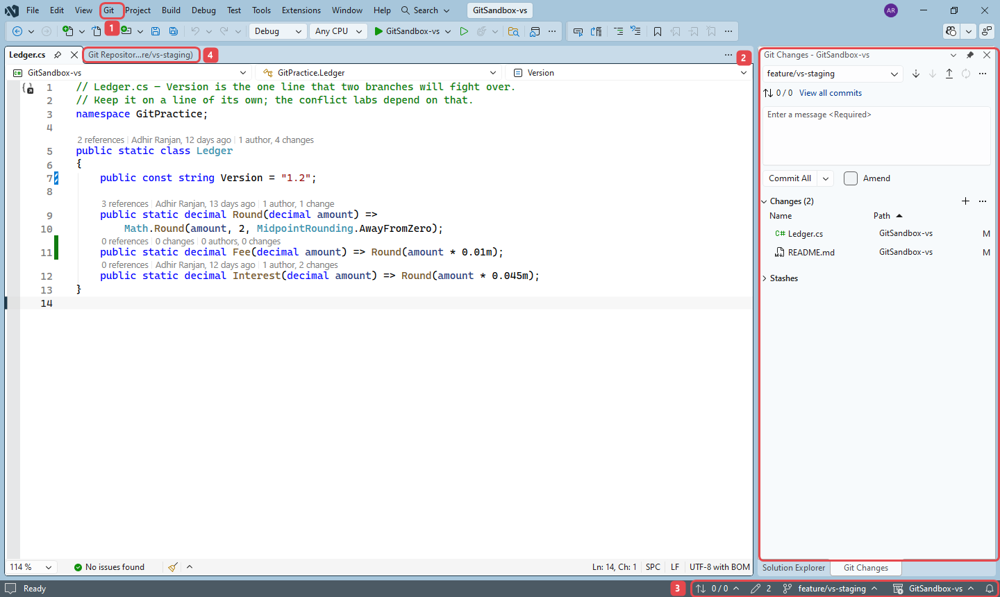](img/git-with-gitea/vs-overview.png)

*Visual Studio 2026 with a practice branch checked out. **(1)** the **Git** menu, **(2)** the **Git
Changes** window docked on the right, **(3)** the git part of the status bar, bottom-right,
**(4)** the **Git Repository** window, open here as a document tab. The numbers match the table.*

| # | Thing | How to open it | What it is, in one line |
|---|---|---|---|
| 1 | **Git menu** | The main menu bar, between *View* and *Project* | Everything you do once in a while: Clone, Fetch, Pull, Push, New Branch, Manage Remotes, Settings |
| 2 | **Git Changes** | **View → Git Changes** | What you have changed right now, and the button that commits it. You will spend 90% of your git time here |
| 3 | **Status bar** | Bottom-**right** of the window, always visible | Which branch you are on, and how many commits you have not pushed (↑) or not pulled (↓) |
| 4 | **Git Repository** | **View → Git Repository** | The history: every commit, every branch, as a graph. Where you go to merge, revert, reset or tag |

**If most of the Git menu is greyed out**, you have no folder or solution open. With nothing open
the menu offers only *Clone*, *Create Git Repository* and *Open Local Repository* — everything else
(Push, Pull, Fetch, New Branch, Manage Remotes, Repository Settings) needs a repository to act on.
**File → Open → Project/Solution**, or **Open Folder**, and the rest lights up. Same for the Git
Changes and Git Repository windows: they are empty until something is open.

[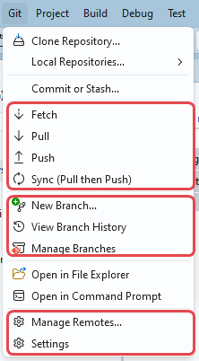](img/git-with-gitea/vs-git-menu.png)

*The **Git** menu with a repository open. Boxed: the four sync commands (**Fetch, Pull, Push,
Sync**), the branch commands, and **Manage Remotes… / Settings** — the three groups this guide uses.*

**Dock Git Changes and Git Repository where you can see both.** Drag one by its title bar onto the
docking guides. Most beginner confusion in the IDE comes from acting in one window and the
consequence appearing in the other — you stage in *Git Changes* and the commit shows up in *Git
Repository*, and if only one is visible it feels like nothing happened.

### 1.2 The Git Changes window, button by button

This is the window to learn first. Top to bottom:

| Part | What it does | The command behind it |
|---|---|---|
| Branch name, top-left | The branch you are committing **to**. Click it to switch | `git switch` |
| Toolbar arrow **1** (down, underlined) | **Fetch** — ask the server what is new, change nothing of yours. Always safe | `git fetch` |
| Toolbar arrow **2** (plain down) | **Pull** — fetch *and* merge it into your branch | `git pull` |
| Toolbar arrow **3** (up) | **Push** — send your commits to Gitea | `git push` |
| Toolbar arrow **4**, the circular **⟳** | **Sync** — **pull, then push, in one click.** *Not* Fetch, despite the refresh-looking icon. Avoid it while learning ([§3](#3-the-daily-loop-in-clicks)) | `git pull && git push` |
| **⋯** | Everything else — Manage Branches, Settings, Stash | |
| Message box | Your commit message. The **✨** asks Copilot to draft one from your changes | the `-m "…"` part |
| **Commit Staged ▾** | Commits. **The dropdown arrow matters — see [§3](#3-the-daily-loop-in-clicks)** | `git commit` |
| **Changes** list | Files you have edited but **not** chosen to commit yet | your working tree |
| **Staged Changes** list | Files you **have** chosen. Only these go into the next commit | the staging area |
| **+** on a file | Move it *down* into Staged Changes | `git add` |
| **−** on a staged file | Move it back *up*. Your edits are untouched | `git restore --staged` |
| **+** / **−** on a *header* | Do it to every file at once | `git add .` |
| Right-click a file → **Undo Changes** | **Throw your edits away permanently.** See the warning in [§7](#7-visual-studio-gotchas) | `git restore` |
| **▾** on the commit button → *Stash All…* | Put unfinished work on a shelf and clean the screen. **There is no separate Stash button** — it shares the commit dropdown (§3) | `git stash` |
| **Stashes** list, at the bottom of the panel | What is currently on the shelf, and **Drop All** | `git stash list` |

[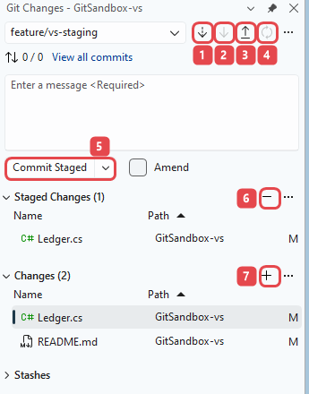](img/git-with-gitea/vs-git-changes.png)

*Git Changes in the middle of Lab V4. **1** Fetch · **2** Pull · **3** Push · **4** Sync (⟳) ·
**5** the commit button — it says **Commit Staged** because something is staged · **6** **−** on
the Staged Changes header (unstage all) · **7** **+** on the Changes header (stage all). Note
`Ledger.cs` in **both** lists: part of it is staged, part is not.*

> **Fetch and Sync sit next to each other and both look like "refresh".** Left to right the four
> arrows are **Fetch, Pull, Push, Sync** — hover to confirm before clicking, or use **Git → Fetch**
> from the menu, which cannot be misread. Clicking ⟳ when you meant Fetch does not just look at the
> server, it merges *and* pushes.

**If the commit button looks dead, look at the message box.** An empty message puts a red
**Required field.** line under it and disables the button. That is the reason nine times out of ten.

**The two lists are the whole idea.** *Changes* is everything you have touched; *Staged Changes*
is the shortlist you are about to commit. A file can appear in **both at once** — that is not a
bug, it means part of the file is on the shortlist and part is not. Lab V4 does this deliberately.

> **Do this now, it takes 20 seconds.** Open any file in your project, type a space, save
> (**Ctrl+S**). Watch it appear under *Changes*. Click **+** and watch it move to *Staged Changes*.
> Click **−** and watch it move back. Then **Ctrl+Z**, save again, and watch it disappear. You have
> just used the staging area, and nothing was committed.

### 1.3 The Git Repository window, pane by pane

**View → Git Repository.** Three panes:

| Pane | Holds | You use it to |
|---|---|---|
| **Left** | Branches, Remotes, Tags, **Stashes** | Switch, merge, delete, rename — all by **right-click** |
| **Middle** | The commit graph, newest at the top | Right-click any commit to Revert, Reset, Cherry-Pick or Tag it |
| **Right/bottom** | The selected commit's message, author, date and full diff | Read what a commit actually changed |

[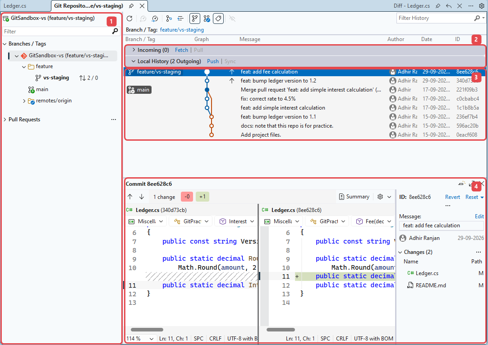](img/git-with-gitea/vs-git-repository.png)

*The whole window, left pane **expanded**. **1** the branch tree (`feature/vs-staging`, `main`,
`remotes/origin`) · **2** the **Incoming** and **Local History (2 Outgoing)** rows · **3** the graph,
newest first · **4** the details of the double-clicked commit: its diff, message, author and
**Changes (2)** — this is the Commit All commit from Lab V4, which swept up `README.md` too.*

> **⚠ The left pane is usually collapsed, and this is the single most confusing thing in the
> window.** By default you see only the graph, and the branch tree is a **narrow vertical strip of
> icons down the far-left edge**. Every instruction in this guide that says *"right-click the
> branch"* means that tree — so if there is no branch list on your screen, you are not missing a
> feature, it is folded up.
>
> Three ways to get it, any of which work:
>
> - Click the **›** chevron at the top of that left strip to expand the pane.
> - **Git → Manage Branches** — opens this window with the branch tree already showing. **Use this
>   one if in doubt.**
> - The **Branch / Tag:** dropdown above the graph filters *which* commits are drawn. It is a
>   filter, not the branch list — you cannot delete a branch from it.
>
> **The coloured branch badges in the graph are labels, not the branch list.** Right-clicking
> `feature/interest-rate` where it sits beside a commit gives you the *commit* menu (Revert, Reset,
> Tag), not the *branch* menu (Merge, Rename, Delete).

Two collapsible rows sit at the top of the middle pane, each with its own links:

- **Incoming (n)** — commits the server has that you do not. *This is what a Pull will bring you.*
  Its **Fetch** | **Pull** links are the safest place to fetch: they are words, not glyphs.
- **Local History (n Outgoing)** — commits you have that the server does not, with **Push** | **Sync**
  links. *This is what a Push will send.*

`Incoming (0)` means *as of your last fetch* — click **Fetch** to refresh the count before trusting
it.

**Those two lists are the most useful thing in the window and almost nobody notices them.** Looking
at *Incoming* before you pull is the difference between being surprised by a merge and expecting
one.

### 1.4 Reading the icons and the counts

[](img/git-with-gitea/vs-status-bar.png)

*Bottom-right of the window: `↑↓ 2 / 0` (outgoing / incoming), `✎ 0` (changed files), the branch,
and the repository.*

Visual Studio 2026 shows both counts behind one **↑↓** icon, **outgoing first**:

| You see | It means |
|---|---|
| `⑂ main` in the status bar | You are on branch `main` |
| `↑↓ 3 / 0` | You have **3 commits not yet pushed**. Your colleagues cannot see them |
| `↑↓ 0 / 2` | The server has **2 commits you have not pulled** (as of your last fetch). You are working on stale code |
| `↑↓ 0 / 0` | You are exactly level with the server |
| `✎ 2` | Two files changed and not yet committed |
| A file in **Changes** | Edited, not on the shortlist |
| A file in **Staged Changes** | On the shortlist for the next commit |
| A file in **both** | Partly staged — see §1.2 |
| **Unmerged Changes** appears | A conflict. Go to [§5](#5-conflicts-the-merge-editor) |
| A red ✕ or gold bar across Git Changes | Something failed. Read §1.5 |

**The first number is the one to watch.** "I pushed it" and "it is on the server" are different
claims, and `↑↓ 1 / 0` is the IDE telling you which one is true.

### 1.5 Where Visual Studio tells you things went wrong

Most git operations report failure quietly, and a beginner who does not know where to look
concludes that "nothing happened". There are three places:

1. **A small dialog, for the common push failure only.** When the server has commits you do not,
   Visual Studio 2026 pops up **Git - Push failed** and offers **Pull then Push**, **Pull** or
   **Cancel** (Lab V10 walks you into it).
2. **A gold, red or blue info bar** across the top of the **Git Changes** window (or the Git
   Repository window), with the short version and sometimes a link that fixes it.
3. **The Output window** — **View → Output** (**Ctrl+Alt+O**), then set **Show output from:** to
   **Source Control - Git**. This is the *full* text git printed, and it is usually the actual
   answer.

[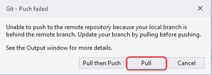](img/git-with-gitea/vs-push-failed.png)

*The one failure that gets a dialog. **Pull** (boxed) is the safe choice — it brings the other
person's commits down so you can look before pushing again. **Pull then Push** does both blind.*

[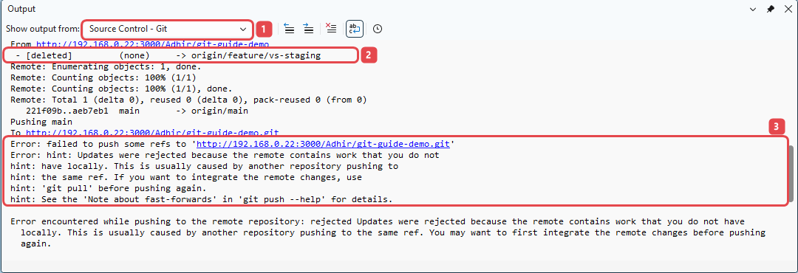](img/git-with-gitea/vs-output-git.png)

*The Output window with **Show output from:** set to **Source Control - Git** (1). Everything git
printed is here: the pruned branch from the last fetch (2), and the full rejection with git's own
hint to pull first (3).*

**Get into the habit now:** when a click seems to do nothing, look at **Output → Source Control -
Git** before anything else. Git's error messages are unusually good and very often contain the
exact fix.

---

## 2. One-time setup in Visual Studio

Do [§0.1](git-with-gitea-part0.md#01-before-you-start) first — identity and the three `git config` settings.

> **The confusion that catches every newcomer: Visual Studio has two different "accounts", and
> neither is the one git uses.**
>
> | What it is | Where | What it is for |
> |---|---|---|
> | Your **Visual Studio / Microsoft account** | Top-right of the IDE | Your VS licence, settings sync, Copilot. **Nothing to do with git** |
> | Your **git identity** | **Git → Settings → Git Global Config** | The name and email stamped on your commits (§0.1) |
> | Your **Gitea credentials** | Prompted on first push; stored in Windows Credential Manager | Permission to actually write to the server (§0.4) |
>
> They are three separate things. Signing into Visual Studio does **not** log you into Gitea, and
> being signed in as one person while committing as another is how commits end up attributed to
> the wrong name. **Git → Settings** is the one that decides whose name is on your work.

**Built-in terminal** — **View → Terminal** (`` Ctrl+` ``). Keep it open. Every verification box in
the labs is typed here, and when the UI does something you did not expect, `git status` and
`git log --oneline --graph --all` will tell you what actually happened.

**Credentials** — the first push prompts for a username and password. Enter `Adhir` and **paste
your Personal Access Token** as the password ([§0.4](git-with-gitea-part0.md#04-your-gitea-account-repo-and-token)), not
your account password. Windows Credential Manager stores it, and Visual Studio never asks again.

**Where VS keeps git settings** — **Git → Settings** opens **Options → Source Control → Git
Settings**, which has two pages:

| Panel | Scope | Equivalent |
|---|---|---|
| **Git Global Config** | every repo on this machine | `git config --global` — the file `C:\Users\<you>\.gitconfig` |
| **Git Repository Config** | this repo only | `git config --local` — the file `<repo>\.git\config`, and it **wins** over the global one |

Two options in there worth setting now, both under **Git Global Config**:

- **Rebase local branch when pulling: False** — matches the `pull.rebase false` from §0.1.
- **Prune remote branches during fetch: True** — otherwise branches deleted on the server linger
  in your branch list forever. Lab V13 shows you this happening.

[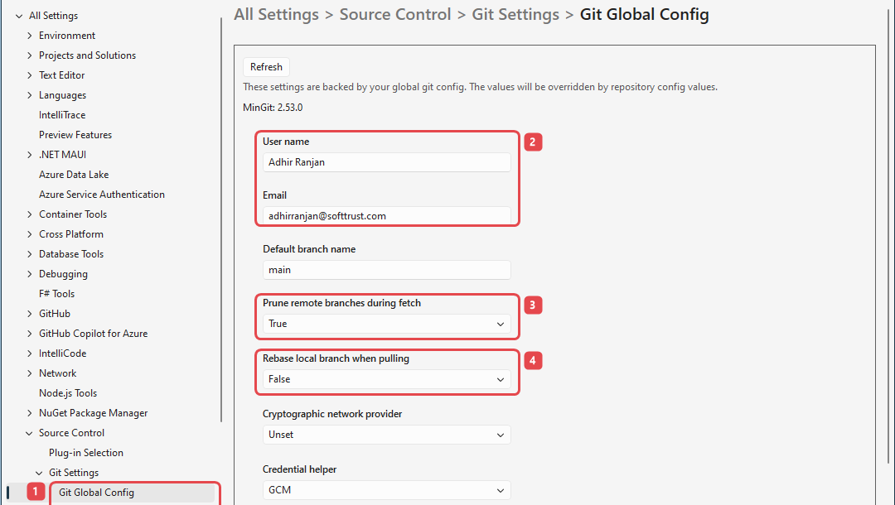](img/git-with-gitea/vs-git-global-config.png)

*Options → Source Control → Git Settings → **Git Global Config** (1). **User name** and **Email**
(2) are what get stamped on every commit. **Prune remote branches during fetch: True** (3) and
**Rebase local branch when pulling: False** (4) are the two settings above.*

---

## 3. The daily loop, in clicks

Six steps cover ~95% of your day in the IDE:

1. **Look.** Glance at **Git Changes** and at the **↑↓** counts in the status bar. This is
   `git status`, and it is already on screen — you get it free, which is the IDE's best trick.
2. **Get everyone else's work.** **Git → Pull** (or the **↓** arrow). Do this *before* you start,
   not after you finish.
3. **Branch.** Branch picker → **New Branch…** → `feature/something`. Always from an up-to-date
   `main`.
4. **Work, then review your own diff.** Double-click each file under *Changes* and read the
   side-by-side diff before you stage it. This is the step people skip and regret.
5. **Stage deliberately, then commit.** **+** on the files you mean, type a message
   ([§0.6](git-with-gitea-part0.md#06-commit-messages-and-branch-names)), click **Commit Staged** — *not* Commit All; see
   [§7](#7-visual-studio-gotchas).
6. **Push.** The **↑** arrow. Visual Studio 2026 pushes a brand-new branch straight away — there is
   no "publish" prompt — creates it on Gitea and links the two (that is `git push -u`).

[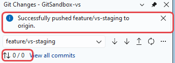](img/git-with-gitea/vs-pushed.png)

*After the first push of a new branch: "Successfully pushed feature/vs-staging to origin", and the
counts drop to `0 / 0`.*

Then repeat 4–6 as often as you like, and open the pull request in the browser when the branch is
ready. Small commits are better than big ones — they are easier to review and easier to undo when
one of them turns out to be wrong.

### The commit button renames itself, and that is the whole trick

**There is only one commit button, and Visual Studio changes its label depending on what you have
staged.** This catches everybody, because the guide you are reading (or a colleague) says "click
Commit All" and no such button is on screen.

| If *Staged Changes* is… | The button reads | Its **▾** dropdown offers |
|---|---|---|
| **not empty** | **Commit Staged** | *Commit Staged and Push*, *Commit Staged and Sync* |
| **empty** | **Commit All** | *Commit All and Push*, *Commit All and Sync* |

[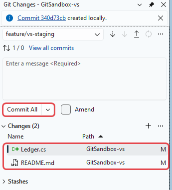](img/git-with-gitea/vs-commit-all.png)

*Right after committing the one staged line in Lab V4: Staged Changes is empty, so the button has
renamed itself **Commit All** — and it will take **both** files listed under Changes.*

So *Commit Staged* and *Commit All* are never offered at the same time — they are the same button,
renamed. **To get "Commit All", stage nothing** (or commit what you staged first, which empties the
list and renames the button for you).

What each one actually does:

| Button / option | What it commits | Then | Use it when |
|---|---|---|---|
| **Commit Staged** | **Only** what is in *Staged Changes* | stops | **Almost always.** You chose the files; it commits exactly those |
| **Commit All** | **Every tracked file you have edited** | stops | Nothing is staged and you genuinely want everything — after looking at the *Changes* list |
| **… and Push** | as above | pushes to Gitea | Never, while learning. Two steps behind one click |
| **… and Sync** | as above | **pulls, then pushes** | Never, while learning. It can start a merge you were not expecting |

**The same dropdown also holds the two stash commands** — there is no separate Stash button
anywhere in the window:

| Also in the dropdown | Does | Command |
|---|---|---|
| **Stash All (--include-untracked)** | Shelves everything, **including files git is not tracking yet**, and cleans the screen | `git stash -u` |
| **Stash All and Keep Staged (--keep-index)** | Shelves everything but **leaves your staged changes in place**, so you can build and test just the part you are about to commit | `git stash --keep-index` |

[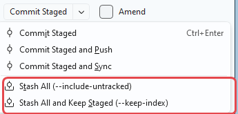](img/git-with-gitea/vs-commit-dropdown.png)

*The **▾** beside **Commit Staged**: the commit variants, then the two stash commands (boxed) —
there is no other Stash button.*

`Ctrl+Enter` in the message box runs whichever commit option the button is currently showing.

**Two things that trip people up:**

- **The button is greyed out until you type a message.** If it looks dead, look at the message box —
  it will say *"Enter a message \<Required\>"*. That is the only reason, nine times out of ten.
- **Whichever dropdown option you pick, Visual Studio remembers it** and makes it the default next
  time. Click *… and Sync* once and every later commit does that until you change it back. Glance
  at the button's label before every commit; it takes half a second.

> **The rule while you are learning: stage with `+`, then press *Commit Staged*.** If the button
> does not say *Commit Staged*, use the **▾** to pick it.

---

## 4. Branching and pull requests from Visual Studio

### Making and switching branches

The **branch picker** at the bottom-right of the status bar is the fastest thing in the whole UI:

| To do this | Click |
|---|---|
| See which branch you are on | It is written right there, always visible |
| Switch branch | Branch picker → double-click the branch |
| New branch | Branch picker → **New Branch…** — pick the **base** branch carefully in that dialog |
| See unpushed / unpulled counts | The ↑↓ numbers beside the branch name |
| Merge, rebase, rename, delete | **Git → Manage Branches** → right-click the branch in the tree. (Same window as **Git Repository**, whose left pane is collapsed by default — [§1.3](#13-the-git-repository-window-pane-by-pane)) |

**The "base" dropdown in the New Branch dialog matters more than the name.** A branch created from
whatever you happened to be standing on is the single most common way to end up with a pull request
full of somebody else's commits. Switch to `main` and pull *first*, then create the branch.

[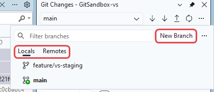](img/git-with-gitea/vs-branch-picker.png)

*The branch picker (this one is at the top of Git Changes; the status-bar one opens the same list):
a filter box, **New Branch**, and **Locals** / **Remotes** tabs. Double-click a branch to switch.*

[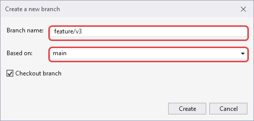](img/git-with-gitea/vs-new-branch.png)

*The New Branch dialog. **Based on:** defaults to the branch you are standing on — make sure it
says `main`. Leave **Checkout branch** ticked so you move onto the new branch.*

### Then leave the IDE

```
In Visual Studio          →   branch, commit, push
In the Gitea web UI       →   create the PR, review it, merge it
In Visual Studio          →   switch to main, pull, delete the branch
```

That middle step never moves into the IDE for Gitea, no matter which extension you find. Budget
for the browser tab; it is where code review happens anyway, and
[§0.5](git-with-gitea-part0.md#05-pull-requests-the-part-that-is-not-git) is the whole of it.

**Pushing a branch changes nothing about `main`.** Your branch sits on the server *beside* main,
and the two are unrelated until something merges them. That something is the pull request.

### After the merge, clean up

1. Branch picker → **`main`**.
2. **↓ Pull** — brings the merge Gitea made down to you.
3. **Git → Manage Branches** → right-click your feature branch → **Delete**. VS refuses if the
   branch is not merged, which is the safety net working, and greys the item out for the branch you
   are currently on — hence step 1.
4. **Git → Fetch** with pruning on (§2) — drops the stale remote-tracking entry.

[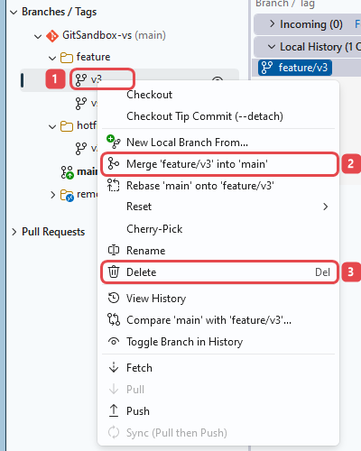](img/git-with-gitea/vs-branch-context.png)

*Right-click a branch in the tree (1): **Merge 'feature/v3' into 'main'** (2) is how Lab V6 merges;
**Delete** (3) is step 3 here. The menu always names the branch you clicked and the one you are on.*

Gitea can delete the remote branch for you at merge time — take the offer. Stale branches pile up
fast and nobody ever cleans them later.

---

## 5. Conflicts — the Merge Editor

A conflict means two branches changed the *same lines* and git will not guess. It is routine, not
a failure — and this is the one job the IDE genuinely does better than the command line.

The three shapes a merge can take — Lab V6 produces all three, with these names:

```
  FAST-FORWARD — main has not moved, so git just slides the label forward

    before:  A ── B            ◄ main
                  └── C ── D   ◄ feature/v3
    after:   A ── B ── C ── D  ◄ main

  MERGE COMMIT — both sides moved on; git joins them with a new commit M

    before:  A ── B ── E       ◄ main
                  └── C ── D   ◄ feature/v3
    after:   A ── B ── E ───── M   ◄ main     (M has two parents: E and D)
                  └── C ── D ──┘

  CONFLICT — both sides changed the SAME line; git stops before M and asks you

    B (where they split)  Version = "1.1"
    main (hotfix/v21)     Version = "2.1" ┐
    feature/v3            Version = "3.0" ┘ you pick one, or write a third
```

When you merge a branch from the branch tree, Visual Studio 2026 first shows a **Merge branches**
dialog that already warns about *potential conflicts*. That is a forecast, not an error — click
**Merge**.

[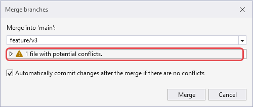](img/git-with-gitea/vs-merge-dialog.png)

*The warning (boxed) means git has spotted a file both branches changed. You still go ahead.*

When a merge or pull conflicts:

1. **Git Changes** lists the conflicted files under **Unmerged Changes**. Double-click one.
2. Three panes open: **Incoming** (left, the branch coming in), **Current** (right, where you are
   standing), **Result** (bottom, what you will actually commit).
3. Tick the checkbox on the side you want, per conflict — or **click into the Result pane and type**,
   when the answer is a mix of both or something new entirely. The Result pane is a normal editor.
4. **Accept Merge** when the file has no conflicts left. Repeat for each file.
5. Back in **Git Changes** the resolved file is under *Staged Changes* and the button reads
   **Commit Staged**. **The message box is empty** — type one (for example `Merge branch
   'feature/v3'`), then click **Commit Staged**. That commit *is* the merge commit.

<figure class="clip"><video controls preload="none" poster="img/git-with-gitea/rec-conflict-poster.png" src="img/git-with-gitea/rec-conflict.webm"></video></figure>

*The whole resolution in 40 seconds, stepped through the real screenshots of Lab V6 below — right-click merge, the warning, Unmerged Changes, the Merge Editor before and after, the empty message box, and the graph that results.*

[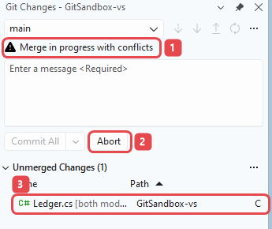](img/git-with-gitea/vs-conflict-unmerged.png)

*Step 1. "Merge in progress with conflicts" (1), the **Abort** button (2), and `Ledger.cs` under
**Unmerged Changes** with a **C** (3). A gold bar across the Git Repository window says the same.*

[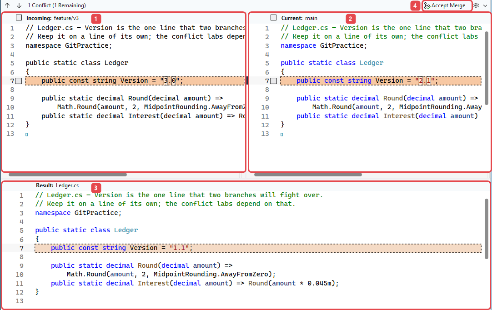](img/git-with-gitea/vs-merge-editor.png)

*Step 2. **Incoming** `feature/v3` says `"3.0"` (1), **Current** `main` says `"2.1"` (2), and
**Result** (3) still shows the old `"1.1"` until you choose. **Accept Merge** (4) is top-right;
"1 Conflict (1 Remaining)" is top-left.*

[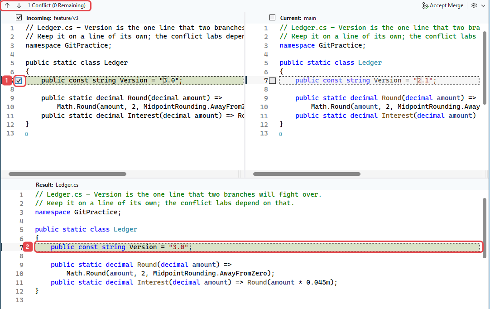](img/git-with-gitea/vs-merge-editor-picked.png)

*Step 3. Ticking the Incoming checkbox (1) writes `"3.0"` into Result (2), and the counter drops to
"1 Conflict (0 Remaining)" (top-left).*

[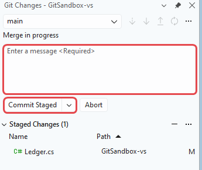](img/git-with-gitea/vs-merge-commit.png)

*Step 5. After **Accept Merge**: Merge in progress, the file staged, **Commit Staged** — and an
empty message box you must fill.*

**Then build and run it.** A conflict resolved so it compiles is not the same as a conflict
resolved correctly — the Merge Editor happily produces code that builds and is wrong. This is
exactly why the sample app prints its version number, and why Lab V6 ends with **Ctrl+F5**.

To bail out entirely: the **Abort** button beside the commit button in **Git Changes** (it appears
only while a merge is in progress). Equally safe, and it puts everything back exactly as it was.

> **The Merge Editor is a better *conflict* tool, not a better *judgement* tool.** It makes the
> mechanics painless; deciding which version is correct is still yours.

---

## 6. Command → Visual Studio, side by side

Keep this table. When you read a git answer online, this is how you translate it.

| Command (Part 2) | In Visual Studio |
|---|---|
| `git status` | The **Git Changes** window, continuously |
| `git diff` | Double-click any file under *Changes* → side-by-side diff |
| `git diff --staged` | Double-click a file under *Staged Changes* |
| `git add <file>` | The **+** beside the file (tooltip: *Stage*) |
| `git add .` | **+** on the *Changes* header |
| `git add -p` | Select lines in the diff → right-click → **Stage Selected Range** |
| `git add -f <ignored>` | **No UI.** Terminal — see Lab V11 |
| `git restore --staged` | The **−** beside a staged file (*Unstage*) |
| `git restore <file>` | Right-click the file → **Undo Changes**. **Destructive** — those edits were never in git |
| `git commit -m` | Type the message, click **Commit Staged** |
| `git commit -am` | **Commit All** — the same button, renamed when nothing is staged. It stages every tracked file. Read the label (§3) |
| `git commit --amend` | Tick **Amend** above the message box before committing. Unpushed commits only |
| `git push` | The **↑** arrow, or **Git → Push** |
| `git pull` | The **↓** arrow, or **Git → Pull** |
| `git fetch` | **Git → Fetch**, the **Fetch** link on the *Incoming* row of **Git Repository**, or the first (underlined-down) arrow in Git Changes. **Not ⟳ — that is Sync** (§1.2). Safe — look before you leap |
| `git log HEAD..origin/main` | After a Fetch, **Git Repository** → the **Incoming** / **Outgoing** lists. The ↑↓ counts on the branch picker are the same thing in miniature |
| `git switch <branch>` | Branch picker (status bar) → double-click the branch |
| `git switch -c <name>` | Branch picker → **New Branch…**, or **Git → New Branch…** |
| `git merge <branch>` | **Git → Manage Branches** → right-click the branch → **Merge \<branch\> into current** |
| `git merge --abort` | **Abort**, in Git Changes, while the merge is in progress |
| `git branch -d` | **Git → Manage Branches** → right-click the branch → **Delete** |
| `git push -u origin <b>` | Just **Push** a new branch — VS 2026 creates it on Gitea and sets the upstream for you, no prompt |
| `git push origin --delete <b>` | **Git → Manage Branches** → expand **Remotes** → `origin` → right-click → **Delete** |
| `git stash -u` | **Git Changes** → the commit button's **▾** → *Stash All (--include-untracked)* |
| `git stash --keep-index` | same dropdown → *Stash All and Keep Staged* |
| `git stash list` | The **Stashes** section at the bottom of **Git Changes** (also in **Git Repository**) |
| `git stash pop` | **Stashes** → right-click the stash → *Pop* |
| `git log` | **Git Repository** window — the graph on the left, commit details on the right |
| `git blame` | Right-click in the editor → **Git → Blame (Annotate)**. CodeLens above each method shows the same thing inline |
| `git revert <sha>` | **Git Repository** → right-click the commit → **Revert**. The safe undo for pushed work |
| `git reset --mixed` | Right-click the commit → **Reset → Keep Changes**. Files return to *Changes*, **unstaged** |
| `git reset --soft` | **No UI** — VS offers only *Keep Changes* (`--mixed`) and *Delete Changes* (`--hard`). Terminal, if you want the changes back **staged** |
| `git reset --hard` | Right-click the commit → **Reset → Delete Changes**. Read §7 before you touch this |
| `git cherry-pick` | Right-click a commit on another branch → **Cherry-Pick** |
| `git tag -a` | Right-click a commit → **New Tag…**; push it from the **Tags** node |
| `git remote -v` / `set-url` | **Git → Manage Remotes** |
| `git clone` | **Git → Clone Repository…** |
| `git init` | **Git → Create Git Repository…** — read §7 first, it commits for you |
| `git config --global` | **Git → Settings → Git Global Config** |
| `git config --local` | **Git → Settings → Git Repository Config** |
| `git reflog` | **No UI.** Terminal. This is why §2 says keep it open |
| `git bisect` | **No UI.** Terminal |
| Open a PR | **No UI for Gitea.** Push, then the browser ([§0.5](git-with-gitea-part0.md#05-pull-requests-the-part-that-is-not-git)) |

---

## 7. Visual Studio gotchas

Read these once now. Each one is a real surprise that the labs will walk you into deliberately.

- **"Commit All" is what the button becomes when you have staged nothing**, and it stages every
  tracked file first — so an unrelated half-finished edit rides along into your commit. If you want
  a focused commit, stage deliberately with **+** so the button says **Commit Staged**. Read the
  button's label before every commit; it is the only thing telling you which of the two you are
  about to do (§3). **Lab V4** makes this happen to you on purpose.
- **"Create Git Repository" makes the first commit for you.** One click does `git init`, stages
  everything not ignored, and commits it — the staging area never appears. Convenient, and the
  reason a beginner can use VS for a month without knowing the staging area exists.
- **Do not let it write the `.gitignore`.** The Visual Studio 2026 *Create Git Repository* dialog
  no longer offers a `.gitignore` template (only a *License template* — leave that at **None**),
  but **Git → Settings → Git Repository Config** has an **Add .gitignore** button that writes VS's
  generic one. Do not click it: §0.3 already gave you the right file. For the real
  solution the rule is firmer: [this repo's `.gitignore`](../../.gitignore) is deliberately written
  to catch `appsettings.Development.json`, `*.pfx`, `App_Data/` and `docker-data/`. Keep ours.
  (`.vs/` and `*.user` are already covered by it.)
- **"Reset → Delete Changes" is `git reset --hard`.** A destructive command, two clicks deep in a
  context menu, with no scary confirmation. Commit before you experiment and it cannot hurt you.
- **"Undo Changes" on a file is unrecoverable** — the edits were never committed, so nothing in
  [§15](git-with-gitea-part3.md#15-oh-no-the-recovery-section) can bring them back. The only genuinely irreversible
  operations in git are the ones on work git never saw.
- **There is no reflog in the UI.** The safety net that makes git forgiving has no button anywhere
  in the IDE. Lab V8 walks you into this wall on purpose so it is not a surprise at 3am.
- **VS finds `.git` by walking upward**, so it works whether you open the `.slnx`, a `.csproj`, or
  the folder. One repo, many solutions is fine.
- **A branch deleted on the server lingers in your list** until a *pruning* fetch. Turn on
  **Prune remote branches during fetch** (§2).
- **Copilot commit messages** (the ✨ icon on the message box) read your staged diff and work
  against any server, Gitea included. Treat the result as a first draft — it describes *what*
  changed; §0.6 asks you to say *why*.
- **Multi-repo:** VS can have several repositories active at once (**Git → Local Repositories**).
  Useful later; irrelevant today.

---

### 7.1 "It did not work" — the beginner troubleshooting table

Every one of these is normal and none of them means you have broken anything. When in doubt, read
**Output → Source Control - Git** first (§1.5).

| What you see | What is actually happening | What to do |
|---|---|---|
| <span id="ts-greyed"></span>**Most of the Git menu is greyed out** | No folder or solution is open, so there is no repository to act on | **File → Open → Project/Solution**, or **Open Folder** |
| <span id="ts-blank"></span>**Git Changes / Git Repository are blank** | Same cause | Open the folder or solution first |
| <span id="ts-unsaved"></span>**Git Changes is empty but I edited a file** | You have not saved it | **Ctrl+S**. Git only sees the file on disk |
| <span id="ts-commit-grey"></span>**The Commit button is greyed out** | Nothing is staged, or the message box is empty | Stage something with **+**, and type a message |
| <span id="ts-not-on-gitea"></span>**My commit did not appear on Gitea** | Committing is local. Nothing reaches the server until you push | Press **↑**. Check the status bar reads `↑↓ 0 / 0` |
| <span id="ts-push-failed"></span>**"Git - Push failed" dialog** | Somebody pushed while you were working | Click **Pull** in the dialog, look at what arrived, then **↑ Push** again. This is routine — Lab V10 |
| <span id="ts-password"></span>**It keeps asking for a password** | The stored credential is stale or wrong | Windows **Credential Manager** → remove the `git:http://192.168.0.22:3000` entry, push again, paste a fresh PAT (Lab V13) |
| <span id="ts-auth"></span>**"Authentication failed"** | You typed your Gitea *password* instead of a token | Generate a PAT ([§0.4](git-with-gitea-part0.md#04-your-gitea-account-repo-and-token)) and paste that as the password |
| <span id="ts-both-lists"></span>**A file is in Changes *and* Staged Changes** | Part of it is staged. Not a bug | §1.2, and Lab V4 |
| <span id="ts-unmerged"></span>**"Unmerged Changes" appeared** | A conflict | [§5](#5-conflicts-the-merge-editor). Or **Abort** in Git Changes to undo the whole thing |
| <span id="ts-commit-all"></span>**I clicked Commit All and it took files I did not want** | That is what Commit All does | Right-click the commit → **Reset → Keep Changes**, then stage properly (Lab V4) |
| <span id="ts-undo-gone"></span>**I clicked "Undo Changes" and my work is gone** | It was never committed, so git never had a copy | It is genuinely gone. This is the one unrecoverable action — §15 |
| <span id="ts-reset-hard"></span>**My commits vanished after Reset → Delete Changes** | The branch moved; the commits still exist | **View → Terminal**: `git reflog`, then `git reset --hard HEAD@{1}` (Lab V8) |
| <span id="ts-stale-branch"></span>**A branch I deleted on Gitea is still listed** | A stale cache from your last fetch | **Git → Fetch** with pruning on (§2) |
| <span id="ts-no-pr-button"></span>**I cannot find the button to make a pull request** | There is not one, for Gitea | Push, then the browser ([§0.5](git-with-gitea-part0.md#05-pull-requests-the-part-that-is-not-git)) |
| <span id="ts-scared"></span>**Everything looks wrong and I am scared** | Almost certainly recoverable | Do **not** delete the folder. Commit what you have, then §15 |

### 7.2 Keyboard shortcuts worth knowing

| Keys | Does |
|---|---|
| **Ctrl+S** | Save. Git cannot see an unsaved file |
| **Ctrl+Shift+B** | Build |
| **Ctrl+F5** | Run without debugging — how several labs verify themselves |
| **Ctrl+`** | Open the built-in **Terminal** |
| **Ctrl+Alt+O** | Open the **Output** window (then pick *Source Control - Git*) |
| **Ctrl+0, Ctrl+G** | Focus **Git Changes** (press Ctrl+0, release, then Ctrl+G) |
| **Ctrl+0, Ctrl+R** | Focus **Git Repository** |
| **Ctrl+Enter** | Commit, when the message box has focus |
| **Ctrl+Z** | Undo in the editor — *not* a git command, and it will not undo a commit |

---

## 8. The Visual Studio labs

Sixteen labs, roughly two and a half hours. **VA and VB** stand alone — their own folder and their
own Gitea repo. **V0–V13** all run in `E:\adtemp\hands_on\git\GitSandbox-vs\` against the Gitea repo
`git-practice-vs`. They assume you have read [§0.3](git-with-gitea-part0.md#03-the-sample-project-every-file-printed-here)
and can run the sample app.

**What you are about to learn, and in what order** — so you can see where this is going:

| Lab | You will learn | Why it matters on real work |
|---|---|---|
| **VA–VB** | Put a folder you already have on Gitea; get a local copy of a Gitea repo | The two things you need on day one — a new project, a new PC |
| **V0–V2** | Set your identity, make a repository, push it to Gitea | Getting your work off your laptop |
| **V3–V4** | The staging area; stage whole files, then individual lines | Making one commit mean one thing |
| **V5** | Branch → push → pull request → merge → clean up | **The lab that is the actual job.** Copy this one |
| **V6** | Cause a conflict, resolve it in the Merge Editor, and abort one | The thing people fear; an hour from now you will not |
| **V7–V8** | Amend, unstage, discard, revert, reset — and recover work you destroyed | Being able to undo anything means you can experiment |
| **V9** | Stash: park unfinished work when something urgent lands | The interruption that happens weekly |
| **V10** | Two people editing at once; a rejected push, and what to do | What every normal working day looks like |
| **V11–V13** | `.gitignore`, tags and releases, token rotation, stale branches | The housekeeping nobody teaches you |

**Only need to get a folder onto Gitea, or a copy off it?** VA and VB — fifteen minutes.

**If you only have twenty minutes, do V0, V1, V2 and V5.** That is a complete working loop and it
is enough to contribute to a real repository. The rest turns "I can follow the steps" into "I know
what happened".

> **How to use these.** Do V0–V13 **in order** — each one leaves the repo in the state the next one
> expects. After every step, look at **Git Changes** and at the **Git Repository** graph and say to
> yourself what just moved. Each lab ends with a **Verify** you can check without help; if it does
> not match, stop and re-read the lab rather than pressing on.
>
> **And yes, several of these commit straight to `main`** — which §0.6 tells you never to do. That
> is deliberate: you are alone in a throwaway repo with no reviewer and no branch protection, and
> there is nothing to branch *from* until the first commit exists. **Lab V5 is the one that shows
> the real workflow** — branch, push, pull request, merge, delete — and that is the one to copy on
> `TflCbsNet10Sol`.

---

### Lab VA — Put an existing folder on Gitea

The situation: a folder of work on your disk — a project, a solution, a set of scripts — that has
never been in git and should now live on Gitea. **This lab and the next stand alone:** they use
their own folder and their own Gitea repo, so do them first, on their own, or skip to V0.

**Before you start:** your name and email are set ([§0.1](git-with-gitea-part0.md#01-before-you-start)) and you
have a token ([§0.4](git-with-gitea-part0.md#the-token-never-your-password)).

1. **Make a stand-in for "the folder you already have".** **File → New → Project… → Console App** →
    name `MyFolder`, location `E:\adtemp\hands_on\git`, tick **Place solution and project in the same
    directory** → **Create** (do **not** let it create a git repo). Then **Ctrl+Shift+B** once, so
    `bin\` and `obj\` exist — exactly like a real folder somebody has been working in.

    *Doing this for real? Open your own folder instead — **File → Open → Project/Solution**, or
    **File → Open → Folder** if it has no solution — and carry on from step 2.*

2. **Decide what must NOT go up — before git sees anything.** Step 4 commits every file it finds,
    with no list to review, so the ignore file has to exist first. Right-click the project →
    **Add → New Item… → Text File** → name it `.gitignore` → paste:

        bin/
        obj/
        .vs/
        *.user

    On a real folder, also add anything holding a password or a connection string
    (`appsettings.Development.json`, `*.pfx`) — [§17](git-with-gitea-part3.md#17-graduating-the-real-repository)
    has the checklist.

3. **In Gitea, make an empty repo:** **+** → **New Repository** → name `git-practice-folder`,
    **Private**, **Initialize Repository left unticked** (the form is pictured in
    [§0.4](git-with-gitea-part0.md#the-practice-repo)). An initialised repo already has a commit of its own, and your
    first push would be rejected.
4. **Git → Create Git Repository…** → under **Other** choose **Local** → **Local path** is your
    folder → **License template: None** → **Create**. Visual Studio runs `git init`, stages
    everything not ignored, and makes the first commit.

    [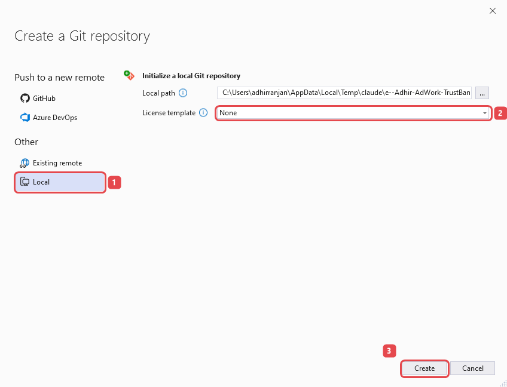](img/git-with-gitea/vs-create-repo.png)

    *Other → **Local** (1), **License template: None** (2), **Create** (3). Your Local path will
    read `E:\adtemp\hands_on\git\MyFolder`. **Existing remote**, just above Local, is a shortcut that
    also connects the folder to a Gitea repo in the same dialog; this lab takes the two visible
    steps so you see each one.*

5. **Git → Manage Remotes…** → in the **Remotes** grid add `origin` with
    `http://192.168.0.22:3000/Adhir/git-practice-folder.git` for **Fetch** and **Push** — exactly as in
    [Lab V2](#lab-v2-connect-to-gitea-and-push) step 1. If the grid will not take a new row, the
    terminal does the same thing (**View → Terminal**):

        git remote add origin http://192.168.0.22:3000/Adhir/git-practice-folder.git

6. **Git → Push.** If asked: username `Adhir`, password = **your token**. The status bar settles
    at `↑↓ 0 / 0`.

**Verify:** refresh the repo page in Gitea — `.gitignore`, `MyFolder.csproj`, `Program.cs` and the
solution file are there, and **no `bin` or `obj`**.

**What git actually did** — **View → Terminal**:

```bash
git log --oneline               # one commit
git show --stat HEAD            # the files in it — no bin/ or obj/
git remote -v                   # origin, twice (fetch and push)
git status -sb                  # "## main...origin/main" — linked to Gitea
```

**Understand:** nothing was copied or moved — the folder became a repository *where it stands*,
by gaining a hidden `.git` folder. The order is the whole lesson: **ignore file → repository →
remote → push**. Get the first one wrong and the build output, or a password, is in the history
for good ([Lab V11](#lab-v11-gitignore-and-the-mistake-it-does-not-fix) shows the clean-up).

> **Stuck?** **Create Git Repository** greyed out → [nothing is open](#ts-greyed). The push is
> rejected → the Gitea repo was created *with* a README; delete it and create it again, empty.
> `bin` or `obj` on Gitea → `.gitignore` was missing or misnamed (`.gitignore.txt`) when you
> clicked Create; untrack them as in [Lab V11](#lab-v11-gitignore-and-the-mistake-it-does-not-fix).
> Asked for a password again and again → [stale credential](#ts-password), or
> [you typed your password, not the token](#ts-auth).

---

### Lab VB — Get a local copy of a Gitea repo

The opposite direction: the repo is on Gitea and you want it on your disk — your own work on a
second PC, or a colleague's project. In git this is **cloning**, and it is one dialog.

1. **Find the URL.** Gitea → the `git-practice-folder` repo from Lab VA → the blue **Code**
    button → copy the **HTTP** URL: `http://192.168.0.22:3000/Adhir/git-practice-folder.git`. (The Code button is pictured in
    [§14.3](git-with-gitea-part3.md#143-the-gitea-web-ui-mapped-to-git-concepts).)
2. **File → Close Solution**, so the two copies cannot be confused.
3. **Git → Clone Repository…**
    - **Repository location:** the URL from step 1
    - **Path:** `E:\adtemp\hands_on\git\MyFolder-copy` — a folder that does **not** exist yet;
      the clone creates it
    - **Clone.**

    [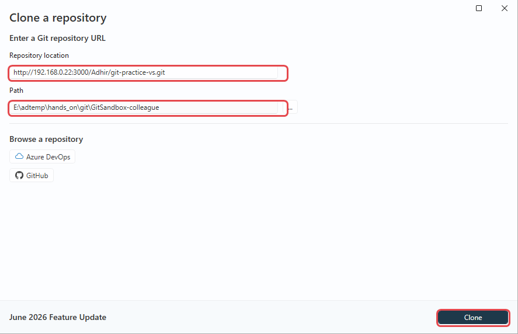](img/git-with-gitea/vs-clone.png)

    *The Clone dialog, shown here with Lab V10's values — yours are the URL and path above. The
    Azure DevOps / GitHub buttons are for those services only; ignore them.*

4. Visual Studio opens the copy. If Solution Explorer shows a folder view, double-click the
    `.slnx` file to open it as a solution.
5. **Look before you touch anything:** **Git Changes** is empty, the status bar reads
    `↑↓ 0 / 0` on `main`, and **View → Git Repository** shows the same single commit as Gitea's
    **Commits** page.
6. **Ctrl+Shift+B.** `bin\` and `obj\` are rebuilt on this machine — and still do not appear in Git
    Changes, because the `.gitignore` came down with everything else.

**Verify:** the short commit id in **Git Repository** matches the one on Gitea's **Commits** page,
and Git Changes stays empty after the build.

**What git actually did:**

```bash
git remote -v                   # origin is already set — the clone did it
git status -sb                  # "## main...origin/main" — already linked, no push -u needed
git log --oneline               # the history came down, not just the files
```

**Understand:** a clone is the whole repository — every commit, every branch — plus `origin`
pointing back at Gitea and `main` linked to `origin/main`. That is why Lab VA needed three steps
(repository, remote, push) and this one needed one. From here the copy works like any other: edit,
commit, **Push** — and **Pull** to get what others pushed.

**When you are done:** nothing later uses these two. Remove `MyFolder` and `MyFolder-copy` from
**Git → Local Repositories**, delete both folders, and delete `git-practice-folder` in Gitea
(**Settings → Delete This Repository**) — or keep them to experiment in.

> **Stuck?** Clone refuses because the folder exists → **Path** must be a new, non-existent folder;
> pick another name. "Repository not found" → check the URL against Gitea's **Code** button; the
> repo is private, so the account you sign in with needs access. Asked for a password →
> [token, not password](#ts-auth). Never clone into a folder that is itself inside another
> repository — clone next to it.

---

### Lab V0 — Identity, and an empty repo on Gitea

**In Visual Studio:**

> **Nothing is open yet, and that is fine.** *Global* settings are not tied to a repository, so
> this works from the start window. If your Visual Studio opened straight to the start dialog with
> no menu bar, click **Continue without code** first. (If you would rather have something open,
> do step 1 of Lab V1 and come back — the order does not matter.)

1. **Git → Settings → Git Global Config** (screenshot in [§2](#2-one-time-setup-in-visual-studio)).
   Confirm **User name** = `Adhir Ranjan` and **Email** = `adhirranjan@softtrust.com`. Fix them if
   not. This is stamped on every commit you will ever make, and it cannot be corrected later
   without rewriting history.
2. While you are here, set **Rebase local branch when pulling** = *False* and **Prune remote
   branches during fetch** = *True*.

**In the terminal** (**View → Terminal**) — these three have no reliable UI:

```bash
git config --global core.autocrlf true        # Windows line endings: check out CRLF, store LF
git config --global pull.rebase false         # a diverged pull merges, never rewrites your commits
git config --global init.defaultBranch main   # new repos start on `main`, not `master`
git config --global --list                    # print everything — confirm name, email and the three above
```

**In the Gitea web UI:** **+** (top right) → **New Repository**.

- Name: `git-practice-vs`
- Visibility: Private
- **Leave "Initialize repository" UNCHECKED.**

(Both Gitea screens — the form and the empty-repo page you land on — are pictured in
[§0.4](git-with-gitea-part0.md#04-your-gitea-account-repo-and-token).)

**Verify:** Gitea shows an empty-repo page with setup instructions and a clone URL, and
`git config --global --list` lists your name, your email and the three settings above.

> **Stuck?** Git menu greyed out, or no **Settings** in it → [open a folder or click *Continue without code*](#ts-greyed). Ticked **Initialize Repository** on Gitea by mistake → delete the repo (**Settings → Delete This Repository**) and create it again, empty.

---

### Lab V1 — Build the sample project and make your first commit

1. Create the project exactly as in [§0.3.1](git-with-gitea-part0.md#031-create-the-folder-and-project) — Console App,
   project name `GitSandbox-vs`, location `E:\adtemp\hands_on\git`, **Place solution and project in the
   same directory** ticked, .NET 10.0.
2. Replace the file contents with the six listings in
   [§0.3.2](git-with-gitea-part0.md#032-the-six-files). Add `Ledger.cs` and `Account.cs` with **right-click the project →
   Add → Class…**, and `README.md` / `.gitignore` with **Add → New Item… → Text File**.
3. **Ctrl+F5.** You must see `ledger v1.0` and `SB-0001 A. Ranjan: 1250.00`. Do not continue
   until you do.
4. **Git → Create Git Repository…**
    - In the left column, under **Other**, choose **Local** — you are not connecting to Gitea yet.
    - **Local path** is already your project folder; leave it.
    - **License template: None.** (Visual Studio 2026 no longer offers a `.gitignore` template here —
     good, because you already wrote one; see the gotcha in §7.)
    - **Create.**

   [](img/git-with-gitea/vs-create-repo.png)

   *Other → **Local** (1), **License template: None** (2), **Create** (3). The Local path shows
   wherever your solution lives — `E:\adtemp\hands_on\git\GitSandbox-vs` for you.*

5. Open **View → Git Changes** and **View → Git Repository**, and dock them side by side.

**Look at what just happened.** Git Changes is *empty*, and Git Repository shows **one commit**
already. Visual Studio ran `git init`, staged everything your `.gitignore` did not exclude, and
committed it — all from that one button, without ever showing you the staging area.

That is convenient and it is also the thing to be aware of: **the IDE will happily commit for you
before you have understood what a commit is.** Lab V3 slows that down deliberately.

Now confirm the `.gitignore` did its job — because it was on disk *before* `git init` ran, `bin/`
and `obj/` were never tracked at all:

**What git actually did** — **View → Terminal**:

```bash
git log --oneline               # exactly one commit
git show --stat HEAD            # the files it contains: six, and no bin/ or obj/
git status                      # "nothing to commit, working tree clean"
```

**Verify:** one commit, six files in it, and `git show --stat HEAD` mentions neither `bin/` nor
`obj/` even though both exist on disk from step 3.

**Understand:** a commit is a snapshot plus a message, an author and a parent. Your repository now
has exactly one, and it has no connection to Gitea whatsoever — everything so far is local.

> **Stuck?** **Create Git Repository** greyed out → [nothing is open](#ts-greyed). `bin/` or `obj/` in the first commit → `.gitignore` was missing or misnamed (`.gitignore.txt`) when you clicked Create; untrack them the way [Lab V11](#lab-v11-gitignore-and-the-mistake-it-does-not-fix) does. The app does not print `ledger v1.0` → recheck the listings in [§0.3.2](git-with-gitea-part0.md#032-the-six-files).

---

### Lab V2 — Connect to Gitea and push

1. **Git → Manage Remotes…** In Visual Studio 2026 this opens **Options → Git Repository Config**;
   remotes live in the **Remotes** grid at the bottom of that page (Name / Fetch / Push). Add one:
    - **Name:** `origin` (just a nickname, not a keyword — but everyone uses it)
    - **Fetch** and **Push:** `http://192.168.0.22:3000/Adhir/git-practice-vs.git`

   If your build of Visual Studio gives you no way to add a row to that grid, do this one step in
   **View → Terminal** instead — it has exactly the same effect, and the grid shows `origin` as
   soon as you reopen the page:

        git remote add origin http://192.168.0.22:3000/Adhir/git-practice-vs.git

2. **Git → Push** (or the **↑** arrow).
3. A credential prompt appears. **Username:** `Adhir`. **Password: paste your Personal Access
   Token** ([§0.4](git-with-gitea-part0.md#04-your-gitea-account-repo-and-token)) — *not* your account password.
4. Watch the status bar. When it finishes, the **↑↓** counts read `0 / 0`.

[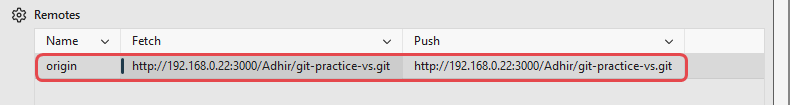](img/git-with-gitea/vs-manage-remotes.png)

*The **Remotes** grid after this lab: `origin`, with the same Gitea URL for Fetch and Push.*

**Verify:** refresh the repo page in Gitea. Your six files are there, with your commit message and
your name against it. If the name is wrong, fix **Git → Settings → Git Global Config** now; it
only applies to *future* commits.

[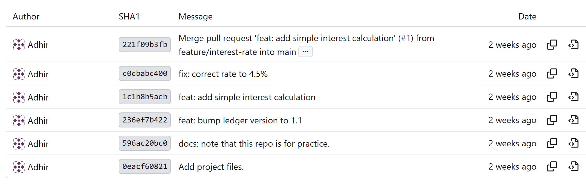](img/git-with-gitea/g-commits.png)

*The repo's **Commits** page: every commit with its author, message, short SHA and time. The name
here comes from **Git Global Config**, not from your Gitea login.*

**What git actually did:**

```bash
git remote -v                   # two lines, fetch and push — normal, not a duplicate
git status -sb                  # "## main...origin/main" — your branch is now linked to the server's
```

**Understand:** VS set the upstream for you (`git push -u`) as part of that first push. That link
is why every later push needs no arguments and why the ↑↓ counts can exist at all.

> **Stuck?** Keeps asking for a password → [stale credential](#ts-password). "Authentication failed" → [you typed your password, not the token](#ts-auth). This very first push is rejected → the Gitea repo was created *with* a README; delete it and create it again, empty ([§0.4](git-with-gitea-part0.md#the-practice-repo)). Nothing on Gitea → [committed but not pushed](#ts-not-on-gitea).

---

### Lab V3 — The staging area, properly

Prove that staging and committing are separate steps. Make **two unrelated** edits, commit them
separately.

1. In `README.md`, add a line: `Practising git.`
2. In `Ledger.cs`, change `Version` from `"1.0"` to `"1.1"`.
3. **Git Changes** now lists both files under **Changes**. Neither is staged.
4. **Double-click `README.md`.** The side-by-side diff opens — old on the left, yours on the
   right. Do the same for `Ledger.cs`. **Read them.** This is the review step people skip.

   [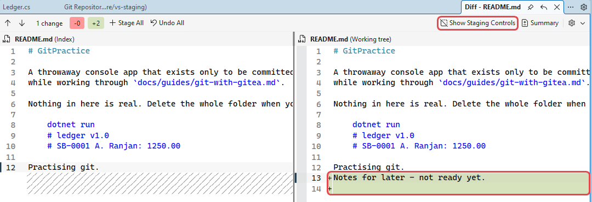](img/git-with-gitea/vs-diff.png)

   *Left is **(Index)** — what git has; right is **(Working tree)** — your file on disk. The green
   block (boxed) is what you added. **Show Staging Controls** (boxed, top) adds stage buttons into
   this view; Lab V4 uses them.*

5. Click **+** on `README.md` only. It moves down to **Staged Changes**; `Ledger.cs` stays put.
   You are now looking at the staging area, directly: one file on the shortlist, one not.
6. Message: `docs: note that this repo is for practice`. Click **Commit Staged**.
7. Look at Git Changes: `Ledger.cs` is **still there**, still modified. It was never staged, so the
   commit passed it by.
8. **Look at the commit button now.** *Staged Changes* is empty, so its label has changed by
   itself from *Commit Staged* to **Commit All** (§3). Type `feat: bump ledger version to 1.1` and
   click it — no dropdown needed. That stages every tracked file and commits, in one step.
9. **↑ Push.**

**Verify:** the **Git Repository** graph shows three commits on `main`. Click each one — the
details pane on the right shows exactly one changed file per commit. Gitea's repo page agrees.

**What git actually did:**

```bash
git log --oneline               # three commits
git show --stat HEAD~1          # README.md only
git show --stat HEAD            # Ledger.cs only
```

**Understand:** `+` is `git add` and **Commit Staged** is `git commit`. They are separate because
you frequently want to commit *some* of your edits and not others — which is the next lab.

> **Push before you branch, always.** Lab V5 branches off `main`. If `main` is ahead of the server
> when you do that, your feature branch carries those extra commits with it and the pull request
> shows three changed files instead of the one you wrote. **A branch always carries everything your
> local `main` has that the server does not.**

> **Stuck?** An edited file is not listed → [not saved](#ts-unsaved). Commit button greyed out → [empty message, or nothing staged](#ts-commit-grey). Both files went into one commit → the button said **Commit All**; undo it as in [Lab V4 step 9](#lab-v4-stage-selected-lines-and-the-two-commit-buttons) and redo.

---

### Lab V4 — Stage selected lines, and the two commit buttons

The one place the UI beats the terminal outright — and the one place it quietly does something you
did not ask for. Meet both, deliberately, once.

1. Branch picker → **New Branch…** → name `feature/vs-staging`, **Based on: `main`**, leave
   **Checkout branch** ticked.

   > **There is no "remote branch" option, and that is not a gap.** Every branch starts local; it
   > appears on Gitea only when you push it (step 12). The *Based on* dropdown offering both `main`
   > and `remotes/origin/main` is choosing a **starting commit**, not a kind of branch — they are
   > the same commit right now, because Lab V3 ended with a push.

2. Make **two unrelated edits in the same file**, `Ledger.cs`:
    - change `Version` to `"1.2"`
    - add a method below `Round`:

            public static decimal Fee(decimal amount) => Round(amount * 0.01m);

3. Also add a stray line to `README.md` — work you are *not* ready to commit.
4. **Git Changes** → double-click `Ledger.cs` to open the diff.
5. Select just the `Version` line in the right-hand (working tree) pane → **right-click → Git →
   Stage Selected Range**.

   [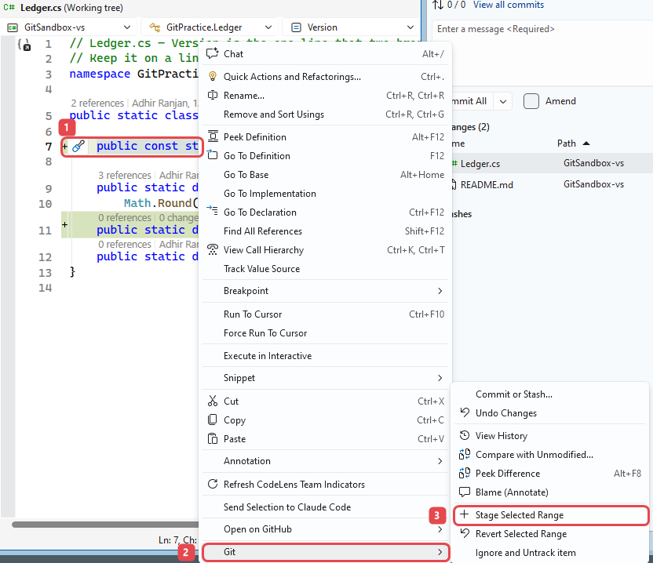](img/git-with-gitea/vs-stage-range.png)

   *Select the line (1), right-click, open **Git ›** at the very bottom of the menu (2), then
   **Stage Selected Range** (3). The same submenu has **Revert Selected Range** — don't confuse the
   two.*

6. **Look at the file list.** `Ledger.cs` now appears under **both** *Changes* **and** *Staged
   Changes* — the same file, in two states at once. This is exactly [§0.2](git-with-gitea-part0.md#02-the-model-in-five-minutes)'s
   staging area, and it is the single most confusing thing in the window until you have seen it once.

   [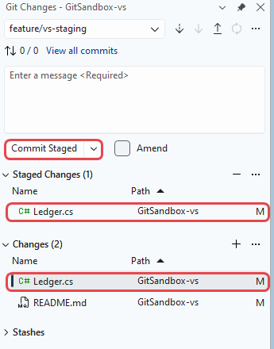](img/git-with-gitea/vs-both-lists.png)

   *The `Version` line is staged (top box); the `Fee` method is not (lower box). The button says
   **Commit Staged**, so only the top one will be committed.*

7. Message `feat: bump ledger version to 1.2` → **Commit Staged**. Only the `Version` line goes in.
8. **Read the commit button again.** Nothing is staged now, so it says **Commit All** — and it will
   sweep up the `Fee` method **and** your unfinished `README.md` edit. Message `feat: add fee
   calculation`. **Do it anyway**, so you see it happen. (This is the label change from §3 doing
   real damage: the button you pressed a moment ago for one line now takes everything — the
   screenshot in [§3](#the-commit-button-renames-itself-and-that-is-the-whole-trick) is this exact
   moment.)

**What git actually did:**

```bash
git log --oneline -2            # your two commits
git show --stat HEAD~1          # Ledger.cs only — and only one line of it
git show --stat HEAD            # Ledger.cs AND README.md: Commit All took both
```

**Verify:** you can point at the exact commit where *Commit All* included a file you had not
finished. That is the whole lesson.

**Now undo the damage**, using only the UI:

9. **Git Repository** → in the graph, right-click the commit **directly below** your newest one —
   that is `feat: bump ledger version to 1.2`, the one you made in step 7 — and choose
   **Reset → Keep Changes (--mixed)**.

   [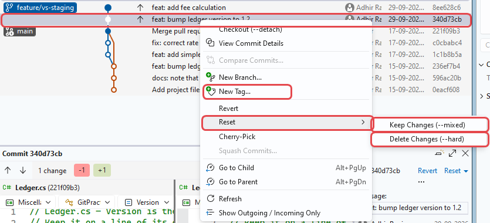](img/git-with-gitea/vs-commit-context.png)

   *Right-clicking the commit **below** the newest (top box) → **Reset ›** → **Keep Changes
   (--mixed)** (1). Its neighbour **Delete Changes (--hard)** (2) is Lab V8's dangerous one. The
   same menu holds **New Tag…** (boxed) for Lab V12, and **Revert** for Lab V7.*

   > **Why that one, and not the commit you want to undo?** **Reset moves your branch to the commit
   > you right-clicked.** You are saying *"make `feature/vs-staging` point here again"*, and
   > everything above that point stops being part of the branch. The graph is newest-at-top, so the
   > commit *below* your latest is its parent — the state you want to go back to. Right-clicking
   > the bad commit itself would reset **to** it and change nothing.

10. **Look at Git Changes.** The bad commit is gone from the graph, and both of its files —
    `Ledger.cs` (the `Fee` method) and `README.md` (the stray line) — are back under **Changes**,
    **unstaged**. Nothing was lost; the commit was taken apart and its contents handed back to you.
    That is `git reset --mixed`, and it is recoverable in every sense.
11. Now do it properly: click **+** on **`Ledger.cs` only**, leave `README.md` where it is, and
    **Commit Staged** with the message `feat: add fee calculation`.

Two focused commits, which is what you wanted from the start.

12. **↑ Push.** The branch exists only on your machine so far — **every branch starts local** — so
    this first push creates it on Gitea. Visual Studio 2026 does it without asking and reports
    *"Successfully pushed feature/vs-staging to origin"* (pictured in [§3](#3-the-daily-loop-in-clicks)).
    That is `git push -u`: it creates the branch *beside* `main` and links the two, which is why
    later pushes need no arguments.
    **`main` is completely unaffected by this.** You are not merging anything; Lab V13 needs this
    branch to exist on the server.
13. Branch picker → **`main`**. Leave `feature/vs-staging` alone; Lab V13 cleans it up.

**Verify:** `README.md` still shows as modified in Git Changes on `main` — proof that the stray
edit is out of your history and still on your disk, exactly as intended. Right-click it →
**Undo Changes** to discard it now.

**Understand:** *Stage Selected Range* is genuinely better than the command-line equivalent
(`git add -p`, where you answer `y`/`n`/`s` per hunk). You click the lines you mean. It is the
strongest argument in this guide for using the IDE.

> **Stuck?** No **Stage Selected Range** → select in the **right-hand** (working tree) pane, then open **Git ›** at the very bottom of the right-click menu. `Ledger.cs` in both lists → [that is the point](#ts-both-lists). Commit All took `README.md` → [steps 9–11 are the fix](#ts-commit-all).

---

### Lab V5 — A branch and a real pull request

The real workflow, end to end. This is the lab to copy on actual work.

1. Branch picker → **`main`** → **↓ Pull**, so you start level with Gitea.
2. Branch picker → **New Branch…** → `feature/interest-rate`, **based on `main`**.
3. In `Ledger.cs`, add a method:

        public static decimal Interest(decimal amount) => Round(amount * 0.04m);

4. **Git Changes** → **+** on `Ledger.cs` → message `feat: add simple interest calculation` →
   **Commit Staged**.
5. **↑ Push.** The branch does not exist on the server yet, so this push creates it there (VS
   2026 does not ask first). `main` on the server is still unchanged.

**Now leave the IDE.** In Gitea (every screen of steps 6–8 is pictured in
[§0.5](git-with-gitea-part0.md#05-pull-requests-the-part-that-is-not-git)):

6. **Pull Requests** tab → **New Pull Request** (or the green *"You pushed on branch
   feature/interest-rate"* banner on the repo page, if it is still showing). Confirm the direction:
   **merge into: `main`** ← **pull from: `feature/interest-rate`**.
7. Title and description per [§0.5](git-with-gitea-part0.md#05-pull-requests-the-part-that-is-not-git) →
   **Create Pull Request**.
8. Open the **Files Changed** tab — this is exactly what a reviewer sees. Hover the `Interest`
   line, click **+**, and leave yourself a comment. Feel how specific it is.

**Back in Visual Studio**, respond to your own review:

9. Change `0.04m` to `0.045m` in `Ledger.cs`. Stage → **Commit Staged**, message
   `fix: correct rate to 4.5%` → **↑ Push** (the branch is already linked, so it just pushes).
10. Refresh the PR. **The new commit is in it automatically** — the PR tracks the *branch*. Never
    close a PR and open a new one to incorporate feedback.
11. In Gitea, scroll past the conversation to the merge box: the button is **Create merge
    commit** — that *is* the merge button (Gitea has no button called *"Merge Pull Request"*; the
    **▾** beside it holds the other merge styles, [§14.4](git-with-gitea-part3.md#144-merge-styles-gitea-offers-on-a-pr)).
    Click it. A confirm form opens with the merge message already filled in — leave it — and a
    **Delete Branch "feature/interest-rate"** checkbox. Tick it, then click **Create merge commit**
    again. (Forgot to tick it? The merged PR then shows a **Delete Branch** button instead.)

[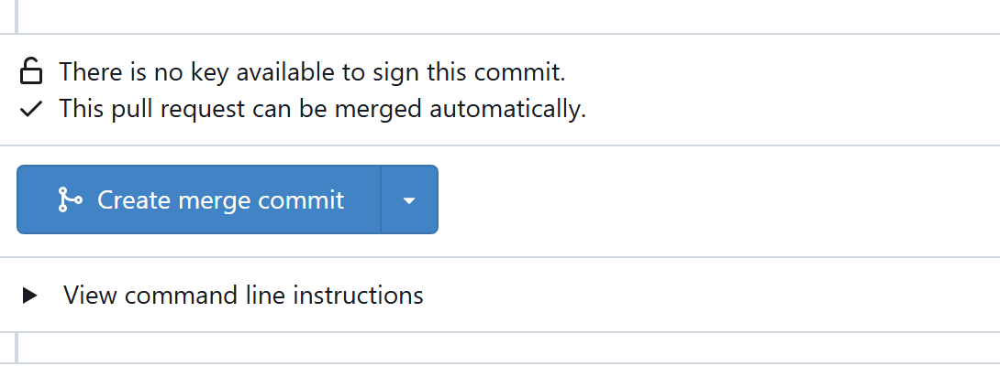](img/git-with-gitea/g-pr-merge-box.png)

*The merge box at the bottom of **Conversation**: "This pull request can be merged automatically."
and the **Create merge commit** button with its **▾**.*

[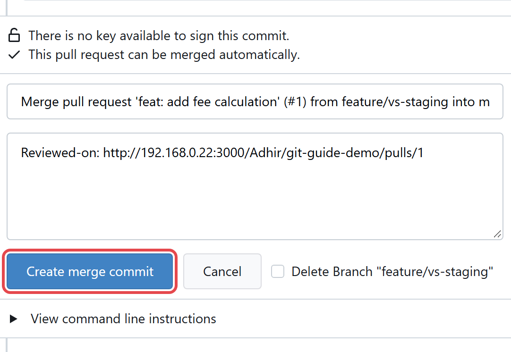](img/git-with-gitea/g-pr-merge-confirm.png)

*After the first click: the pre-filled merge message, the confirming **Create merge commit**
(boxed), and the **Delete Branch** checkbox to its right.*

[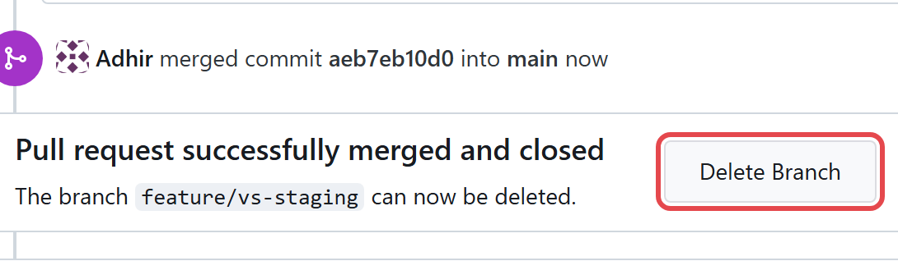](img/git-with-gitea/g-pr-delete-branch.png)

*If you left the box unticked: "Pull request successfully merged and closed — The branch … can now
be deleted." One click on **Delete Branch** (boxed) removes it from Gitea; there is no confirm.*

**Back in Visual Studio, clean up:**

12. Branch picker → **`main`**.
13. **Git → Fetch** — the menu, not the toolbar, because ⟳ in Git Changes is **Sync**, not Fetch
    ([§1.2](#12-the-git-changes-window-button-by-button)). The **Git Repository** window has a
    **Fetch** link on its *Incoming* row too. Nothing on your branch changes yet.
14. **Git Repository** → look at the **Incoming** list: the merge commit and your two feature
    commits, sitting on the server, not yet yours. *This is the step worth learning* — look before
    you pull.

    [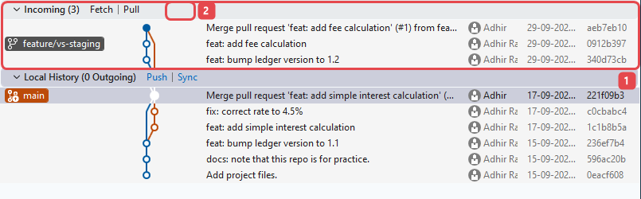](img/git-with-gitea/vs-incoming.png)

    *The Incoming list after **Git → Fetch** (1): the PR's merge commit and its two commits, on
    the server but not yet in your `main`. Its **Pull** link (2) is step 15.*

15. **↓ Pull.**
16. **Git → Manage Branches** → under **Branches**, right-click `feature/interest-rate` → **Delete**.
    *(Same window as **Git Repository**; the branch tree is that window's left pane, collapsed to a
    strip of icons until you expand it — see [§1.3](#13-the-git-repository-window-pane-by-pane).
    The branch badge in the graph is a label, not the branch list: right-clicking it gives you the
    commit menu.)* **Delete** is greyed out for the branch you are standing on, which is why step 12
    put you on `main` first.

**Verify:** `main` contains the `Interest` method, the branch is gone from both the local list and
`remotes/origin`, and the graph shows a merge commit joining two lines of work.

**What git actually did:**

```bash
git log --oneline --graph --all -8   # the fork and the join
git branch -a                        # feature/interest-rate is in neither list
```

> **Why *Create merge commit*.** Deleting a branch is only allowed when its commits are reachable from where
> you stand. **Create squash commit** and the two **Rebase, then …** styles ([§14.4](git-with-gitea-part3.md#144-merge-styles-gitea-offers-on-a-pr))
> all rewrite your commits into *new* ones with new SHAs, so git cannot see your branch as merged
> and Gitea's **Delete Branch** / Visual Studio's **Delete** refuses. That is the safety net doing its job with incomplete
> information, not a bug. On a team that squash-merges, you confirm the work landed on `main` and
> then force the delete.

> **Stuck?** No pull request button in Visual Studio → [there is none, for Gitea](#ts-no-pr-button). Your branch is missing from **pull from:** → [not pushed yet](git-with-gitea-part0.md#pr-no-branch). The diff is [empty](git-with-gitea-part0.md#pr-empty) or [enormous](git-with-gitea-part0.md#pr-enormous) → the direction is backwards. No merge button → [scroll down, or remove `WIP:`](git-with-gitea-part0.md#pr-no-merge). **Delete** refused → the PR was merged with a squash or rebase style; see the note just above.

---

### Lab V6 — Make a conflict on purpose, fix it in the Merge Editor

The single most feared part of git. Do it deliberately, once, and it stops being scary.

1. Branch picker → **`main`** → **↓ Pull**.
2. Branch picker → **New Branch…** → `feature/v3`, **based on `main`**.
3. In `Ledger.cs`, set `Version = "3.0"`. Stage → **Commit Staged** (`feat: version 3.0`).
4. Branch picker → **New Branch…** → `hotfix/v21`, **based on `main`** — *not* on `feature/v3`.
   Branching both from `main` is what makes the histories diverge.
5. Set the **same line** to `"2.1"`. Stage → **Commit Staged** (`fix: version 2.1`).
6. Branch picker → **`main`**. **Git → Manage Branches** → right-click `hotfix/v21` → **Merge
   'hotfix/v21' into 'main'** → **Merge** in the small *Merge branches* dialog. Clean — `main` had
   no commits of its own, so the pointer just slides forward. (That is a *fast-forward*: a merge
   with nothing to merge.)
7. Right-click `feature/v3` → **Merge 'feature/v3' into 'main'**. This time the dialog warns
   *"1 file with potential conflicts"* — click **Merge** anyway. **Conflict.** `Ledger.cs` appears
   under **Unmerged Changes** in Git Changes.
8. Double-click it. The **Merge Editor** opens: **Incoming** (left), **Current** (right),
   **Result** (bottom).
9. Tick one side's checkbox, then the other, and watch the *Result* pane change. Then click into
   *Result* and type `"3.0"` by hand — proving the answer does not have to be either side.
10. **Accept Merge**. In Git Changes the button now reads **Commit Staged** and the message box is
    **empty**: type `Merge branch 'feature/v3'` and click **Commit Staged**.
11. **Ctrl+F5.**

Every screen of steps 7–10 — the right-click menu, the dialog, the conflict, the Merge Editor
before and after, and the empty message box — is pictured in
[§4](#after-the-merge-clean-up) and [§5](#5-conflicts-the-merge-editor), taken during this lab.

**Verify:** the app prints `ledger v3.0`, and the **Git Repository** graph shows a genuine fork and
join — not a straight line.

[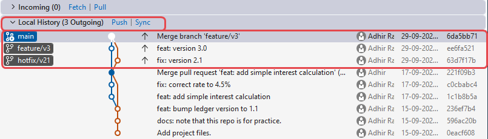](img/git-with-gitea/vs-merge-graph.png)

*The fork and the join: `fix: version 2.1` and `feat: version 3.0` on two lines, rejoined by
`Merge branch 'feature/v3'` (boxed). The ↑ arrows mark commits not yet pushed.*

**What git actually did:**

```bash
git log --oneline --graph --all -8   # two branches diverging and rejoining
git show --stat HEAD                 # a merge commit: two parents, and the file you resolved
```

**Now prove the escape hatch works**, because you will want it one day:

12. Branch picker → **New Branch…** → `spike/conflict-again` from `main`, set `Version` to
    `"9.9"`, commit.
13. Switch to `main`, right-click `spike/conflict-again` → **Merge into `main`** → conflict.
14. Click **Abort** at the top of **Git Changes** (it appears only while a merge is in progress).

**Verify:** Git Changes is clean, the graph is unchanged, and `Ledger.cs` still says `"3.0"`.
Nothing was lost and nothing was half-merged.

15. **↑ Push** to send the real merge to Gitea.

**Understand:** the Merge Editor made the mechanics easy, but step 11 is what proved you were
*right*. A resolution that compiles can still be wrong, and only running it tells you.

> **Stuck?** No conflict at step 7 → the two branches were not both made from `main`, or step 5 changed a different line; `git log --oneline --graph --all` shows which. Lost in the Merge Editor → [**Abort**](#ts-unmerged) puts everything back. The app prints the wrong version → you kept the other side, which is exactly what step 11 is there to catch: fix `Ledger.cs` and commit again.

---

### Lab V7 — Undo, from the history graph

Five undos, each for a different situation. Do all five, in order, entirely in the UI.

**(a) Wrong message — Amend.**

1. Edit `README.md`. Stage it. Commit with a deliberately bad message: `asdf`.
2. Tick **Amend** (beside the commit button). The message box fills with the last commit's message
   (`asdf`) — replace it with `docs: describe the practice labs`, then click the commit button.

   [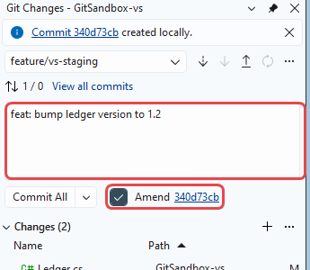](img/git-with-gitea/vs-amend.png)

   *With **Amend** ticked, VS names the commit it will replace (`Amend 340d73cb`) and pre-fills its
   message (boxed) for you to edit.*

3. Look at the graph: **one** commit, new message. That is `git commit --amend` — it *replaces*
   the last commit rather than adding one.

**(b) Staged the wrong file — Unstage.**

4. Edit `README.md` and `Account.cs`. Stage **both** with the **+** on the *Changes* header.
5. Unstage `README.md` with **−**. Your edits are untouched; only the shortlist changed.
6. **Commit Staged** — `Account.cs` alone goes in.

**(c) Wrecked a file — Undo Changes. The irreversible one.**

7. Make a mess of `README.md` — delete half of it.
8. Right-click it under *Changes* → **Undo Changes** → confirm.

   [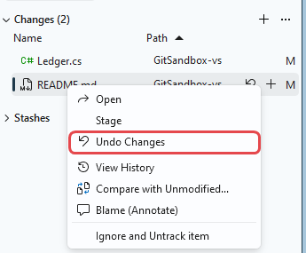](img/git-with-gitea/vs-undo-changes.png)

   *The **Undo Changes** item (boxed) sits between the harmless Stage and View History. Nothing
   about it warns you that the edits are gone for good.*

9. **Those edits are gone for good.** They were never committed, so nothing in
   [§15](git-with-gitea-part3.md#15-oh-no-the-recovery-section) can bring them back. This is the only truly irreversible
   operation in this lab, and it lives in a context menu next to a dozen safe ones.

**(d) Undo something already pushed — Revert.**

10. Edit `Ledger.cs` (change `Round`'s comment, anything). Stage, **Commit Staged**, **↑ Push**.
11. **Git Repository** → right-click that commit in the graph → **Revert**.
12. Look at the graph: **two** commits now — yours and its reversal. Nothing was deleted, which is
    exactly why this is the safe undo for anything others may already have pulled. **↑ Push**.

**(e) Committed too early — Reset.**

13. Edit any file, stage, commit with the message `wip`.
14. Right-click the commit **below** it → **Reset → Keep Changes (--mixed)** (the menu is pictured
    in Lab V4, step 9). The `wip` commit disappears and your work returns to Git Changes, ready to
    stage properly. That is `git reset --mixed`.
15. Stage and **Commit Staged** with a real message.

**Verify:** you can say, in your own words, why (d) must be used instead of (a) or (e) once a
commit has been pushed. (Because (a) and (e) *rewrite* commits, and everyone else's history still
contains the originals.)

**What git actually did:**

```bash
git log --oneline -6            # the amend left one commit; the revert left two
```

> **Stuck?** Amend made a *new* commit → **Amend** was not ticked; [Reset › Keep Changes](git-with-gitea-part3.md#oh-too-early) on the commit below and try again. Revert stops with a conflict → a later commit touched the same lines; resolve it as in [§5](#5-conflicts-the-merge-editor). Undo Changes took real work → [it is gone](#ts-undo-gone), which is this lab's lesson.

---

### Lab V8 — Destroy work, get it back, and hit the wall

This is the lab that makes you unafraid of git — and the one that shows you the IDE's limit.

1. Note where you are: **Git Repository** → read the top three commits.
2. Add a line to `Ledger.cs` — a comment saying `// something valuable`. Stage, **Commit Staged**
   (`feat: valuable work I am about to destroy`).
3. **Git Repository** → right-click the commit **two below** your latest → **Reset → Delete
   Changes (--hard)**. Read the menu item. Accept.
4. Look at the graph. Your two commits are gone, and the line has vanished from `Ledger.cs`. That
   was `git reset --hard`: the single genuinely dangerous operation in git, sitting in a context
   menu with no red warning.

**Now get it back — and try the UI first.**

5. Search every Git menu, every right-click, every pane, for something that undoes step 3. Spend a
   real minute on it. **There is nothing.** Visual Studio has no reflog.
6. **View → Terminal** — this part is **not optional**:

```bash
git reflog -10               # every position HEAD has held, including the one you just left
git reset --hard HEAD@{1}    # move the branch back to where HEAD was one step ago
git log --oneline -3         # your commits are back, with the same SHAs
```

[](img/git-with-gitea/t-reflog.png)

*What it looks like (the command-line Lab C7 does the same steps): after the `reset --hard HEAD~2`
the log has lost two commits, but `git reflog` still lists the "destroyed" one as `HEAD@{1}`, and
`git reset --hard HEAD@{1}` brings it back with the same SHA (`b75c72b`).*

7. Switch back to the **Git Repository** window and look: the graph has repopulated. The IDE reads
   the same repository; it simply had no way to *ask* for that.

**Now the same for a deleted branch:**

8. Branch picker → **New Branch…** → `spike/throwaway` from `main`. Edit `README.md`, stage,
   **Commit Staged** (`spike: work I will lose`).
9. Branch picker → **`main`** (you cannot delete the branch you are standing on).
10. **Git → Manage Branches** → right-click `spike/throwaway` → **Delete**. VS warns it is unmerged.
    Delete it anyway. That commit now belongs to no branch.
11. **Terminal:**

```bash
git reflog                              # find "spike: work I will lose" and copy its SHA
git switch -c spike/recovered <that-sha>   # create a branch AT that commit — the work is back
git log --oneline -1
```

12. Branch picker → **`main`**, then delete `spike/recovered` from the graph. You have proved the
    point; you do not need the branch.

**Verify:** you recovered both, and you can name the one thing in this lab that had no button.

**Remember for life:** anything **committed** is recoverable for ~90 days via `git reflog`.
Anything never committed — Lab V7's *Undo Changes* — is not. That is the whole rule.

> **Stuck?** Cannot tell which reflog line to use → look for `commit: feat: valuable work…`; its `HEAD@{n}` is the one. Restored the wrong one → run `git reflog` again: that reset is recorded too, so pick the right line and reset again ([§15](git-with-gitea-part3.md#oh-reset-hard)). The terminal says `not a git repository` → it opened somewhere else; `cd E:/adtemp/hands_on/git/GitSandbox-vs`.

---

### Lab V9 — Stash: "I need to switch branches right now"

1. Branch picker → **`main`**.
2. Start editing `Program.cs` — add a half-finished line, something that does not even compile:

        // TODO: print the fee as well

   Leave it. Do **not** commit.
3. **Git Changes** → click the **▾** on the **commit button** → **Stash All (--include-untracked)**.
   *(There is no separate Stash button — stashing shares the commit dropdown, §3.)*
4. Look: Git Changes is empty, and `Program.cs` on disk is back to its committed state. Your edit
   is not lost — it is on a shelf.
5. Scroll to the bottom of **Git Changes** — the **Stashes** section now lists it. (**Git
   Repository** shows the same thing in its left pane.)
6. Branch picker → **New Branch…** → `fix/urgent` from `main`. Edit `README.md`, stage,
   **Commit Staged** (`fix: the urgent thing`). This is the interruption you stashed for.
7. Branch picker → **`main`**.
8. **Stashes** → right-click your stash → **Pop ›** → **Pop All as Unstaged**. (*Pop* applies it
   **and** removes it from the shelf; *Apply* keeps a copy. Both are submenus in VS 2026; the other
   choice, *…and Restore Staged (--index)*, also puts back what you had staged.)

   [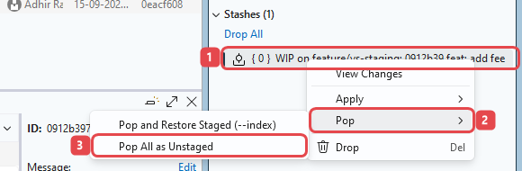](img/git-with-gitea/vs-stash.png)

   *The stash entry under **Stashes (1)** (1), its right-click menu with **Pop ›** (2), and the two
   Pop choices (3) — **Pop All as Unstaged** is the one for this lab.*

9. `Program.cs` has your half-finished line back, exactly as you left it.
10. **Important:** right-click `Program.cs` → **Undo Changes** to throw that scrap away now.

**Verify:** the edit came back, the **Stashes** section says *There are no stashed changes*, and
Git Changes is clean.

> **Do not skip step 10.** Lab V10 has a "colleague" edit `Program.cs`, and Lab V10 commits your
> side too. Leave this practice edit lying around and it rides along into that commit, collides
> with the colleague's change, and Lab V10's "different files, so no conflict" stops being true.

**Understand:** a stash is not a commit and not a branch. It is a shelf, it is easy to forget things
on, and the **Stashes** section is the only place you will ever see them. Check it before concluding
work is lost.

> **Stuck?** No **Stash All** anywhere → it is in the commit button's **▾**, not a button of its own. The stash seems gone → the **Stashes** section at the bottom of Git Changes. Pop reports a conflict → the file changed since you stashed; resolve it as in [§5](#5-conflicts-the-merge-editor) — the stash stays on the shelf until you drop it.

---

### Lab V10 — Be your own colleague

Simulate the thing that actually causes trouble: two people editing at once.

1. **↑ Push**, so your copy and the server are level.
2. **Git → Clone Repository…** (the same dialog as Lab VB)
    - URL `http://192.168.0.22:3000/Adhir/git-practice-vs.git`
    - Path `E:\adtemp\hands_on\git\GitSandbox-colleague`
    - **Clone.** Visual Studio opens the second copy. *From here on, pretend you are somebody else.*

   [](img/git-with-gitea/vs-clone.png)

   *Repository location and Path filled in as above, then **Clone** (bottom right). The Azure DevOps
   / GitHub buttons are for those services only — ignore them.*

3. In the colleague's copy, edit `Program.cs` — add a line at the end of `Main`:

        Console.WriteLine("-- end of report --");

   Stage, **Commit Staged** (`feat: colleague adds a report footer`), **↑ Push**. Gitea's `main`
   has now moved forward.
4. **Switch back to your own copy** — **Git → Local Repositories → GitSandbox-vs**. It knows
   nothing about that push.
5. Edit `README.md`. Stage, **Commit Staged** (`docs: my own change`).
6. **↑ Push.** **Rejected.** Visual Studio 2026 pops up **Git - Push failed** ("your local branch
   is behind the remote branch"), pictured in [§1.5](#15-where-visual-studio-tells-you-things-went-wrong).
   Click **Cancel** for now — this lab wants you to *look* first — and read the full text in
   **Output → Source Control - Git**: the server holds a commit you do not have.
7. **Git → Fetch**, then **Git Repository** → read the **Incoming** list. There is the colleague's
   commit.
8. **↓ Pull.** You edited different files, so it merges cleanly and creates a merge commit.
9. **↑ Push.** Accepted this time — your branch now contains theirs.

**Verify:** both changes are on Gitea, and the graph shows two lines of work joining.

[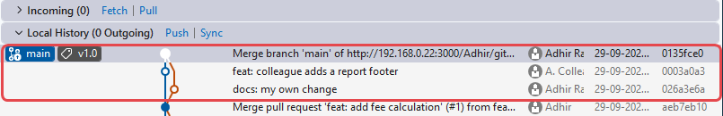](img/git-with-gitea/vs-colleague-merge.png)

*The result (boxed): `feat: colleague adds a report footer` by **A. Colleague** and your
`docs: my own change`, joined by the merge commit the pull created.*

**Now do it again, badly**, because this is what your real day looks like:

10. Repeat steps 3–8 but have **both** copies edit the **same line** of `README.md`. The pull
    conflicts; resolve it in the Merge Editor as in Lab V6.

11. When you are done, **Git → Local Repositories** → remove `GitSandbox-colleague` from the list,
    and delete the folder from disk.

**Understand:** the rejection in step 6 is not an error you did something to cause. It is git
refusing to let you overwrite work you have never seen. *Fetch, look, pull, push* is the whole
answer, every time.

> **Stuck?** The [Push failed dialog](#ts-push-failed) at step 6 is the lab working. The pull at step 8 conflicts → both copies edited the same line (step 10 does that on purpose); [§5](#5-conflicts-the-merge-editor). The picture of what happened is *Why a push gets rejected* in [§0.2](git-with-gitea-part0.md#02-the-model-in-five-minutes).

---

### Lab V11 — .gitignore, and the mistake it does not fix

1. **Ctrl+Shift+B** to build. `bin\` and `obj\` fill with hundreds of files.
2. Look at **Git Changes**: nothing. Not one of them appears. That is your `.gitignore` working.
3. **Now break it deliberately.** There is **no UI for this** — force-adding an ignored file is the
   second of the three walls. **View → Terminal:**

```bash
git add -f bin/                 # stage bin/ even though .gitignore excludes it. NEVER do this for real
```

4. Back in **Git Changes**: every file in `bin/` is suddenly listed under *Staged Changes*. Commit
   them with the message `oops: committed build output`.
5. **Ctrl+Shift+B** again, and watch **Git Changes**: every rebuilt artefact now counts as a
   modification. The window is useless — this is what a repo with committed build output feels like
   forever.
6. Fix it. **Terminal:**

```bash
git rm -r --cached bin/         # stop tracking bin/ — --cached leaves the files on disk
```

7. **Git Changes** shows those files as *deleted* and staged. Commit: `chore: stop tracking build
   output`.
8. **Ctrl+Shift+B** once more.

**Verify:** `bin\` still exists on disk (Solution Explorer → **Show All Files** proves it), and
**Git Changes** is quiet again.

**Understand:** `.gitignore` only governs files git is **not already tracking**. Once a file is
tracked, the ignore rule is simply not consulted. This is exactly how
`appsettings.Development.json` — with your DB password in it — ends up in a repository forever, and
why [§17](git-with-gitea-part3.md#17-graduating-the-real-repository) checks the ignores *before* the first commit rather
than after.

> **Stuck?** The terminal says `not a git repository` → `cd E:/adtemp/hands_on/git/GitSandbox-vs`. `bin/` files still listed after `git rm -r --cached bin/` → commit step 7 first; until then they are staged deletions. The rule behind it: [§11.8](git-with-gitea-part2.md#118-ignoring-files).

---

### Lab V12 — Tags and a Gitea release

1. Branch picker → **`main`** → **↓ Pull**, then **↑ Push** so nothing is outstanding. A tag should
   point at a commit the server already has.
2. **Git Repository** → right-click the top commit on `main` → **New Tag…**
    - **Tag name** `v1.0`, **Tag message** `First practice release`. **Create.**

   [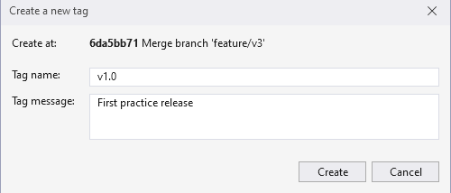](img/git-with-gitea/vs-new-tag.png)

   *The dialog names the commit it will tag (**Create at:**). A message makes it an annotated
   tag, which is what Gitea releases expect.*

3. In the left pane, expand **tags** → right-click `v1.0` → **Push**. (**A plain Push does not send
   tags.** This catches everybody once.)

   [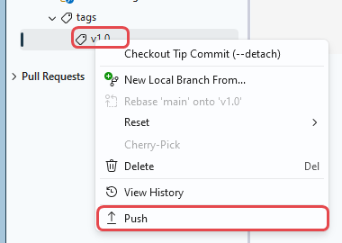](img/git-with-gitea/vs-tag-push.png)

   *The `v1.0` tag under **tags** (top box) and its **Push** item (bottom box). VS confirms with
   "Successfully pushed tag v1.0 to origin".*

4. In Gitea: **Releases** → **New Release** → type or pick `v1.0` in **Git Tag** → title and notes
   → **Publish Release**.

[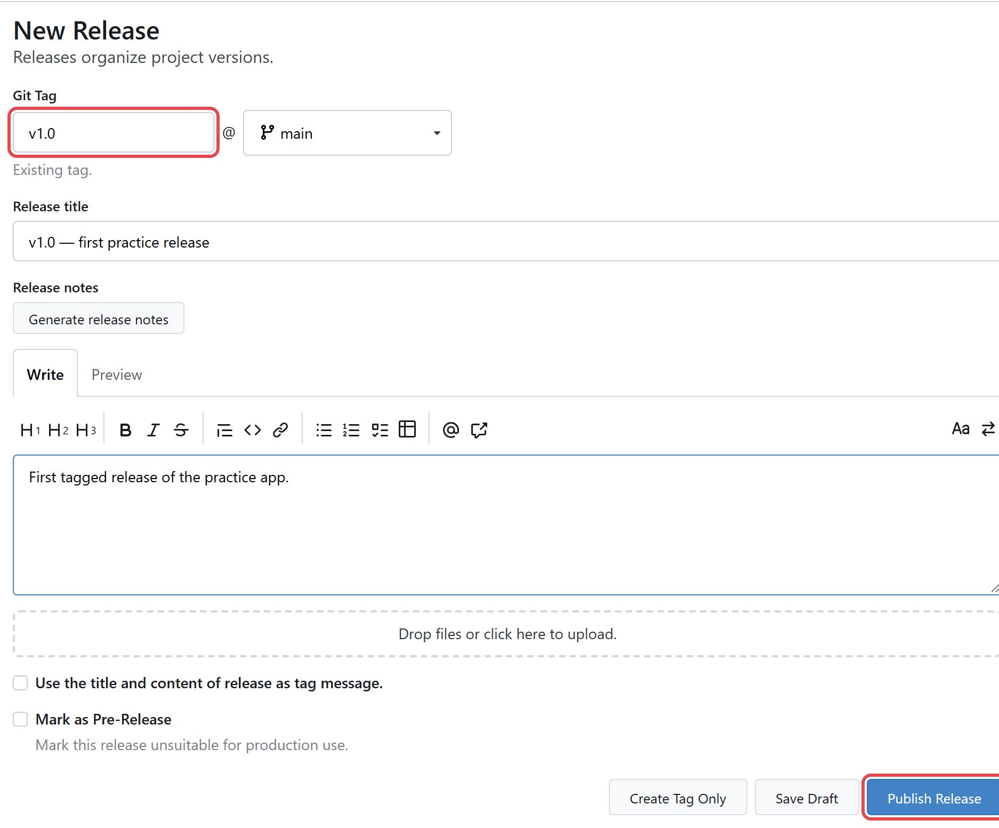](img/git-with-gitea/g-release-new.png)

*Step 4: **Git Tag** `v1.0` (boxed), a title, notes, then **Publish Release** (boxed).*

[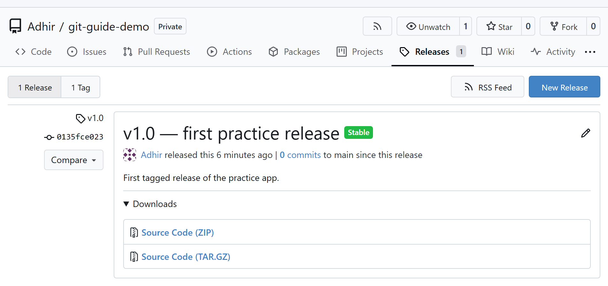](img/git-with-gitea/g-releases.png)

*The Releases tab afterwards: the tag, the commit it points at, your notes, and source archives
Gitea builds for free.*

**Verify:** Gitea's **Releases** tab shows `v1.0`, and the **Tags** node in Git Repository shows it
as pushed.

**What git actually did:**

```bash
git tag                         # v1.0
git show v1.0                   # the tag's own message, author and date, then the commit it points at
git ls-remote --tags origin     # proof the server has it
```

**Understand:** a Gitea *release* is a tag plus a description and optional file attachments. The
tag is the git part; the release is the web part — the same split as commits and pull requests.

> **Stuck?** `v1.0` not on Gitea, or not offered in **Git Tag** → a plain push does not send tags; step 3. Tagged the wrong commit → before pushing it, `git tag -d v1.0` in the terminal, then tag again.

---

### Lab V13 — Gitea housekeeping from Visual Studio

Short, and it settles the questions everybody hits in week one.

1. **Git → Manage Remotes.** The **Remotes** grid (pictured in Lab V2) lists `origin` with the
   Gitea URL. If the server ever moves, edit the URL in that grid (click the cell) rather than
   removing and re-adding the remote — editing preserves every branch's upstream link. The terminal
   equivalent is `git remote set-url origin <new-url>`.
2. **Git → Settings → Git Repository Config.** Per-repo overrides live here, and they **beat**
   your global settings. A different `user.email` for one project is the usual reason.

   [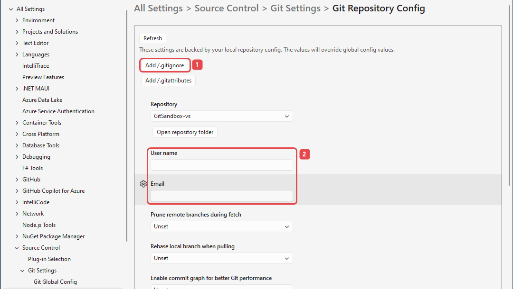](img/git-with-gitea/vs-git-repo-config.png)

   *Git Repository Config. **User name / Email** left empty (2) mean "use the global value". The
   **Add .gitignore** button (1) writes Visual Studio's generic file — the one §7 tells you not to
   use.*

3. **Prove the stale-branch cache.** In **Gitea**, delete the `feature/vs-staging` branch through
   the web UI (**Branches** → the bin icon). Back in VS, look at **Git Repository** → `remotes/origin`:
   it is **still listed**. Now **Git → Fetch** with pruning on (§2) and look again — gone.
   That entry was never live; it was a cache from your last fetch.

   [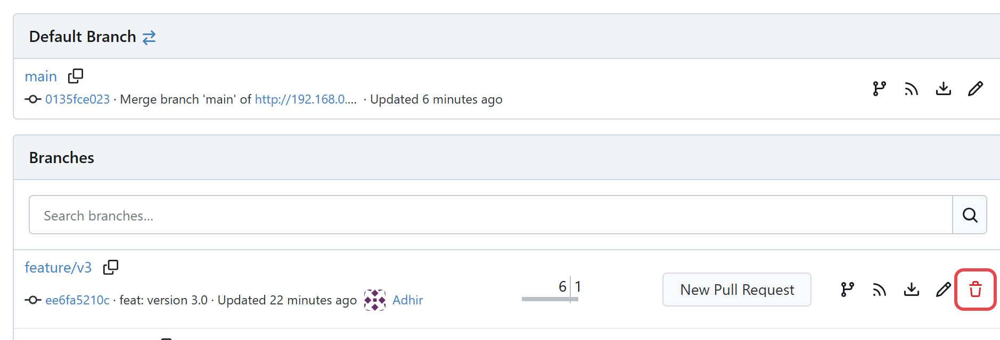](img/git-with-gitea/g-branches.png)

   *Gitea's **Branches** page: the default branch on top, the others below, each with **New Pull
   Request** and the bin icon (boxed) that deletes it on the server.*

   After the pruning fetch, **Output → Source Control - Git** shows the line
   `- [deleted] (none) -> origin/feature/vs-staging` — that is the stale entry being dropped (see
   the Output screenshot in §1.5).
4. Delete the leftover local branches too: right-click `feature/vs-staging` and `spike/*` →
   **Delete**.
5. **Rotate your token.** Windows **Credential Manager** → *Windows Credentials* → find the
   `git:http://192.168.0.22:3000` entry → **Remove**. Push again in VS: it prompts, and you paste a
   fresh PAT from Gitea. This is how you rotate a token, and how you fix "VS keeps using the wrong
   account".

   [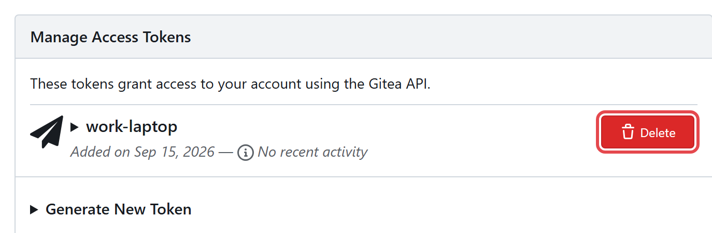](img/git-with-gitea/g-token.png)

   *Gitea → Settings → **Applications**: your existing tokens, each with **Delete** (boxed) — delete
   the old one once the new one works. **Generate New Token** below makes the replacement (§0.4).*

6. **Confirm the boundary for yourself.** Open every Git menu in Visual Studio and look for
   anything that creates a pull request. There is nothing — VS's PR tooling binds to GitHub and
   Azure DevOps only. The browser is not a workaround here; it is the tool.

**Verify:** you can rotate your PAT without help, you know that a branch deleted on the server
lingers in VS until a pruning fetch, and your branch list contains only `main`.

> **Stuck?** `remotes/origin/feature/vs-staging` still listed after the fetch → [pruning is off](#ts-stale-branch); turn it on in [§2](#2-one-time-setup-in-visual-studio). No `git:http://192.168.0.22:3000` entry in Credential Manager → look for any entry containing `192.168.0.22`; Git Credential Manager may have named it differently.

---

### You have finished Part 1

You can now do, entirely in the IDE: clone and init, stage by file and by line, commit, amend,
branch, merge, resolve a conflict, stash, tag, revert, reset, push and pull — and you know the
three places where you must open a terminal, and why.

**Where to go from here:**

- [§15 — "Oh no", the recovery section](git-with-gitea-part3.md#15-oh-no-the-recovery-section). Read it once now, so you
  remember it exists at 3am.
- [§17 — Graduating: the real repository](git-with-gitea-part3.md#17-graduating-the-real-repository), when you are ready
  to work on `TflCbsNet10Sol` itself.
- **[Part 2](git-with-gitea-part2.md)**, if you want to understand what the buttons were
  doing. The labs there use a separate folder and a separate Gitea repo, so nothing you did here is
  at risk. Doing both halves is not repetition — Part 2's reference tables
  ([§11](git-with-gitea-part2.md#11-section-a-practical-reference) and [§12](git-with-gitea-part2.md#12-section-b-exhaustive-reference)) are
  what you will actually reach for when an error message is unfamiliar.

---

**Next:** [Part 2 — Git at the command line →](git-with-gitea-part2.md)

[Git with Gitea — start page](git-with-gitea.md) · [← Part 0 · Common ground](git-with-gitea-part0.md) · [Part 2 · Command line →](git-with-gitea-part2.md) · [Cheat sheet](git-with-gitea-cheat-sheet.md)
