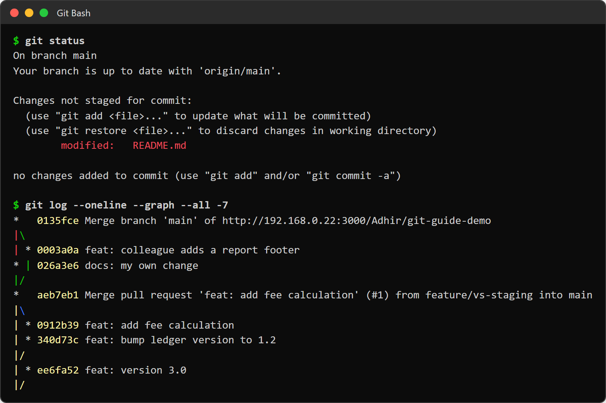
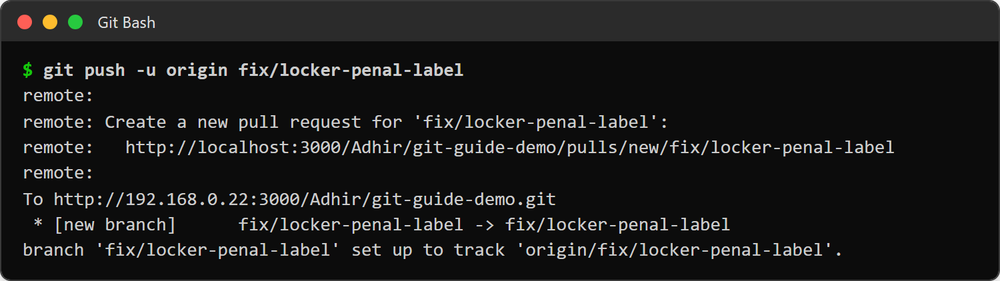
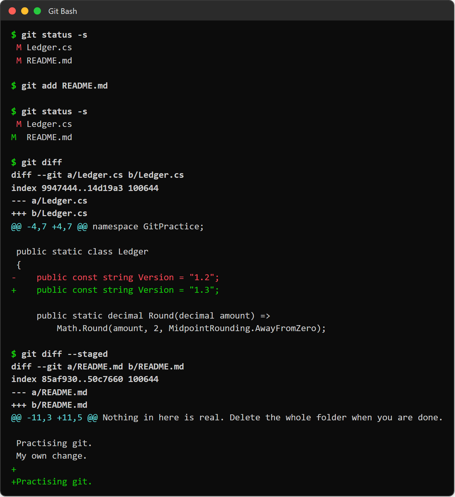
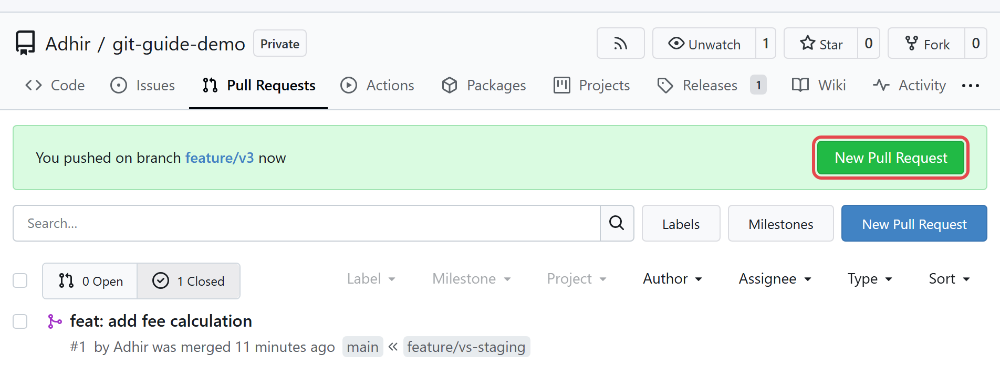
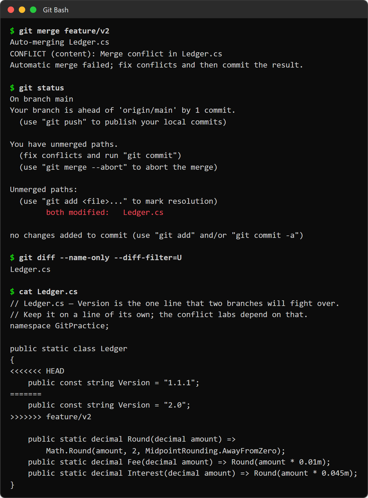
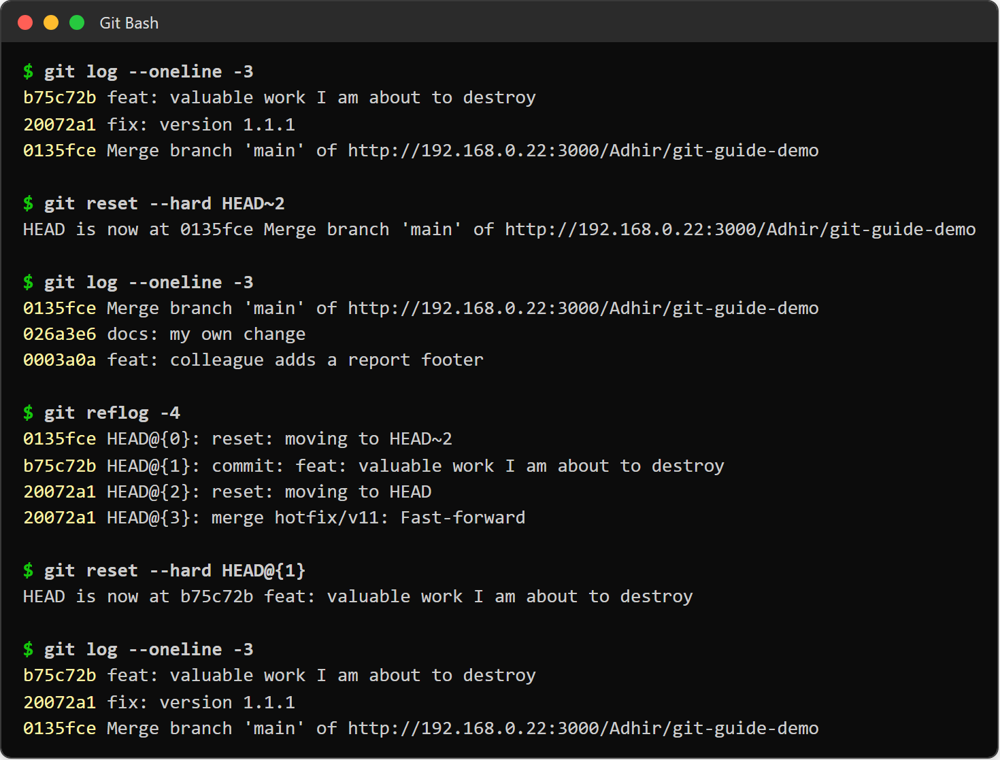
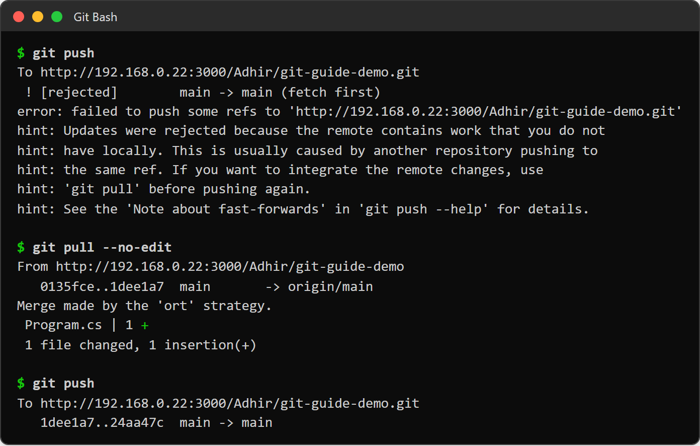

[Git with Gitea — start page](git-with-gitea.md) · [← Part 1 · Visual Studio](git-with-gitea-part1.md) · [Part 3 · Reference →](git-with-gitea-part3.md) · [Cheat sheet](git-with-gitea-cheat-sheet.md)

# Part 2 — Git at the command line

Everything in this half is typed. You will not need Part 1 to follow it.

This is the half that teaches you what git *is*, rather than what a particular IDE calls it. Every
button in Part 1 runs one of the commands below, so if you have done Part 1 and something there
surprised you, the explanation is in here — most often in
[§11.6](#116-undoing-things) or [§11.5](#115-syncing-with-gitea).

**Work in `E:\adtemp\hands_on\git\GitSandbox\` against the Gitea repo `git-practice`** — a different
folder and a different repo from Part 1, so the two halves cannot interfere with each other.


**On this page**

- [9. The daily loop, in commands](#9-the-daily-loop-in-commands)
- [10. Branching and pull requests from the terminal](#10-branching-and-pull-requests-from-the-terminal)
    - [Make the branch and push it](#make-the-branch-and-push-it)
    - [Responding to review is just more commits](#responding-to-review-is-just-more-commits)
    - [Pull it down to test somebody else's branch](#pull-it-down-to-test-somebody-elses-branch)
    - [Two things Gitea may stop you with, both normal](#two-things-gitea-may-stop-you-with-both-normal)
    - [Once merged, clean up](#once-merged-clean-up)
- [11. Section A — Practical reference](#11-section-a-practical-reference)
    - [11.1 Starting a repo](#111-starting-a-repo)
    - [11.2 Looking around — do this before every action](#112-looking-around-do-this-before-every-action)
    - [11.3 Staging and committing](#113-staging-and-committing)
    - [11.4 Branching](#114-branching)
    - [11.5 Syncing with Gitea](#115-syncing-with-gitea)
    - [11.6 Undoing things](#116-undoing-things)
    - [11.7 Conflicts](#117-conflicts)
    - [11.8 Ignoring files](#118-ignoring-files)
- [12. Section B — Exhaustive reference](#12-section-b-exhaustive-reference)
    - [12.1 Create and configure](#121-create-and-configure)
    - [12.2 Inspect](#122-inspect)
    - [12.3 Change the working tree and index](#123-change-the-working-tree-and-index)
    - [12.4 Commit and rewrite](#124-commit-and-rewrite)
    - [12.5 Branch, merge, and combine](#125-branch-merge-and-combine)
    - [12.6 Talk to Gitea (or any server)](#126-talk-to-gitea-or-any-server)
    - [12.7 Temporary storage](#127-temporary-storage)
    - [12.8 Debugging and forensics](#128-debugging-and-forensics)
    - [12.9 Multiple checkouts and nested repos](#129-multiple-checkouts-and-nested-repos)
    - [12.10 Maintenance](#1210-maintenance)
    - [12.11 Things that are not commands, but you must know](#1211-things-that-are-not-commands-but-you-must-know)
- [13. The command-line labs](#13-the-command-line-labs)
    - [Lab CA — Put an existing folder on Gitea](#lab-ca-put-an-existing-folder-on-gitea)
    - [Lab CB — Get a local copy of a Gitea repo](#lab-cb-get-a-local-copy-of-a-gitea-repo)
    - [Lab C0 — An empty repo on Gitea](#lab-c0-an-empty-repo-on-gitea)
    - [Lab C1 — Your first repository and commit](#lab-c1-your-first-repository-and-commit)
    - [Lab C2 — Connect to Gitea and push](#lab-c2-connect-to-gitea-and-push)
    - [Lab C3 — The staging area, properly](#lab-c3-the-staging-area-properly)
    - [Lab C4 — A branch and a real pull request](#lab-c4-a-branch-and-a-real-pull-request)
    - [Lab C5 — Make a conflict on purpose, then fix it](#lab-c5-make-a-conflict-on-purpose-then-fix-it)
    - [Lab C6 — Undo, four different ways](#lab-c6-undo-four-different-ways)
    - [Lab C7 — Destroy work, then get it back](#lab-c7-destroy-work-then-get-it-back)
    - [Lab C8 — Stash: "I need to switch branches right now"](#lab-c8-stash-i-need-to-switch-branches-right-now)
    - [Lab C9 — Be your own colleague](#lab-c9-be-your-own-colleague)
    - [Lab C10 — .gitignore, and the mistake it does not fix](#lab-c10-gitignore-and-the-mistake-it-does-not-fix)
    - [Lab C11 — Tags and a Gitea release](#lab-c11-tags-and-a-gitea-release)
    - [Lab C12 — Cherry-pick and bisect](#lab-c12-cherry-pick-and-bisect)
    - [You have finished Part 2](#you-have-finished-part-2)

---

## 9. The daily loop, in commands

Nine commands cover ~95% of your day.

```bash
git status                        # 1. where am I, what's changed?      ← run this constantly
git pull                          # 2. get everyone else's work first
git switch -c feature/add-taluka  # 3. new branch for your work
                                  # 4. ... edit files in your editor ...
git diff                          # 5. review what you changed, before staging
git add Ledger.cs                 # 6. stage the files you want to commit
git commit -m "Add taluka lookup" # 7. snapshot them, with a message
git push -u origin feature/add-taluka  # 8. send the branch to Gitea
                                  # 9. open a Pull Request in the Gitea web UI
```

Then repeat 4–8 as many times as you like. Small commits are better than big ones — they are
easier to review, and easier to undo when one of them turns out to be wrong.

[](img/git-with-gitea/t-status-log.png)

*Step 1 on a real repo: `git status` names the branch, says how it compares with the server, and
lists the changed file with the exact commands to stage or discard it. `git log --oneline --graph
--all` draws every branch — each `*` is a commit, the lines are the branches, and the coloured
labels are where `HEAD`, your branches, tags and `origin/…` point.*

Message conventions are in [§0.6](git-with-gitea-part0.md#06-commit-messages-and-branch-names), and they are the same
whichever half you are in.

---

## 10. Branching and pull requests from the terminal

**Never commit directly to `main`.** Branch, push, open a PR, get it reviewed, merge. What a pull
request actually *is*, how to open one, how to review one and how to read the PR page are all in
[§0.5](git-with-gitea-part0.md#05-pull-requests-the-part-that-is-not-git) — that part is identical for both halves,
because it happens in a browser either way. This section is only the git commands on each side of
it.

### Make the branch and push it

```bash
git switch main                     # start from main
git pull                            # make sure it's current
git switch -c fix/locker-penal-label   # branch off it

# ... work, add, commit ... (as many commits as you like)

git push -u origin fix/locker-penal-label   # -u only needed the FIRST push of a branch
```

[](img/git-with-gitea/t-push-u.png)

*The first push of a new branch: `* [new branch]`, then `set up to track 'origin/…'` — that is what
`-u` bought you. The `remote:` lines are Gitea itself, offering a link to open the pull request.*

> **That link says `localhost:3000` — replace it.** Our Gitea currently prints
> `http://localhost:3000/…` in this message, which only works on the server itself. Change the host
> to `192.168.0.22:3000`, or just open the repo page and use the banner. (The fix belongs on the
> server: Gitea's `ROOT_URL` setting should be `http://192.168.0.22:3000/` — worth raising with
> whoever runs it.)

**Pushing a branch changes nothing about `main`.** Your branch now sits on the server *beside*
main, and the two are unrelated until something merges them. That something is the pull request.

**There is no CLI for opening one.** Neither `git` nor Visual Studio speaks Gitea's API; the
browser is the way. (`tea`, Gitea's own CLI, can — see
[§14.6](git-with-gitea-part3.md#146-tea-giteas-official-cli-optional) — but learn this first.)

### Responding to review is just more commits

```bash
# still on your branch, in the same folder
# ... make the requested changes ...
git commit -am "fix: address review — clamp the rate at 100%"
git push                      # no -u; the branch is already linked
```

Refresh the PR — the new commit is in it.

### Pull it down to test somebody else's branch

```bash
git fetch
git switch fix/locker-penal-label   # tracks origin's branch automatically
dotnet build && dotnet test
```

### Two things Gitea may stop you with, both normal

- **"This branch has conflicts that must be resolved"** — `main` moved under you. Fix it locally:
  ```bash
  git switch main && git pull
  git switch fix/locker-penal-label
  git merge main            # resolve conflicts here, as in §11.7
  git push                  # the PR re-checks itself and goes green
  ```
- **"Required approvals not met"** — branch protection
  ([§14.5](git-with-gitea-part3.md#145-branch-protection-expect-main-to-reject-you)). Get the review.

### Once merged, clean up

```bash
git switch main
git pull                                     # bring the merge down
git branch -d fix/locker-penal-label         # delete local branch (-d refuses if unmerged)
git fetch --prune                            # drop the stale remote-tracking ref
```

Gitea can delete the remote branch for you at merge time — take the offer. Stale branches pile up
fast and nobody ever cleans them later.

---

## 11. Section A — Practical reference

The commands you will actually type. Every one has a purpose, an example, and the gotcha that
bites people.

### 11.1 Starting a repo

| Command | Purpose | Example | Gotcha |
|---|---|---|---|
| `git init` | Turn the current folder into a repo | `git init` | Creates `.git/`. Run it in the project root, never in your home folder. |
| `git clone <url>` | Copy an existing repo from Gitea | `git clone http://192.168.0.22:3000/Adhir/git-practice.git` | Creates a *new subfolder*. Do not `mkdir` first. |
| `git clone <url> <dir>` | Clone into a named folder | `git clone <url> practice` | — |
| `git remote -v` | Show which server this repo talks to | `git remote -v` | Two lines (fetch + push) is normal, not a duplicate. |
| `git remote add origin <url>` | Point a local repo at Gitea | `git remote add origin http://192.168.0.22:3000/Adhir/git-practice.git` | `origin` is just a nickname, not a keyword. |
| `git remote set-url origin <url>` | Change the server URL | `git remote set-url origin https://new-host/x.git` | Use this after a server move — do not remove and re-add. |

### 11.2 Looking around — do this before every action

| Command | Purpose | Example | Gotcha |
|---|---|---|---|
| `git status` | What changed, what is staged, which branch | `git status` | The single most useful command. Its hints name the exact command to undo things. |
| `git status -s` | Same, one line per file | `git status -s` | `M`=modified `A`=added `??`=untracked. Left column = staged, right = unstaged. |
| `git diff` | Unstaged changes (working tree vs staging) | `git diff` | Shows **nothing** for files you already added. That confuses everyone once. |
| `git diff --staged` | Staged changes (what will be committed) | `git diff --staged` | Run this right before committing. `--cached` is a synonym. |
| `git diff main` | Your branch vs main | `git diff main -- Ledger.cs` | `--` separates paths from branch names. |
| `git log` | History | `git log` | Press `q` to quit the pager. |
| `git log --oneline --graph --all` | Readable history with branches | `git log --oneline --graph --all -20` | Alias this (§16). You will want it hourly. |
| `git log -p <file>` | History of one file, with diffs | `git log -p Ledger.cs` | — |
| `git show <commit>` | One commit in full | `git show a1b2c3d` | `git show HEAD` = the last commit. |
| `git blame <file>` | Who last changed each line, and when | `git blame Ledger.cs` | For understanding, not for blaming. Use `-w` to ignore whitespace churn. |

### 11.3 Staging and committing

| Command | Purpose | Example | Gotcha |
|---|---|---|---|
| `git add <file>` | Stage one file | `git add Ledger.cs` | — |
| `git add .` | Stage everything under the current folder | `git add .` | **Check `git status` first.** This is how secrets and `bin/` folders get committed. |
| `git add -p` | Stage selected *hunks* of a file | `git add -p Ledger.cs` | `y`/`n`/`s` (split)/`q`. Excellent for separating two unrelated edits. |
| `git commit -m "msg"` | Commit what is staged | `git commit -m "Add taluka lookup"` | Commits **only staged** changes. Unstaged edits stay put. |
| `git commit` | Commit, writing the message in an editor | `git commit` | Needed for multi-line messages. Set `core.editor` if the default is unfamiliar. |
| `git commit -am "msg"` | Stage all *tracked* files and commit | `git commit -am "Fix typo"` | Does **not** add new/untracked files. A frequent surprise. |
| `git commit --amend` | Fix the last commit (message or content) | `git commit --amend -m "Better message"` | **Only if you have not pushed.** It rewrites the commit. |
| `git commit --amend --no-edit` | Add a forgotten file to the last commit | `git add missed.cs && git commit --amend --no-edit` | Same rule: unpushed only. |

### 11.4 Branching

| Command | Purpose | Example | Gotcha |
|---|---|---|---|
| `git branch` | List local branches | `git branch` | `*` marks the current one. |
| `git branch -a` | List local + remote branches | `git branch -a` | `remotes/origin/x` is a *cached* view; refresh with `git fetch`. |
| `git switch <name>` | Move to an existing branch | `git switch main` | Modern replacement for `git checkout <branch>`. |
| `git switch -c <name>` | Create a branch and move to it | `git switch -c feature/x` | Branches off wherever you are — `git switch main` first if you mean main. |
| `git switch -` | Back to the previous branch | `git switch -` | Like `cd -`. |
| `git branch -d <name>` | Delete a merged branch | `git branch -d feature/x` | Refuses if unmerged — that refusal is a feature. |
| `git branch -D <name>` | Force-delete a branch | `git branch -D spike/junk` | Recoverable via `git reflog` for ~90 days. |
| `git branch -m <new>` | Rename the current branch | `git branch -m fix/better-name` | If already pushed, delete the old remote branch and push again. |
| `git merge <branch>` | Bring another branch's work into this one | `git switch main && git merge feature/x` | Merge *into* where you are standing. |
| `git merge --abort` | Undo a merge that hit conflicts | `git merge --abort` | Puts everything back exactly as it was. Safe. |

### 11.5 Syncing with Gitea

| Command | Purpose | Example | Gotcha |
|---|---|---|---|
| `git fetch` | Download new commits, change nothing locally | `git fetch` | The safe way to look before you leap. |
| `git fetch --prune` | Fetch, and drop refs for branches deleted on the server | `git fetch --prune` | Run occasionally or `git branch -a` fills with ghosts. |
| `git pull` | Fetch **and** integrate into your branch | `git pull` | Equals `fetch` + `merge` — or `fetch` + `rebase` if `pull.rebase` says so (§0.1). Merge adds a merge commit and leaves your commits alone; rebase replays them with new SHAs, so never rebase commits you have already pushed. Conflicts here are normal. |
| `git push` | Send your commits to Gitea | `git push` | Rejected? Someone else pushed — pull first, then push again. |
| `git push -u origin <branch>` | First push of a new branch | `git push -u origin feature/x` | `-u` links them, so later `git push`/`git pull` need no arguments. |
| `git push origin --delete <branch>` | Delete a branch on the server | `git push origin --delete feature/x` | Gitea can do this for you when a PR merges. |
| `git push --force-with-lease` | Overwrite the remote branch, safely | `git push --force-with-lease` | **Never on `main`.** Only your own branch, after a rebase or amend. It refuses if someone else pushed meanwhile — which is exactly why it is not plain `--force`. |

**Look before you pull.** `git pull` is `fetch` + `merge` in one go, so it changes your branch
before you have seen what arrived. Split it in two whenever you care what is coming:

```bash
git fetch                    # download the server's commits. Your branch, tree and index are NOT touched

git status -sb               # the one-line answer: "## main...origin/main [behind 1]"
git log --oneline HEAD..origin/main   # commits THEY have that you do not  <- exactly what pull will bring in
git log --oneline origin/main..HEAD   # commits YOU have that they do not  <- exactly what push would send
git diff --stat HEAD origin/main      # which files differ, and by how much
git diff HEAD origin/main             # the actual line-by-line difference
git log --oneline --graph --all -10   # the shape of both sides at once

git pull                     # now merge it in, knowing what you are getting
```

**`A..B` means "commits reachable from B but not from A".** Read `HEAD..origin/main` as *"what is
on the server that is not on me"*, and flip the order to ask the opposite. It is the same syntax a
pull request uses to build its diff (§0.5). Three dots — `git log --oneline --left-right
HEAD...origin/main` — lists **both** directions at once, marking each commit `<` yours or `>` theirs.

None of this can cost you anything: `fetch`, `status`, `log` and `diff` only ever read, and `fetch`
writes only to `refs/remotes/origin/*` — the cache, never your work.

### 11.6 Undoing things

The most important table in this guide. **Nothing committed is ever really lost** — see §15.

| Command | Purpose | Example | Gotcha |
|---|---|---|---|
| `git restore <file>` | Throw away unstaged edits to a file | `git restore Ledger.cs` | **Destructive and unrecoverable** — those edits were never in git. |
| `git restore --staged <file>` | Unstage, keeping your edits | `git restore --staged Ledger.cs` | The exact opposite of `git add`. Perfectly safe. |
| `git restore --source=HEAD~2 <file>` | Get a file back as it was N commits ago | `git restore --source=HEAD~2 Ledger.cs` | Does not move your branch, only the file. |
| `git revert <commit>` | Undo a commit by making a new, opposite commit | `git revert a1b2c3d` | **The safe undo for anything already pushed.** History is added to, never rewritten. |
| `git reset --soft HEAD~1` | Undo last commit, keep changes staged | `git reset --soft HEAD~1` | Great for "I committed too early". |
| `git reset HEAD~1` | Undo last commit, keep changes unstaged | `git reset HEAD~1` | The default mode (`--mixed`). |
| `git reset --hard HEAD~1` | Undo last commit and **destroy the changes** | `git reset --hard HEAD~1` | The one genuinely dangerous command. Uncommitted work is gone for good. Commit first, always. |
| `git clean -nd` | *Preview* deleting untracked files | `git clean -nd` | Always run the `-n` preview first. |
| `git clean -fd` | Delete untracked files and folders | `git clean -fd` | Unrecoverable. Respects `.gitignore` unless you add `-x`. |
| `git stash` | Park uncommitted work temporarily | `git stash` | For "I need to switch branch right now". |
| `git stash pop` | Bring parked work back | `git stash pop` | `pop` removes it from the stash; `apply` keeps a copy. |
| `git stash list` | See what you parked | `git stash list` | Easy to forget things here. Check before assuming work is lost. |

### 11.7 Conflicts

A conflict means two branches changed the *same lines* and git will not guess. It is routine,
not a failure.

The three shapes a merge can take — Lab C5 produces all three, with these names:

```
  FAST-FORWARD — main has not moved, so git just slides the label forward

    before:  A ── B            ◄ main
                  └── C ── D   ◄ feature/v2
    after:   A ── B ── C ── D  ◄ main

  MERGE COMMIT — both sides moved on; git joins them with a new commit M

    before:  A ── B ── E       ◄ main
                  └── C ── D   ◄ feature/v2
    after:   A ── B ── E ───── M   ◄ main     (M has two parents: E and D)
                  └── C ── D ──┘

  CONFLICT — both sides changed the SAME line; git stops before M and asks you

    B (where they split)  Version = "1.1"
    main (hotfix/v11)     Version = "1.1.1" ┐
    feature/v2            Version = "2.0"   ┘ you pick one, or write a third
```

```text
<<<<<<< HEAD                                    <- what is on YOUR current branch
    public const string Version = "1.1";
=======                                         <- divider
    public const string Version = "2.0";
>>>>>>> feature/x                               <- what is on the branch coming in
```

To resolve: **open the file, delete all three marker lines, leave the code you want** (which may
be one side, or a mix, or something new), then:

```bash
git add Ledger.cs        # "I have resolved this file"
git status               # any files left conflicted? repeat.
git commit               # completes the merge (git pre-fills the message)
```

Escape hatches, if it turns into a mess:

| Command | Purpose |
|---|---|
| `git merge --abort` | Cancel the whole merge, back to exactly before |
| `git checkout --ours <file>` | Keep your branch's version of that file entirely |
| `git checkout --theirs <file>` | Keep the incoming version entirely |
| `git diff --name-only --diff-filter=U` | List just the still-conflicted files |

### 11.8 Ignoring files

`.gitignore` lists what git should pretend does not exist — build output, secrets, local config.
This repo already has a well-considered one at [.gitignore](../../.gitignore).

```gitignore
bin/                                     # a folder, at any depth
obj/
*.user                                   # by extension
**/appsettings.Development.json          # local DB credentials — never commit
!appsettings.Development.json.example    # ! un-ignores an exception
```

**The catch:** `.gitignore` only affects files git is not *already* tracking. If `bin/` was
committed once, ignoring it later changes nothing. Fix it with:

```bash
git rm -r --cached bin/     # stop tracking, keep the files on disk
git commit -m "Stop tracking build output"
```

---

## 12. Section B — Exhaustive reference

Every user-facing ("porcelain") git command, grouped by what it is for. You will not need most
of these — they are here so that when you meet one in a Stack Overflow answer you know what it
does before you paste it. Plumbing commands (`cat-file`, `update-ref`, `hash-object`, …) are
deliberately excluded: they are for writing tools, not for using git.

**Legend:** ★ = in §11, you will use it constantly · ☆ = occasional · ○ = rare/specialist.

### 12.1 Create and configure

| Command | What it does |
|---|---|
| ★ `git init` | Create a new repository in the current folder |
| ★ `git clone` | Copy a repository (and its whole history) from a server |
| ★ `git config` | Read/write settings. `--global` = you, `--local` = this repo, `--system` = machine |
| ☆ `git help <cmd>` | Full manual page for any command. `git help -a` lists everything |
| ○ `git init --bare` | Create a repo with no working files — what a *server* holds |

### 12.2 Inspect

| Command | What it does |
|---|---|
| ★ `git status` | Working tree and staging summary |
| ★ `git diff` | Line-by-line changes between any two of: working tree, index, commits |
| ★ `git log` | Commit history, filterable a hundred ways |
| ★ `git show` | Show one object (commit, tag, blob) in full |
| ★ `git blame` | Annotate each line with the commit that last touched it |
| ☆ `git shortlog` | History grouped by author — `-sn` gives a contribution count |
| ☆ `git describe` | Human-readable name for a commit, based on the nearest tag |
| ☆ `git grep` | Search tracked files. Faster than plain grep and can search *old commits* |
| ☆ `git reflog` | **Log of where HEAD has been.** Your safety net — see §15 |
| ○ `git count-objects -vH` | Repository size on disk |
| ○ `git fsck` | Check the object database for corruption / find dangling commits |
| ○ `git whatchanged` | Older, rougher `git log --stat`. Superseded |

### 12.3 Change the working tree and index

| Command | What it does |
|---|---|
| ★ `git add` | Stage changes for the next commit |
| ★ `git restore` | Restore files from the index or a commit (modern, split out of `checkout`) |
| ★ `git rm` | Delete a file *and* stage the deletion. `--cached` = untrack but keep on disk |
| ☆ `git mv` | Rename/move a file and stage it. Git detects renames anyway — this is convenience |
| ☆ `git clean` | Delete untracked files. Preview with `-n` first, always |
| ○ `git sparse-checkout` | Check out only part of a huge repo |
| ○ `git update-index --skip-worktree` | Tell git to ignore local changes to a *tracked* file |

### 12.4 Commit and rewrite

| Command | What it does |
|---|---|
| ★ `git commit` | Record the staged snapshot |
| ★ `git revert` | Create a new commit that undoes an old one — safe after pushing |
| ★ `git reset` | Move the branch pointer. `--soft` keeps staged, `--mixed` keeps unstaged, `--hard` destroys |
| ☆ `git rebase` | Replay your commits on top of another branch — a linear history instead of a merge |
| ☆ `git rebase -i` | *Interactive*: reorder, squash, reword, drop commits before sharing them |
| ☆ `git cherry-pick` | Copy one specific commit from another branch onto this one |
| ○ `git commit --fixup` / `git rebase --autosquash` | Mark a commit as a fix for an earlier one, then fold them together automatically |
| ○ `git filter-repo` | Rewrite the entire history (e.g. purge a leaked secret). Not built in; replaces the old `filter-branch` |
| ○ `git replace` | Graft a substitute object over another without rewriting |

### 12.5 Branch, merge, and combine

| Command | What it does |
|---|---|
| ★ `git branch` | List, create, rename, delete branches |
| ★ `git switch` | Change which branch you are on |
| ★ `git merge` | Join two histories together |
| ☆ `git checkout` | The old command that did `switch` **and** `restore`. Still works; still in every old answer online. Prefer the two new ones |
| ☆ `git tag` | Mark a commit permanently — releases, versions. `-a` for an annotated tag |
| ☆ `git range-diff` | Compare two versions of a branch (e.g. before/after a rebase) |
| ○ `git merge --squash` | Combine a branch into a single un-committed change set |
| ○ `git rerere` | "Reuse recorded resolution" — remembers how you solved a conflict and redoes it next time |

### 12.6 Talk to Gitea (or any server)

| Command | What it does |
|---|---|
| ★ `git fetch` | Download refs and objects; change nothing you are working on |
| ★ `git pull` | `fetch` + integrate (`merge` by default, `rebase` with `--rebase`) |
| ★ `git push` | Upload your commits, and create/update/delete remote branches |
| ★ `git remote` | Manage the named URLs (`origin`, and any others) |
| ☆ `git ls-remote` | List a server's branches/tags without cloning anything |
| ○ `git bundle` | Pack a repo into one file, to move history over a USB stick / air gap |
| ○ `git archive` | Export a tree as a `.zip`/`.tar` with no `.git` history |
| ○ `git request-pull` | Generate a plain-text PR summary. Predates web PRs |

### 12.7 Temporary storage

| Command | What it does |
|---|---|
| ★ `git stash` | Park uncommitted work and clean the tree |
| ★ `git stash pop` / `apply` / `list` / `drop` | Retrieve, inspect, discard parked work |
| ○ `git stash -u` | Include untracked files (they are otherwise left behind) |

### 12.8 Debugging and forensics

| Command | What it does |
|---|---|
| ☆ `git bisect` | Binary-search the history for the commit that introduced a bug. Genuinely magical on a 5000-commit repo — `start` / `bad` / `good`, then test what it checks out, `git bisect reset` at the end |
| ☆ `git reflog` | Recover "lost" commits, branches, and bad resets |
| ○ `git log -S "text"` | Find the commit that added or removed a specific string ("pickaxe") |
| ○ `git log -L 10,20:file` | History of just those lines of that file |
| ○ `git notes` | Attach notes to a commit after the fact, without rewriting it |

### 12.9 Multiple checkouts and nested repos

| Command | What it does |
|---|---|
| ☆ `git worktree` | Check out a second branch into a second folder, sharing one `.git`. Better than cloning twice |
| ○ `git submodule` | Embed another repo at a fixed commit. Powerful, and a well-known source of pain |
| ○ `git subtree` | Merge another repo's history into a subfolder. The alternative to submodules |
| ○ `git lfs` | Large File Storage — keeps big binaries out of the history. An add-on, not built in |

### 12.10 Maintenance

| Command | What it does |
|---|---|
| ○ `git gc` | Garbage-collect and compress. Runs automatically; rarely needed by hand |
| ○ `git prune` | Delete unreachable objects (this is what finally removes reflog-recoverable commits) |
| ○ `git repack` | Repack objects for size/speed |
| ○ `git maintenance` | Schedule background upkeep on large repos |

### 12.11 Things that are not commands, but you must know

| Thing | Meaning |
|---|---|
| `HEAD` | Where you are right now — normally the tip of the current branch |
| `HEAD~1`, `HEAD~3` | 1 / 3 commits *back* from here |
| `HEAD^` | The first parent (matters only at merge commits) |
| `origin` | The default nickname for your Gitea server |
| `origin/main` | Your *cached* copy of the server's `main`. Only updates on `fetch`/`pull` |
| `A..B` | Commits reachable from `B` but not from `A`. `HEAD..origin/main` = what the server has that you do not |
| `A...B` | Commits on *either* side but not both — with `--left-right`, `<` marks yours and `>` theirs |
| `main` | The mainline branch. Older repos call it `master` |
| detached HEAD | You checked out a commit, not a branch. Commits made here belong to no branch — `git switch -c name` to keep them |
| fast-forward | A merge with nothing to merge: git just slides the pointer forward |
| `.git/` | The whole repository. Delete it and you have deleted your history |

---

## 13. The command-line labs

Fifteen labs, roughly two and a half hours. **CA and CB** stand alone — put a folder you already
have on Gitea, and get a local copy of a Gitea repo — each with its own folder and repo. **C0–C12** run against the **real Gitea server** using the throwaway
console app from [§0.3](git-with-gitea-part0.md#03-the-sample-project-every-file-printed-here) — so you can make every
mistake in a place where mistakes cost nothing.

**Sandbox:** `E:\adtemp\hands_on\git\GitSandbox\`, created in
[§0.3.1](git-with-gitea-part0.md#031-create-the-folder-and-project), holding the six files from
[§0.3.2](git-with-gitea-part0.md#032-the-six-files):

```
GitSandbox/
  GitSandbox.csproj   # the project file — its name follows the folder
  Program.cs          # entry point; prints the ledger version
  Account.cs          # one class — the file Lab C6 forgets and then remembers
  Ledger.cs           # holds Version — Lab C5 makes two branches fight over that line
  README.md
  .gitignore          # bin/ obj/ .vs/ *.user
```

It is deliberately *outside* `TflCbsNet10Sol\` so it can never be swept into the real solution or
its build. If you ever want a clean start: delete the whole `GitSandbox` folder, delete the
`git-practice` repo in Gitea, and redo §0.3.1.

> **How to use these.** Type the commands — do not paste. The muscle memory is the point.
> After every single command, run `git status` and read it. Each lab ends with a **Verify**
> step; if its output does not match, stop and re-read the lab before continuing.
>
> **And yes, these labs commit straight to `main`** — which §0.6 tells you never to do. Labs C1–C3,
> and most of C5–C12, work directly on `main` on purpose: you are alone in a throwaway repo with no
> reviewer and no branch protection, and there is nothing to branch *from* until the first commit
> exists. **Lab C4 is the one that shows the real workflow** — branch, push, pull request, merge,
> delete — and that is the one to copy on `TflCbsNet10Sol`. If you had enabled branch protection
> ([§14.5](git-with-gitea-part3.md#145-branch-protection-expect-main-to-reject-you)) on the practice repo, every direct
> push to `main` below would be rejected; leave it off here.

---

### Lab CA — Put an existing folder on Gitea

The situation: a folder of work on your disk that has never been in git and should now live on
Gitea. **This lab and the next stand alone** — their own folder and their own Gitea repo — so do
them first, on their own, or skip to C0. Your identity must already be set
([§0.1](git-with-gitea-part0.md#01-before-you-start)).

```bash
cd E:/adtemp/hands_on/git                  # the parent folder
dotnet new console -o MyFolder-cli         # a stand-in for "the folder you already have"
cd MyFolder-cli                            # move into it
dotnet build                               # bin/ and obj/ now exist, as in any folder that has been worked in
git status                                 # "fatal: not a git repository" — correct: it is not one yet
```

Doing this for real? `cd` into your own folder and start from the next block.

**Decide what must not go up — before git sees anything:**

```bash
dotnet new gitignore                       # write .NET's standard .gitignore: bin/, obj/, .vs/, *.user and more
git init                                   # create .git — the folder becomes a repository where it stands
git status                                 # untracked: .gitignore, the .csproj, Program.cs — and NOT bin/ or obj/
```

On a real folder, read that `git status` list line by line. Anything holding a password or a
connection string goes into `.gitignore` **now** —
[§17](git-with-gitea-part3.md#17-graduating-the-real-repository) has the checklist.

In the Gitea web UI: **+** → **New Repository** → `git-practice-folder-cli`, **Private**,
**Initialize Repository unticked**. Then:

```bash
git add .                                  # stage everything not ignored
git status                                 # last look at exactly what the first commit will contain
git commit -m "Initial commit"             # the first commit
git remote add origin http://192.168.0.22:3000/Adhir/git-practice-folder-cli.git   # point it at the Gitea repo
git push -u origin main                    # upload, and link main to origin/main (-u)
```

**Verify:** Gitea's repo page shows `.gitignore`, `MyFolder-cli.csproj` and `Program.cs`, and no
`bin` or `obj`; `git status -sb` prints `## main...origin/main`.

**Understand:** the order is the whole lesson — **ignore file, `init`, look, commit, `remote add`,
`push -u`**. A file committed by mistake stays in the history even after you delete it, so the
looking happens before the first commit, not after.

> **Stuck?** `! [rejected] main -> main (fetch first)` → the Gitea repo was initialised; delete it,
> create it again empty, push again. `error: src refspec main does not match any` → nothing is
> committed yet, or the branch is called `master` because `init.defaultBranch` is not set
> ([§0.1](git-with-gitea-part0.md#01-before-you-start)) — `git branch -M main` renames it. `Authentication failed` →
> [token, not password](git-with-gitea-part1.md#ts-auth).

---

### Lab CB — Get a local copy of a Gitea repo

The opposite direction: the repo is on Gitea and you want it on your disk. Copy the URL from the
repo page's blue **Code** button, then:

```bash
cd E:/adtemp/hands_on/git                  # clone creates a NEW folder here — do not mkdir it first
git clone http://192.168.0.22:3000/Adhir/git-practice-folder-cli.git MyFolder-cli-copy   # copy the whole repository into a new folder
cd MyFolder-cli-copy                       # move into the copy
git remote -v                              # origin is already set — the clone did it
git status -sb                             # "## main...origin/main" — already linked, no -u needed
git log --oneline                          # the history came down, not just the files
dotnet build                               # it builds here too...
git status                                 # ...and bin/ obj/ stay invisible: .gitignore came down with everything else
```

**Verify:** `git log --oneline` shows the same commit id as Gitea's **Commits** page, and
`git status` says *"nothing to commit, working tree clean"* after the build.

**Understand:** a clone is the whole repository plus `origin` and the link from `main` to
`origin/main`. That is why Lab CA needed `init`, `remote add` and `push -u`, and this needed one
command.

**When you are done:** nothing later uses these two. Delete `MyFolder-cli` and `MyFolder-cli-copy`,
and the `git-practice-folder-cli` repo in Gitea (**Settings → Delete This Repository**) — or keep
them to experiment in.

> **Stuck?** `fatal: destination path … already exists and is not an empty directory` → pick a new
> folder name. `repository not found` → check the URL against the **Code** button; the repo is
> private, so the account you sign in with needs access. `Authentication failed` →
> [token, not password](git-with-gitea-part1.md#ts-auth). Never clone inside a folder that is
> itself a repository — clone next to it.

---

### Lab C0 — An empty repo on Gitea

Your identity and the three global settings are already done in
[§0.1](git-with-gitea-part0.md#01-before-you-start). Confirm them, then make the repo:

```bash
git config --global --list      # print every global setting — user.name, user.email, and the three from §0.1
```

Now in the Gitea web UI: **+** (top right) → **New Repository**.

- Name: `git-practice`
- Visibility: Private
- **Leave "Initialize repository" UNCHECKED.** You want a genuinely empty repo — Lab C2 pushes
  your own history into it, and an initialised repo would collide.

**Verify:** Gitea shows an empty-repo page with setup instructions and a clone URL.

> **Stuck?** Ticked **Initialize Repository** by mistake → delete the repo and create it again, empty; otherwise Lab C2's first push is rejected.

---

### Lab C1 — Your first repository and commit

```bash
cd E:/adtemp/hands_on/git/GitSandbox   # change directory into the sandbox — every command below runs here

dotnet run                  # prove the app works BEFORE git is involved: "ledger v1.0" / "SB-0001 A. Ranjan: 1250.00"

git init                    # create the .git folder — this folder is now a repository
git status                  # show the state of every file — all "untracked": git can see them but is not watching them

git add .gitignore          # stage ONE file — put it on the shortlist for the next commit
git status                  # show the state again — .gitignore moved to "Changes to be committed"; the rest did not

git add .                   # stage everything else in this folder
git status                  # show the state — all staged, and note bin/ and obj/ are absent: .gitignore works

git commit -m "Initial commit: GitPractice console app"   # record the staged files as a commit, with a message
git log --oneline           # list the commits, one line each — you should see exactly one
```

**Verify:** `git status` says *"nothing to commit, working tree clean"* and `git log --oneline`
shows exactly one commit containing six files (`git show --stat HEAD`).

**Understand:** you committed *nothing* until `git commit`. `git add` only built a shortlist.
Staging `.gitignore` first, in its own step, is what let you *see* that: one file moved, five
did not.

> **Stuck?** `Author identity unknown` → identity not set; [§0.1](git-with-gitea-part0.md#01-before-you-start). `bin/` or `obj/` listed → `.gitignore` is missing or misnamed; [§11.8](#118-ignoring-files). `fatal: not a git repository` → wrong folder; `cd` into the sandbox.

---

### Lab C2 — Connect to Gitea and push

```bash
git config --global credential.helper manager   # set where git stores passwords: Windows Credential Manager, encrypted per-user

git remote add origin http://192.168.0.22:3000/Adhir/git-practice.git   # register that URL as a remote named "origin"
git remote -v               # list the configured remotes and their URLs — two lines (fetch + push) is normal, not a duplicate

git push -u origin main     # upload branch `main` to origin and set it as upstream (-u), so later pushes need no arguments
                            # you will be prompted: username = Adhir, password = PASTE YOUR TOKEN (§0.4)
```

**Verify:** refresh the repo page in Gitea — your six files are there, with your commit message
and your name against it. If the name is wrong, fix `git config --global user.email` now; it only
applies to *future* commits.

> **Stuck?** `Authentication failed` → [token, not password](git-with-gitea-part1.md#ts-auth). `! [rejected] main -> main (fetch first)` on this first push → the Gitea repo was initialised; delete it and create it again, empty. `error: remote origin already exists` → use `git remote set-url origin <url>` instead of `add`.

---

### Lab C3 — The staging area, properly

Prove that `add` and `commit` are separate. Make **two unrelated** edits, commit them separately.

```bash
# Edit 1: in README.md, add a line "Practising git."
# Edit 2: in Ledger.cs, change the Version constant from "1.0" to "1.1"

git status                  # show the state — two files modified, neither of them staged
git diff                    # show UNSTAGED changes line by line — both files here

git add README.md           # stage only the README edit
git diff                    # show unstaged changes — only Ledger.cs now; the README left this view...
git diff --staged           # show STAGED changes, i.e. what the next commit will contain — ...and turns up here instead

git commit -m "docs: note that this repo is for practice"   # record the staged snapshot — the STAGED file only
git status                  # show the state — Ledger.cs still modified: never staged, so it stayed behind

git commit -am "feat: bump ledger version to 1.1"   # stage every TRACKED file and commit, in one step (-a)
git log --oneline           # list the commits — three now, one file in each

git push                    # upload both new commits to Gitea — do NOT skip this, see the note below
git status                  # show the state — "Your branch is up to date with 'origin/main'"
```

[](img/git-with-gitea/t-diff-staged.png)

*The middle of this lab, for real. In `git status -s` the **left** column is the staging area and the
**right** is your working files: after `git add README.md`, README's `M` jumps from right (red) to
left (green). Then `git diff` shows only the unstaged Ledger.cs change, and `git diff --staged` only
the README line — the same two edits, split across the two views.*

**Verify:** three commits, each containing exactly one file, and Gitea's repo page shows all three.

> **Why the `git push` matters before Lab C4.** Without it your local `main` sits two commits ahead
> of the server. Lab C4 then branches off that local `main`, so when you push the feature branch it
> carries those two commits with it — and the pull request would show **three** commits and three
> changed files instead of the one you just wrote. It would still work, but Lab C4's whole point is
> reading a small, focused diff the way a reviewer does. **A branch always carries everything your
> local `main` has that the server does not.** Push `main` before branching off it, always.

> **Stuck?** `git diff` shows nothing after `git add` → [that is the point](#112-looking-around-do-this-before-every-action): staged changes only show with `--staged`. Both files went into one commit → [`git reset --soft HEAD~1`](git-with-gitea-part3.md#oh-too-early) and redo.

---

### Lab C4 — A branch and a real pull request

```bash
git switch -c feature/interest-rate   # create a branch and move onto it (-c = create)

# In Ledger.cs, add this method below Round:
#     public static decimal Interest(decimal amount) => Round(amount * 0.04m);

git add Ledger.cs                     # stage the edit
git commit -m "feat: add simple interest calculation"   # record it as a commit on THIS branch — main is untouched
git push -u origin feature/interest-rate   # upload the branch to Gitea and set upstream (-u). main is still unchanged
```

The push output ends with Gitea's `remote: Create a new pull request for …` link — mind the
`localhost` in it ([§10](#make-the-branch-and-push-it)).

In Gitea: **Pull Requests** tab → **New Pull Request** (or the green *"You pushed on branch …"*
banner on the repo page, if it is still showing). Confirm **merge into: `main`** ← **pull from:
`feature/interest-rate`**. Write a title and a description
([§0.5](git-with-gitea-part0.md#05-pull-requests-the-part-that-is-not-git) pictures every screen). **Create Pull Request.**

[](img/git-with-gitea/g-pr-list.png)

*The **Pull Requests** tab with its **New Pull Request** button (boxed). The list below is filtered
to Closed, showing an already-merged PR.*

Look at the **Files Changed** tab — this is exactly what a reviewer sees. Leave a comment on a
line, to feel it. Then respond to your own review:

```bash
# Change 0.04m to 0.045m in Ledger.cs
git commit -am "fix: correct rate to 4.5%"   # stage every tracked edit and commit, in one step
git push                    # upload the new commit — no -u this time, the branch is already linked
```

Refresh the PR: the new commit is in it automatically. Scroll to the bottom of **Conversation** and
click **Create merge commit** — that is Gitea's merge button, and the label names the style it will
use; the **▾** beside it holds the others. Keep this one for the lab; the note after the cleanup
explains why. The confirm form keeps the pre-filled merge message and has a **Delete Branch** checkbox —
tick it (or use the **Delete Branch** button on the merged PR afterwards; Part 1's Lab V5 pictures
all three screens). That removes the branch on Gitea, which is what `--prune` below then tidies
locally. Now clean up:

```bash
git switch main                       # move onto main, leaving the feature branch
git fetch                             # download the merge Gitea made, WITHOUT changing your branch yet
git log --oneline HEAD..origin/main   # list what is about to arrive: the merge commit and your two feature commits
git diff --stat HEAD origin/main      # show which files it will change — Ledger.cs, the Interest method
git pull                              # now merge it in, knowing exactly what you are getting (§11.5)
git branch -d feature/interest-rate   # delete the local branch (-d refuses if it were still unmerged)
git fetch --prune                     # fetch, and drop remote-tracking refs for branches deleted on the server
git log --oneline --graph --all       # draw the commit graph across all branches — the shape of what just happened
```

**Verify:** `main` contains the interest method, and `git branch -a` no longer lists the feature
branch anywhere.

> **Why *Create merge commit*, and what the other styles do to that cleanup.** `git branch -d` deletes a
> branch only when its commits are already reachable from where you stand. **Create squash commit** and
> the two **Rebase, then …** styles ([§14.4](git-with-gitea-part3.md#144-merge-styles-gitea-offers-on-a-pr)) all rewrite your commits
> into *new* ones with new SHAs, so git cannot see your branch as merged and refuses:
> `error: The branch 'feature/interest-rate' is not fully merged.` That is the safety net doing its
> job with incomplete information, not a bug. On a team that squash-merges you confirm the work
> landed on `main`, then delete with `-D`. Worth trying deliberately on a later branch.

> **Stuck?** Your branch is missing from **pull from:** → [not pushed](git-with-gitea-part0.md#pr-no-branch). The diff is [empty](git-with-gitea-part0.md#pr-empty) or [enormous](git-with-gitea-part0.md#pr-enormous) → the direction is backwards, or `main` was not pushed before you branched (the note at the end of Lab C3). `git branch -d` refuses → the PR was squash- or rebase-merged; see the note just above.

---

### Lab C5 — Make a conflict on purpose, then fix it

The single most feared part of git. Do it deliberately, once, and it stops being scary.

```bash
git switch -c feature/v2    # create branch #1 off main and move onto it
# Ledger.cs: set Version = "2.0"
git commit -am "feat: version 2.0"    # stage tracked edits and commit — this change now exists only on feature/v2

git switch main             # move back onto main, where Ledger.cs still reads "1.1" (Lab C3 set it)
git switch -c hotfix/v11    # create branch #2, also off main — it has never seen "2.0"
# Ledger.cs: set the SAME line to "1.1.1"
git commit -am "fix: version 1.1.1"   # stage and commit — a second, different change to the same line

git switch main             # move onto main, which still has neither change
git merge hotfix/v11        # merge that branch into main — clean: main had no commits of its own, so the pointer just slides (fast-forward)
git merge feature/v2        # merge the other branch in — CONFLICT: both changed the same line, and git will not guess
```

Open `Ledger.cs`. You will see the `<<<<<<<` / `=======` / `>>>>>>>` markers from
[§11.7](#117-conflicts).

```bash
git status                            # show the state — names the conflicted file and spells out what to do next
git diff --name-only --diff-filter=U  # list changed file NAMES, filtered to unmerged (= conflicted) ones only
```

[](img/git-with-gitea/t-conflict.png)

*This exact lab, run for real. `git merge` stops with `CONFLICT (content)`; `git status` lists
`both modified: Ledger.cs` and names both exits (`git commit` or `git merge --abort`); the filter
command prints just the file name; and the file itself holds `"1.1.1"` from `HEAD` (your branch,
above `=======`) against `"2.0"` from `feature/v2` (below it).*

Edit the file: **delete all three marker lines**, keep `"2.0"`. Then:

```bash
git add Ledger.cs           # stage the file — staging a conflicted file is how you say "I have resolved this one"
git status                  # show the state — "All conflicts fixed but you are still merging"
git commit                  # record the merge commit, opening an editor — git pre-fills the message, so save and close
dotnet run                  # build and run the app — a conflict resolved so it COMPILES can still be wrong
git log --oneline --graph --all   # draw the graph — the two branches now join at a merge commit
git push                    # upload the merge to Gitea
```

**Verify:** `dotnet run` prints `ledger v2.0`, and the graph shows the two branches joining.

**Now do it again and bail out**, so you know the escape hatch works: create another conflicting
branch, `git merge` it, then `git merge --abort` and confirm `git status` is clean and `Ledger.cs`
still reads `"2.0"`.

> **Stuck?** No conflict → `hotfix/v11` was not branched from `main`, or edited a different line. `git commit` opened an editor you cannot leave → it is probably Vim: type `:wq` and press Enter, then set a friendlier editor ([§16](git-with-gitea-part3.md#other-settings-worth-having)). Lost → [`git merge --abort`](git-with-gitea-part3.md#oh-merge).

---

### Lab C6 — Undo, four different ways

Each undo suits a different situation. Do all four.

```bash
# (a) Wrong message
git commit --allow-empty -m "Fxi typo in ledgre"   # make a commit with no file changes (--allow-empty), purely for practice
git commit --amend -m "fix: correct typo in ledger output"   # replace the last commit with a new one carrying this message
git log --oneline -1        # list the last commit — message fixed, and there is still only one commit

# (b) Forgot a file
# Add a line to README.md
git commit -am "docs: describe the labs"   # stage tracked files and commit — but this change was incomplete
# ...now edit Account.cs too — it belonged in that commit
git add Account.cs          # stage the file you forgot
git commit --amend --no-edit   # replace the last commit, folding this in and reusing its message (--no-edit)

# (c) Committed too early
# Edit any file
git commit -am "wip"        # stage and commit — a commit you regret the moment you press Enter
git reset --soft HEAD~1     # move the branch back one commit; --soft leaves the changes STAGED
git status                  # show the state — your work is still there, staged and ready
git commit -m "feat: a properly described change"   # record it again, this time deliberately

# (d) Undo something already pushed — the safe way
git push                    # upload it — now it is on Gitea, (a)-(c) are off the table: they rewrite commits
git revert HEAD             # create a NEW commit that undoes the last one — nothing is deleted
git log --oneline -3        # list the last three commits — mistake and reversal both visible. History stays honest
git push                    # upload the revert — everyone gets the fix without their history changing under them
```

**Verify:** you can state, in your own words, why (d) must be used instead of (a)–(c) once a
commit has been pushed. (Because (a)–(c) *rewrite* commits, and everyone else's history still
contains the originals.)

> **Stuck?** Every step here is also a row of [§15](git-with-gitea-part3.md#15-oh-no-the-recovery-section), with the same fix. `--amend` opened an editor → save and close it (Vim: `:wq`); `-m` or `--no-edit` skips it.

---

### Lab C7 — Destroy work, then get it back

This is the lab that makes you unafraid of git.

```bash
git log --oneline -3        # list the last three commits — note them, so you can tell they came back
echo "// something valuable" >> Ledger.cs   # append a line to the file (>> appends; a single > would overwrite it)
git commit -am "feat: valuable work I am about to destroy"   # stage and commit, so git has definitely seen this work
git log --oneline -1        # list the last commit — note this SHA: it is what you are about to "lose"

git reset --hard HEAD~2     # move the branch back 2 commits AND wipe the working files to match. Destructive
git log --oneline -3        # list the last three commits — your two are gone from the branch. Really gone?

git reflog                  # list every position HEAD has held — no: it is all still recorded, for ~90 days
git reset --hard HEAD@{1}   # move the branch to where HEAD was one step ago, i.e. immediately before the reset
git log --oneline -3        # list the commits — everything is back, with the same SHAs
```

[](img/git-with-gitea/t-reflog.png)

*Run for real. Before: `b75c72b` on top. After `reset --hard HEAD~2`: gone from the log. But
`git reflog` still lists it — `HEAD@{1}: commit: feat: valuable work…` — and `reset --hard
HEAD@{1}` puts the branch back on it, **same SHA**. Nothing was ever deleted; the branch just
stopped pointing at it.*

Now the same for a deleted branch:

```bash
git switch -c spike/throwaway   # create a branch you are about to abandon, and move onto it
git commit --allow-empty -m "spike: work I will lose"   # make one empty commit on it
git switch main                 # move onto main — you cannot delete the branch you are standing on
git branch -D spike/throwaway   # force-delete the branch (-D) even though it was never merged. That commit is now orphaned

git reflog                      # list every position HEAD has held — find "spike: work I will lose" and copy its SHA
git switch -c spike/recovered <that-sha>   # create a new branch AT that commit and move onto it — the work is back
git log --oneline -1            # list the last commit — recovered: a branch is only a pointer, so re-pointing one restores it
git switch main                 # move back, and delete spike/recovered — you have proved the point
git branch -D spike/recovered
```

**Verify:** you have recovered both. **Remember for life:** anything *committed* is recoverable
for ~90 days via `git reflog`. Anything never committed is not.

> **Stuck?** `HEAD@{1}` brought back the wrong state → run `git reflog` again: the reset you just did is now `HEAD@{0}` and the state you want is further down ([§15](git-with-gitea-part3.md#oh-reset-hard)).

---

### Lab C8 — Stash: "I need to switch branches right now"

```bash
git switch main             # move onto main
# Start editing Program.cs — leave it half-finished, do not commit

git switch -c fix/urgent    # try to create a branch — git either refuses, or drags your half-finished mess onto it
git switch main             # move back onto main — neither outcome is what you want, so do it properly
git branch -d fix/urgent    # delete that branch — it points at main, so -d is happy. You recreate it properly below

git stash                   # park every uncommitted change on a shelf; the working tree goes clean
git status                  # show the state — "nothing to commit": your edit is not lost, it is elsewhere
git stash list              # list what is on the shelf — stash@{0}, there it is

git switch -c fix/urgent    # create the branch and move onto it — NOW, from a clean tree
git commit --allow-empty -m "fix: the urgent thing"   # make an empty commit — the urgent job
git switch main             # move back onto main, where you were

git stash pop               # re-apply the newest stash and drop it from the shelf (pop = apply AND remove)
git status                  # show the state — your half-finished edit is back, exactly as you left it

git restore Program.cs      # NOW throw that practice edit away — §11.6's unrecoverable one, fine here: it was scrap
git status                  # show the state — clean. Lab C9 needs Program.cs untouched, see below
```

**Verify:** your half-finished edit came back, `git stash list` is empty, and the final
`git restore` leaves the tree clean.

> **Do not skip that last `git restore`.** Lab C9 has a "colleague" edit `Program.cs`, and it commits
> your side with `git commit -am`, which stages **every** tracked modified file. Leave this practice
> edit lying around and it rides along into that commit, collides with the colleague's change, and
> Lab C9's "different files, so no conflict" stops being true.

> **Stuck?** `git switch` refused with *"Your local changes … would be overwritten"* → git protecting your edit; it is what `stash` is for. `git stash pop` conflicted → resolve as in [§11.7](#117-conflicts); the stash stays in `git stash list` until you `git stash drop` it.

---

### Lab C9 — Be your own colleague

Simulate the thing that actually causes trouble: two people editing at once.

```bash
cd E:/adtemp/hands_on/git/GitSandbox   # change directory to your normal copy
git push                        # upload everything, so both copies start level with Gitea

cd E:/adtemp/hands_on/git              # change directory out of the repo before cloning
git clone http://192.168.0.22:3000/Adhir/git-practice.git practice-colleague   # copy the whole repo from Gitea into a new folder — a SECOND, independent copy
cd practice-colleague           # change into it — from here on, pretend you are somebody else

# "Colleague" adds a line at the end of Main in Program.cs:
#     Console.WriteLine("-- end of report --");
git commit -am "feat: colleague adds a report footer"   # stage tracked files and commit, in the colleague's copy
git push                        # upload it — Gitea's main has now moved forward

# Back in YOUR copy — which knows nothing about that
cd ../GitSandbox                # change back to your copy, which still believes main is where it was
# Edit README.md
git commit -am "docs: my own change"   # stage and commit locally — always fine, no server involved
git push                        # try to upload — REJECTED: the server holds a commit you do not have
```

Read the rejection message; it is telling you exactly what happened.

[](img/git-with-gitea/t-push-rejected.png)

*The whole story in three commands. `! [rejected] main -> main (fetch first)` and the `hint:` lines
say it plainly: the server has work you do not. `git pull` fetches it (`0135fce..1dee1a7`) and makes
a merge commit (`Merge made by the 'ort' strategy`); the second `git push` is accepted. The steps
below do the same thing more carefully — looking before pulling.*

```bash
git fetch                            # download from origin WITHOUT touching your branch — always safe
git log --oneline HEAD..origin/main  # list commits on origin/main that are not on HEAD (the `a..b` range syntax)
git pull                             # fetch and merge into your branch — you edited different files, so no conflict
git log --oneline --graph -5         # draw the graph — a merge commit now joins the two lines of work
git push                             # upload again — accepted: your branch now contains theirs, so it is a fast-forward
dotnet run                           # both changes are live: the footer line prints too
```

**Verify:** both changes are on Gitea. Now repeat the whole lab but have **both** sides edit the
*same line* of `README.md`, so `git pull` produces a conflict — resolve it as in Lab C5. This is
what your real day will look like.

Delete `practice-colleague` when done.

> **Stuck?** `! [rejected] … (fetch first)` → [expected](git-with-gitea-part3.md#oh-rejected); the picture is *Why a push gets rejected* in [§0.2](git-with-gitea-part0.md#02-the-model-in-five-minutes). `fatal: Need to specify how to reconcile divergent branches` → `pull.rebase` is not set; [§0.1](git-with-gitea-part0.md#01-before-you-start). `git pull` opened an editor for the merge message → save and close it (Vim: `:wq`).

---

### Lab C10 — .gitignore, and the mistake it does not fix

```bash
cd E:/adtemp/hands_on/git/GitSandbox   # change directory back to your own copy
dotnet build                 # compile the project — produces bin/ and obj/, hundreds of files
git status                   # show the state — they do not appear at all: .gitignore is doing its job

# Now break it deliberately:
git add -f bin/              # stage bin/ even though .gitignore excludes it (-f = force). Never do this for real
git commit -m "oops: committed build output"   # record it — bin/ is now part of the history, permanently
git status                   # show the state — clean, but bin/ is TRACKED now, so .gitignore no longer applies to it
# Rebuild and watch the noise:
dotnet build && git status   # rebuild, then show the state — every rebuilt artefact counts as a modification

git rm -r --cached bin/      # stop tracking bin/ (--cached = remove from git only, leave the files on disk)
git commit -m "chore: stop tracking build output"   # record the untracking — from this commit on, .gitignore governs bin/ again
dotnet build && git status   # rebuild and show the state — quiet again
```

**Verify:** `bin/` still exists on disk but `git status` ignores it.

**Understand:** `.gitignore` only governs files git is **not already tracking**. This is exactly
how `appsettings.Development.json` (your DB password) ends up in a repo forever — and why
[§17](git-with-gitea-part3.md#17-graduating-the-real-repository) checks the ignores *before* the first commit.

> **Stuck?** `bin/` changes still listed after `git rm -r --cached bin/` → commit that removal first; until then they are staged deletions. The rule behind it: [§11.8](#118-ignoring-files).

---

### Lab C11 — Tags and a Gitea release

```bash
git switch main                  # move onto main — a tag marks one commit, so stand on the right one first
git pull                         # fetch and merge, so main is current before you tag it
git push                         # upload Lab C10's two commits first — a tag should point at something the server has
git tag -a v1.0 -m "First practice release"   # create an annotated tag on this commit (-a = carries an author, date and message)
git tag                          # list every tag in this repo
git show v1.0                    # show that object in full — the tag's message, plus the commit it points at
git push origin v1.0             # upload the tag by name — a plain `git push` does NOT send tags
```

In Gitea: **Releases** → **New Release** → pick tag `v1.0`. That is all a release is — a tag
plus a description.

**Verify:** `git ls-remote --tags origin` lists `v1.0`.

> **Stuck?** `git ls-remote --tags origin` shows nothing → a plain `git push` does not send tags; `git push origin v1.0`. Tagged the wrong commit → `git tag -d v1.0` and tag again, before pushing it.

---

### Lab C12 — Cherry-pick and bisect

Two commands worth meeting once, so you recognise them when somebody suggests them.

```bash
# Cherry-pick: take ONE commit from another branch
git switch -c experiment                # create a branch that will hold two commits, only one of them wanted
git commit --allow-empty -m "feat: something worth keeping"     # make an empty commit — the one you want
git commit --allow-empty -m "junk: something not worth keeping" # make a second empty commit — the one you do not
git log --oneline -2                    # note the SHA of the FIRST of those two
git switch main                         # move onto main, which has neither
git cherry-pick --allow-empty <sha-of-the-first>   # copy that ONE commit here, as a new commit (--allow-empty only because this practice commit is empty)
git branch -D experiment                # the branch has served its purpose

# Bisect: find which commit broke something, across a long history
git bisect start                        # begin a binary search through the history for the commit that broke something
git bisect bad                          # mark the commit you are on as broken
git bisect good v1.0                    # mark v1.0 as working — so the culprit is somewhere between the two
#   git checks out a midpoint; test it; then `git bisect good` or `git bisect bad`
#   repeat — each answer halves the range, so ~1000 commits take about 10 tests
git bisect reset                        # end the search and return to where you started. ALWAYS finish with this

git push                                # upload main
```

**Verify:** after the cherry-pick, `git log --oneline` on `main` shows the kept commit and not
the junk one, and Gitea's repo page agrees.

> **Stuck?** `The previous cherry-pick is now empty` → you left out `--allow-empty`; `git cherry-pick --abort` and run it as printed. A real cherry-pick conflicts → resolve as in [§11.7](#117-conflicts), then `git cherry-pick --continue` (or `--abort`). Lost mid-bisect, `HEAD detached` → `git bisect reset` always brings you back.

---

### You have finished Part 2

You can now do, at the terminal: init and clone, stage by file and by hunk, commit, amend, branch,
merge, resolve a conflict, stash, tag, revert, reset, recover from the reflog, push and pull — and
you have two reference sections ([§11](#11-section-a-practical-reference),
[§12](#12-section-b-exhaustive-reference)) to come back to.

**Where to go from here:**

- [§15 — "Oh no", the recovery section](git-with-gitea-part3.md#15-oh-no-the-recovery-section). Read it once now, so you
  remember it exists at 3am.
- [§16 — Make git comfortable](git-with-gitea-part3.md#16-make-git-comfortable) — aliases, ten minutes, saves them back
  in a week.
- [§17 — Graduating: the real repository](git-with-gitea-part3.md#17-graduating-the-real-repository), when you are ready
  to work on `TflCbsNet10Sol` itself.
- **[Part 1](git-with-gitea-part1.md)**, if you now want the IDE. It uses a separate folder
  and a separate Gitea repo, so nothing here is at risk — and having done this half, its
  [§6 command-to-menu table](git-with-gitea-part1.md#6-command-visual-studio-side-by-side) is the only part you strictly
  need.

---

**Next:** [Part 3 — Common reference →](git-with-gitea-part3.md)

[Git with Gitea — start page](git-with-gitea.md) · [← Part 1 · Visual Studio](git-with-gitea-part1.md) · [Part 3 · Reference →](git-with-gitea-part3.md) · [Cheat sheet](git-with-gitea-cheat-sheet.md)
