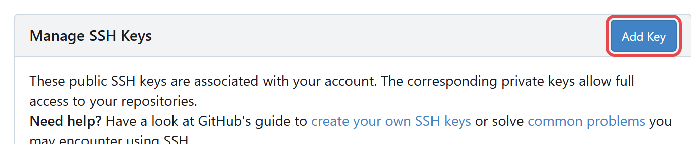
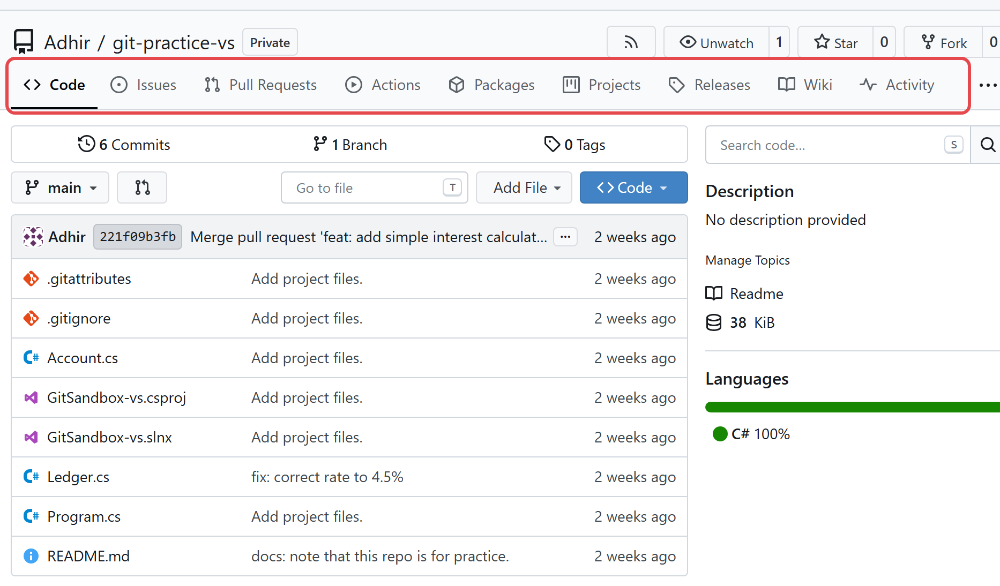
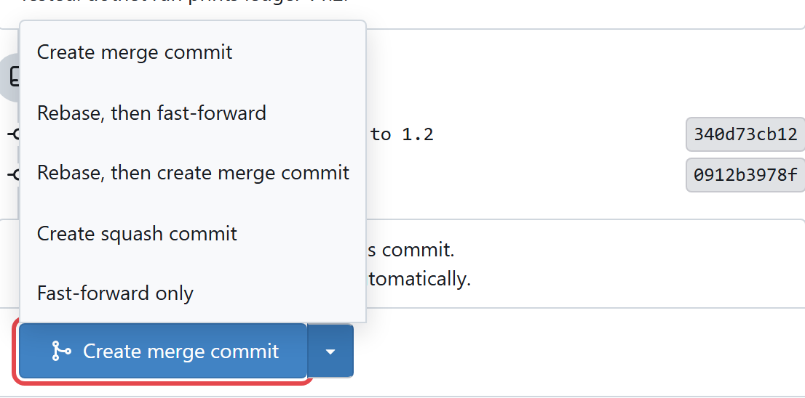
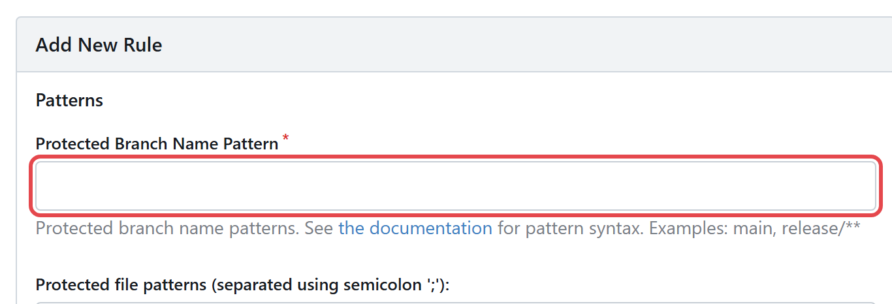

[Git with Gitea — start page](git-with-gitea.md) · [← Part 2 · Command line](git-with-gitea-part2.md) · [Cheat sheet](git-with-gitea-cheat-sheet.md)

# Part 3 — Common reference

Everything here applies to both halves. Sections 14 and 15 are worth reading once now; 16 to 19
are for coming back to.


**On this page**

- [14. Gitea specifics](#14-gitea-specifics)
    - [14.1 Tokens — see §0.4](#141-tokens-see-04)
    - [14.2 SSH instead (optional, nicer once set up)](#142-ssh-instead-optional-nicer-once-set-up)
    - [14.3 The Gitea web UI, mapped to git concepts](#143-the-gitea-web-ui-mapped-to-git-concepts)
    - [14.4 Merge styles Gitea offers on a PR](#144-merge-styles-gitea-offers-on-a-pr)
    - [14.5 Branch protection — expect `main` to reject you](#145-branch-protection-expect-main-to-reject-you)
    - [14.6 `tea` — Gitea's official CLI (optional)](#146-tea-giteas-official-cli-optional)
- [15. "Oh no" — the recovery section](#15-oh-no-the-recovery-section)
- [16. Make git comfortable](#16-make-git-comfortable)
    - [Aliases — worth 30 seconds, saves them back daily](#aliases-worth-30-seconds-saves-them-back-daily)
    - [Other settings worth having](#other-settings-worth-having)
    - [Where settings live](#where-settings-live)
- [17. Graduating: the real repository](#17-graduating-the-real-repository)
- [18. Rules of thumb](#18-rules-of-thumb)
- [19. Glossary](#19-glossary)
- [Where to go next](#where-to-go-next)

---

## 14. Gitea specifics

Everything so far is universal git. This section is about our server —
`http://192.168.0.22:3000`, running **Gitea 1.27** (check yours at
<http://192.168.0.22:3000/api/v1/version>). Button names below are that version's.

> **Gitea is not GitHub, and the tutorials you find will be GitHub's.** The concepts are identical;
> several of the buttons are not. The ones that trip people up:
>
> | You will read (GitHub) | What Gitea actually shows |
> |---|---|
> | *Compare & Pull Request* banner | **Pull Requests** tab → **New Pull Request**. (A green *"You pushed on branch …"* banner with the same button appears on the repo page for a while after a push) |
> | *Merge pull request* button | **Create merge commit**, with a **▾** for the other styles ([§14.4](#144-merge-styles-gitea-offers-on-a-pr)) |
> | *Squash and merge* | **Create squash commit** |
> | *Settings → Developer settings → Personal access tokens* | **Settings → Applications** ([§0.4](git-with-gitea-part0.md#04-your-gitea-account-repo-and-token)) |
> | *Draft pull request* | a `WIP:` title prefix ([§0.5](git-with-gitea-part0.md#05-pull-requests-the-part-that-is-not-git)) |
> | *CODEOWNERS*, required reviewers | **Settings → Branches** protection rules ([§14.5](#145-branch-protection-expect-main-to-reject-you)) |
> | `gh` CLI | `tea` ([§14.6](#146-tea-giteas-official-cli-optional)) |
>
> Same page, different label. When a guide names a button you cannot find, look for the one that
> does the same job before assuming you are lost.

### 14.1 Tokens — see §0.4

Authentication is in [§0.4](git-with-gitea-part0.md#04-your-gitea-account-repo-and-token), because both halves need it
before their first push: generate a Personal Access Token in **Gitea → Settings → Applications**,
give it **repository → Read and Write** (and nothing else), and let Windows Credential Manager
store it. **Never your account password,
and never a token embedded in the remote URL.** Visual Studio and the command line share the same
credential store, so you do this once for both.

The warning there is worth repeating: **this server is plain HTTP**, so treat the token as
LAN-visible.

### 14.2 SSH instead (optional, nicer once set up)

```bash
ssh-keygen -t ed25519 -C "adhirranjan@softtrust.com"     # Enter x3 accepts the defaults
cat ~/.ssh/id_ed25519.pub                          # copy this whole line
# Gitea → Settings → SSH / GPG Keys → Add Key → paste
ssh -T git@192.168.0.22                               # verify

git remote set-url origin git@192.168.0.22:Adhir/git-practice.git
```

No tokens, no prompts. Use HTTPS+token if your network blocks SSH.

[](img/git-with-gitea/g-ssh-keys.png)

*Gitea → Settings → **SSH / GPG Keys** → **Add Key** (boxed): paste the single line from
`id_ed25519.pub`.*

### 14.3 The Gitea web UI, mapped to git concepts

| In Gitea | Is | Notes |
|---|---|---|
| **Code** | your files at the tip of the selected branch | The branch dropdown top-left |
| **Issues** | to-do items / bug reports | Say `Fixes #12` in a commit or PR to auto-close issue 12 on merge |
| **Pull Requests** | a request to merge branch A into branch B | Reviewed and merged here. No *git* command reaches it — browser, or `tea` ([§14.6](#146-tea-giteas-official-cli-optional)) |
| **Releases** | annotated tags, with files attached | Built on `git tag` |
| **Wiki** | a second git repo, for prose | Cloneable separately |
| **Activity / Insights** | commit graphs, contributors | Reads your commit *email* — see §0.1 |
| **Packages** | a registry (NuGet, npm, Docker, …) attached to the repo | Not git. Gitea can host our NuGet feed |
| **Actions** | Gitea's built-in CI, GitHub-Actions-compatible YAML in `.gitea/workflows/` | Off unless an admin enabled it *and* registered a runner |
| **Settings → Branches** | branch protection | Where "you cannot push to main" is configured |
| **Settings → Webhooks** | fire an HTTP call on push/PR | For driving an *external* CI server |

[](img/git-with-gitea/g-repo-home.png)

*The repo page. The boxed tab row is the table above, left to right (**Settings** hides behind **⋯**
on a narrow window). Below it: the commit / branch / tag counters, the branch dropdown, and the blue
**Code** button that holds the clone URL.*

### 14.4 Merge styles Gitea offers on a PR

The merge button is labelled with the style itself — there is no generic *"Merge"* button. The
default reads **Create merge commit**; the **▾** beside it switches style (an admin can disable
any of these per repo, so you may see fewer):

[](img/git-with-gitea/g-pr-merge-styles.png)

*The **▾** opened on a real PR in Gitea 1.27: five styles. **Manually merged** is missing because
it is switched off in this repo's settings.*

| Button label | Result | When |
|---|---|---|
| **Create merge commit** | Keeps every commit, adds a merge commit | Default. Full, honest history |
| **Rebase, then fast-forward** | Replays your commits onto main, no merge commit | Linear history, if the team wants that |
| **Rebase, then create merge commit** | Replays your commits onto main, then adds a merge commit anyway | Linear commits *and* a visible "this came from a PR" marker |
| **Create squash commit** | All your commits collapse into one | Great when your branch has 14 "wip" commits |
| **Fast-forward only** | Refuses unless the branch is already up to date | Strictest |
| **Manually merged** | Marks the PR merged without merging — you did it at the command line | Rare. Bookkeeping only |

Ask which one this team uses and be consistent. Squash is the friendliest default for a learner —
your messy branch history never reaches `main`.

### 14.5 Branch protection — expect `main` to reject you

If an admin enabled protection on `main`, a direct `git push` to it fails by design:

```
! [remote rejected] main -> main (protected branch hook declined)
```

That is not a bug and not a permissions problem to escalate. Branch, push, PR.

[](img/git-with-gitea/g-branch-protection.png)

*Where protection is configured: repo **Settings → Branches → Add New Rule**. **Protected Branch
Name Pattern** (boxed) is where an admin types `main`; the rest of the page sets who may push and
how many approvals a PR needs. The practice repos have no rule, which is why the labs can push to
`main` directly.*

---

### 14.6 `tea` — Gitea's official CLI (optional)

Every git tutorial you find online will sooner or later type `gh`. **`gh` is the GitHub CLI** — a
separate program from git, which does the things that live on GitHub's *website* rather than in
git itself (`gh pr create`, `gh issue list`, `gh pr checkout 42`). It talks to github.com and
nowhere else. Run it here and you get "command not found" or an authentication failure against a
server that has nothing to do with us. That is not you doing something wrong.

**`tea` is the Gitea equivalent.** Same idea, our server: pull requests, issues and releases from
the terminal instead of the browser.

> **You do not need this.** Nothing in this guide requires `tea`, and the labs in §8 and §13 never use it.
> Learn git first. Come back here when opening the browser for every PR starts to annoy you.

**Install** — a single binary, no runtime:

1. Download the Windows build from the releases page: <https://gitea.com/gitea/tea/releases>
   (`tea-<version>-windows-amd64.exe`).
2. Rename it to `tea.exe` and put it in a folder that is on your `PATH`.
3. `tea --version` to confirm.

**Log in** — with the same Personal Access Token from §0.4, never your password:

```bash
tea login add --name trustbank --url http://192.168.0.22:3000 --token <YOUR-PAT>
tea login list                      # confirm it is there
```

**What it can do** — run from inside a cloned repo, which is how it knows which project you mean:

| Command | Does |
|---|---|
| `tea pr create --base main --head feature/x --title "..."` | Open a pull request without leaving the terminal |
| `tea pr list` | Open PRs on this repo |
| `tea pr <number>` | Show one PR — title, state, branches |
| `tea pr checkout <number>` | Check out someone else's PR branch locally to test it |
| `tea pr merge <number>` | Merge it (if you have the rights) |
| `tea issue list` / `tea issue create` | Issues |
| `tea release create --tag v1.0` | A Gitea release from a tag |
| `tea notifications` | Your Gitea notification inbox |
| `tea open` | Open the current repo's Gitea page in the browser |
| `tea <command> --help` | The authoritative flag list — trust this over any doc, including this one |

**What it does not do.** `tea` is not a git replacement. Cloning, branching, staging, committing,
pushing — all still plain `git`, exactly as in §11. `tea` only covers the layer *above* git, the
same layer the web UI covers.

**Two cautions:**

- **Your token lands in a config file** (`%USERPROFILE%\.config\tea\config.yml`) in readable form.
  That is a file on your disk holding write access to our source. Treat it like a password file,
  and revoke the token in Gitea (**Settings → Applications**) if the machine is ever lost or handed on.
- **Reviewing code in a terminal is worse than reviewing it in a browser.** `tea pr create` is a
  genuine convenience — you are already in the terminal, you just pushed. But reading a diff,
  commenting on line 47 and having a conversation about it are things the Gitea web UI does far
  better. Most people end up creating PRs with `tea` and reviewing them in the browser.

---


## 15. "Oh no" — the recovery section

Read this once now, so you remember it exists at 3am.

**This section is terminal-only, and that is not an oversight.** `git reflog` — the thing that
makes almost everything below recoverable — **has no button in Visual Studio**, in Rider, or in
any other IDE. If you work in the IDE, the one git command worth knowing by heart is `git reflog`,
typed into **View → Terminal**. Lab V8 exists to make you meet that wall once, calmly, before it
matters.

**Which undo?** Answer two questions — *is it committed?* and *is it pushed?* — and the tool
follows:

```
  What are you undoing?               Visual Studio           Command
  ─────────────────────               ─────────────           ───────
  NOT committed yet
    ├─ staged by mistake, keep edits  −  on the file          git restore --staged <file>
    └─ throw the edits away  ⚠        Undo Changes            git restore <file>

  committed, NOT pushed
    ├─ wrong message / forgot a file  tick Amend              git commit --amend
    ├─ undo it, keep the work         Reset › Keep Changes    git reset HEAD~1
    └─ undo it AND the work           Reset › Delete Changes  git reset --hard HEAD~1

  committed AND pushed
    └─ always, whatever the mistake   Revert                  git revert <sha>

  ⚠ the one git cannot undo: those edits were never committed.
  Delete Changes / reset --hard CAN be undone, with git reflog.
  Never reset commits that others have already pulled — revert them.
```

**The rule: if it was ever committed, it is still there for ~90 days, even if you cannot see it.**
`git reflog` records every position `HEAD` has held — including ones you "destroyed".

```bash
git reflog                    # a numbered list: HEAD@{0}, HEAD@{1}, ...
git reset --hard HEAD@{3}     # go back to how things were 3 moves ago
```

| Situation | Fix |
|---|---|
| <span id="oh-message"></span>Wrong message on the last commit | `git commit --amend -m "Right message"` (unpushed only) |
| <span id="oh-forgot-file"></span>Forgot a file in the last commit | `git add f.cs && git commit --amend --no-edit` (unpushed only) |
| <span id="oh-too-early"></span>Committed too early | `git reset --soft HEAD~1` — the changes come back, staged |
| <span id="oh-staged-wrong"></span>Staged the wrong file | `git restore --staged f.cs` |
| <span id="oh-wrecked"></span>Wrecked a file, not yet staged | `git restore f.cs` (this one is genuinely unrecoverable) |
| <span id="oh-on-main"></span>Committed to `main` by mistake | `git branch feature/x` then `git reset --hard origin/main`, then work on `feature/x` |
| <span id="oh-pushed"></span>Need to undo a **pushed** commit | `git revert <sha>` then push. Never `reset` shared history |
| <span id="oh-reset-hard"></span>`git reset --hard` and regretted it | `git reflog`, find the commit, `git reset --hard <sha>` |
| <span id="oh-deleted-branch"></span>Deleted a branch by mistake | `git reflog`, find its last commit, `git switch -c <name> <sha>` |
| <span id="oh-merge"></span>Merge went wrong, mid-conflict | `git merge --abort` |
| <span id="oh-rebase"></span>Rebase went wrong, mid-rebase | `git rebase --abort` |
| <span id="oh-rejected"></span>Pull rejected: "non-fast-forward" | `git pull` (merge theirs in), resolve, then push |
| <span id="oh-detached"></span>"detached HEAD" | `git switch -c keep-this` to save the commits, or `git switch main` to abandon them |
| <span id="oh-secret"></span>Committed a secret | Rotate the secret **first** — assume it is compromised. Then purge with `git filter-repo`, force-push, and tell everyone to re-clone |
| <span id="oh-lost"></span>Truly, totally lost | `git fsck --lost-found` lists dangling commits |

**Two rules that prevent almost every disaster:**

1. **Commit before you experiment.** A commit is free and makes everything undoable.
2. **Never rewrite history that others have pulled** (`reset --hard`, `rebase`, `--force` on a
   shared branch). On your own unpushed branch, rewrite all you like.

---


## 16. Make git comfortable

Aliases are command-line settings, but **they are worth having even if you live in the IDE** —
the three places Part 1 sends you to the terminal (`reflog`, `add -f`, `bisect`) are exactly the
places you will be typing under pressure.

### Aliases — worth 30 seconds, saves them back daily

```bash
git config --global alias.st  status
git config --global alias.co  checkout
git config --global alias.br  branch
git config --global alias.cm  "commit -m"
git config --global alias.lg  "log --oneline --graph --all --decorate -20"
git config --global alias.last "log -1 HEAD --stat"
git config --global alias.unstage "restore --staged"

git lg          # the one you will use most
```

### Other settings worth having

```bash
git config --global core.editor "code --wait"     # VS Code for commit messages
git config --global diff.tool vscode
git config --global fetch.prune true              # auto-prune dead remote branches
git config --global rerere.enabled true           # remember conflict resolutions
git config --global push.default simple           # push only the current branch
```

### Where settings live

| Scope | File | Wins? |
|---|---|---|
| `--system` | git install dir | lowest priority |
| `--global` | `C:\Users\<you>\.gitconfig` | middle — your personal defaults |
| `--local` | `<repo>\.git\config` | **highest** — per-repo overrides |

Use `--local` to set a different `user.email` for one repo (e.g. work vs personal).

## 17. Graduating: the real repository

Do this only after the labs, and read every step before running it.

**Where `TflCbsNet10Sol\` stands today:** `git init` has been run and the branch is `main`, but
there are **no commits yet** — everything in the solution is still untracked. A carefully written
[.gitignore](../../.gitignore) is already in place, which is the hard part. So the work below is
the *first commit*, not the initialisation.

**Check the remote before you push anything.** Run `git remote -v`. If it does not name
`192.168.0.22:3000`, the repository is pointed somewhere other than our Gitea server, and pushing
would publish the whole solution to that other place. Settle where this code belongs *before* the
first push, and fix it with `git remote set-url origin <the-right-url>` (**Git → Manage Remotes →
Edit** in Visual Studio) rather than removing and re-adding.

```bash
cd E:/Adhir/AdWork/TrustBank.Code/TflCbsNet10Sol

git remote -v             # WHERE would a push go? Settle this first — see above
git status                # will list THOUSANDS of files — this is why the next step matters

# 1. Confirm the ignores are doing their job BEFORE you add anything.
git status -s | grep -Ei "bin/|obj/|appsettings.Development.json|\.pfx|App_Data|docker-data"
#    ^ this must print NOTHING. If it prints anything, fix .gitignore first.

# 2. Sanity-check the size of what you are about to commit.
git status -s | wc -l
git add -A
git status -s | wc -l     # same number? good.

# 3. Look for secrets one more time. This is the last cheap moment to catch them.
git diff --staged --name-only | grep -Ei "secret|password|\.env|credential|\.pfx|\.p12"

git commit -m "Initial commit: TrustBank CBS .NET 10 migration"
```

Then, with an empty (**not** initialised) repo created in Gitea:

```bash
git remote add origin http://192.168.0.22:3000/Adhir/TflCbsNet10Sol.git   # or `set-url`, if origin already exists
git push -u origin main
```

> **Doing this in Visual Studio instead?** Steps 1 and 3 have no UI — the filtering is the whole
> point of them, and **Git Changes** cannot filter. Open **View → Terminal** and run them there
> before you touch the commit button. Everything after that (**Commit All**, **Git → Manage
> Remotes**, **Push**) works exactly as in Part 1.

**Before that first push, three things are worth settling with your lead:**

1. **Is the dev connection string in a committed file anywhere?** `**/appsettings.Development.json`
   is ignored, but check `compose*.yaml`, `web.config`, and the deploy scripts by hand. A secret
   in commit #1 is a secret in the history forever.
2. **Should `TflCbs.Entities.dll` (bare-DLL HintPath) be committed?** Binaries in git are a known
   smell, but the build genuinely needs it. Decide deliberately, not by accident.
3. **Protect `main` in Gitea** (Settings → Branches) from day one, so nobody — including you —
   can push to it directly. It is far easier to enable now than after bad habits form.

---

## 18. Rules of thumb

- **Run `git status` constantly.** It is free, and it answers most questions before you ask them.
- **Commit small and often.** A commit is a save point; you cannot have too many.
- **Pull before you start work**, and before you push.
- **Never commit to `main`.** Branch, PR, review, merge.
- **Never `--force` a shared branch.** `--force-with-lease` on your own branch, at most.
- **Never commit secrets, build output, or `.user` files.** Check `git status` before `git add .`.
- **Write the commit message for the person who reads it in a year.** That person is you.
- **If you are about to try something risky, commit first.** Then anything is undoable.
- **Read the error message.** Git's errors are unusually good and usually contain the fix.

---

## 19. Glossary

| Term | Meaning |
|---|---|
| repository (repo) | A project plus its entire history — the `.git` folder |
| working tree | The files as they currently sit on your disk |
| index / staging area | The shortlist of changes that will go into the next commit |
| commit | A snapshot + message + author + parent. Identified by a SHA like `a1b2c3d` |
| SHA / hash | A commit's unique id. The first 7 characters are usually enough |
| branch | A movable pointer to a commit. That is all |
| HEAD | Where you are now |
| remote | A named server URL, usually `origin` |
| origin/main | Your cached copy of the server's `main`, as of the last fetch |
| tracking branch | A local branch linked to a remote one (what `-u` sets up) |
| fetch | Download from the server, change nothing local |
| pull | Fetch, then integrate |
| push | Upload your commits |
| merge | Join two histories, possibly creating a merge commit |
| rebase | Replay commits onto a new base — rewrites them |
| fast-forward | A merge that only needs the pointer moved |
| conflict | Two branches changed the same lines; git needs you to decide |
| stash | A shelf for uncommitted work |
| tag | A permanent name for a commit, usually a release |
| detached HEAD | You are on a commit, not a branch |
| reflog | The log of where HEAD has been — your undo history |
| PR | Pull Request: "please merge my branch", reviewed in the Gitea UI. A server feature, not a git one — §0.5 |
| upstream | The branch yours tracks |
| clean tree | No uncommitted changes |

---

## Where to go next

- **The other half of this guide.** If you came through
  [Part 1](git-with-gitea-part1.md), Part 2 explains what every button was doing; if you came
  through [Part 2](git-with-gitea-part2.md), Part 1 is mostly one translation table
  ([§6](git-with-gitea-part1.md#6-command-visual-studio-side-by-side)). Each half has its own sandbox folder and its own
  Gitea repo, so doing the second costs you nothing you already built.
- `git help <command>` — the authoritative manual, offline, for any command here.
- [Pro Git](https://git-scm.com/book) — free, complete, and genuinely well written. Chapters 2, 3 and 6.
- [docs/guides/day-one.md](day-one.md) — getting the CBS app itself running.

---

**Back to:** [the start page](git-with-gitea.md) · [the cheat sheet](git-with-gitea-cheat-sheet.md)

[Git with Gitea — start page](git-with-gitea.md) · [← Part 2 · Command line](git-with-gitea-part2.md) · [Cheat sheet](git-with-gitea-cheat-sheet.md)
