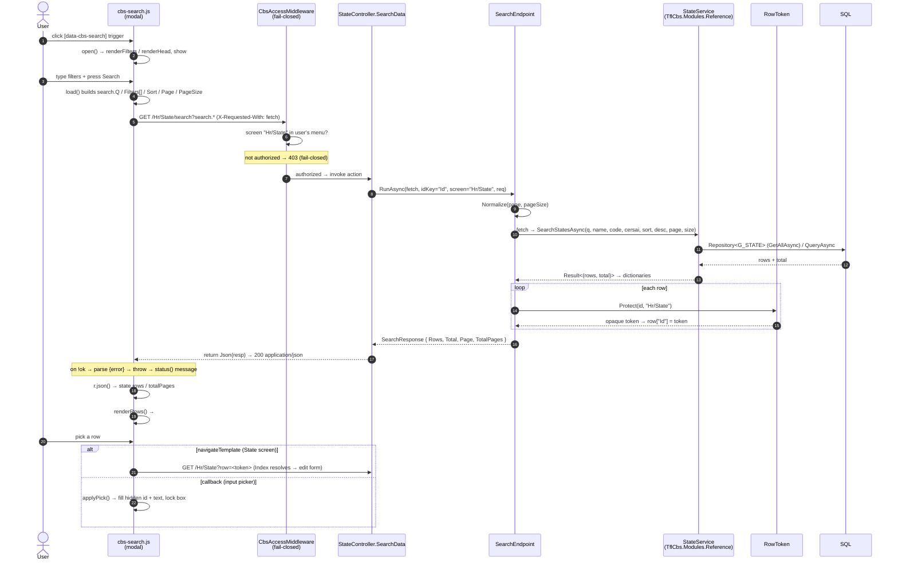
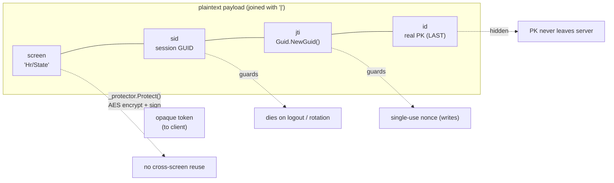
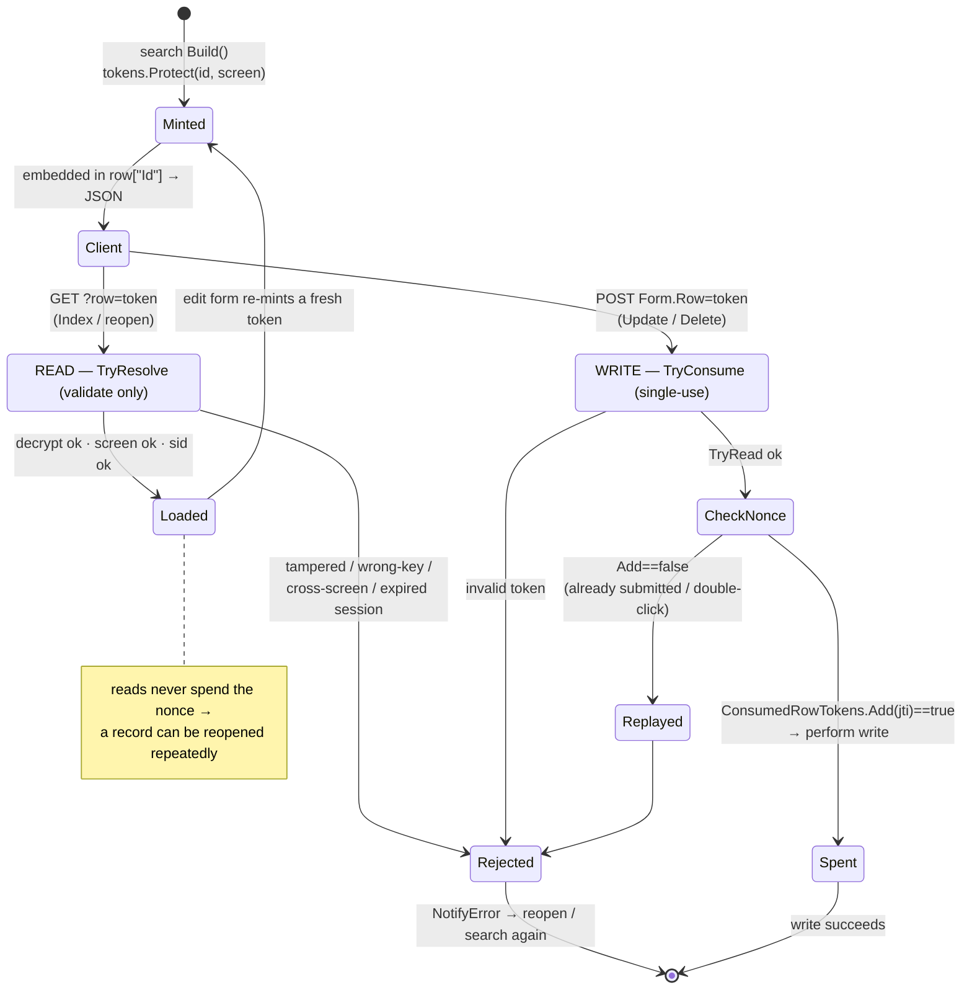

# Search modal + RowToken — visual reference

How the reusable search modal round-trips data, and how `RowToken` keeps real primary keys off
the client. Diagrams are [Mermaid](https://mermaid.js.org/) — they render in VS Code (Markdown
Preview / "Markdown Preview Mermaid Support" extension) and on GitHub.

Source of truth:
- Client: [`cbs-search.js`](../../TflCbs.Web.Shared/wwwroot/js/cbs-search.js) (shared RCL — served from `~/_content/TflCbs.Web.Shared/js/`)
- Endpoint: [`SearchEndpoint.cs`](../../TflCbs.Framework/Services/SearchEndpoint.cs)
- Token: [`RowToken.cs`](../../TflCbs.Framework/Infrastructure/RowToken.cs) · single-use set in [`CbsSessionStore.cs`](../../TflCbs.Framework/Services/CbsSessionStore.cs)
- Worked example: [`StateController.cs`](../../TflCbs.Modules.Hr.Web/Areas/Hr/Controllers/StateController.cs) (screen `Hr/State`, backed by `StateService` in `TflCbs.Modules.Reference`)

---

## 1. Search flow — end to end (sequence)

**Read it as:** the browser owns rendering (no Razor view for `/search`); the server only
filters/pages, swaps each raw PK for a token, and returns JSON. The picked token round-trips back
to `Index` (diagram 3) or fills a form field.

---

## 2. RowToken payload (what's inside the opaque string)

`id` is placed **last** so a string id may itself contain `|` (split limit 4); `screen`/`sid`/`jti`
never contain `|`.

---

## 3. RowToken lifecycle — mint → resolve → consume (state)

**Key distinction:**

| Path | Method | Touches nonce? | Why |
|------|--------|----------------|-----|
| Read (`Index`, reopen) | `TryResolve` | No | record can be reopened any number of times |
| Write (`Update`, `Delete`) | `TryConsume` | Yes — `jti` added to session set | single-use: blocks replay + accidental double-submit |

`Update` deliberately validates the token **first** via `TryBeginWrite` (so a `ModelState` failure
re-renders the form without burning it) and only `TryConsume`s once the write actually proceeds — see
[`StateController.cs:89`](../../TflCbs.Modules.Hr.Web/Areas/Hr/Controllers/StateController.cs#L89) and
[`:94`](../../TflCbs.Modules.Hr.Web/Areas/Hr/Controllers/StateController.cs#L94). `TryBeginWrite` /
`TryOpenRecord` are the `CbsScreenController` wrappers over `RowToken.TryResolve`.

> **Not access control.** Tokens secure the *handoff* (PK confidentiality + integrity + single-use).
> Authorization is still enforced separately by `CbsAccessMiddleware` (menu/route guard) and the
> scoped service calls. A valid token is never a substitute for being allowed on the screen.
